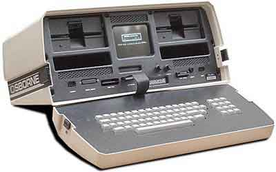

# A Message For Adam
* Author: Andy Hertzfeld
* Story Date: April 1981
* Topics: Personality, Personality Clashes
* Characters: Adam Osborne, Steve Jobs
* Summary: We encounter Adam Osborne at the West Coast Computer Faire

 

    
The Apple II was officially introduced at the First West Coast Computer Faire in April 1977, one of the very first trade shows dedicated to the newly emerging microcomputing industry.  I loved the Computer Faires because they were attended by passionate hobbyists in the days before commercial forces completely dominated.

In April 1981, a few members of the Mac team took off the afternoon and drove up to San Francisco to visit the sixth West Coast Computer Faire at Brooks Hall. The biggest splash at the show was the unveiling of the Osborne I, from a brand new company named Osborne Computer, which was touted as the world's first portable computer.

The Osborne I was the brain-child of Adam Osborne, who was a well known figure in the world of early microcomputers.  Adam was a technical writer who founded a publishing company to publish crucial information about microprocessors and software that was sorely lacking at the time, which was eventually sold to McGraw-Hill.  He became a controversial columnist, opining on the industry from his pulpit in InfoWorld and other publications.  He had a populist vision of computing, touting a no-frills, low cost, high volume approach to the business.

 In 1980, he decided to put his theories into practice, and founded the Osborne Computer Company to design, manufacture and market the Osborne 1, which was a low cost, one-piece, portable computer complete with a suite of bundled applications.  He recruited Lee Felsenstein, already a microcomputing legend as the master of ceremonies of the Home Brew Computer Club, to design the hardware.  Now, they were introducing the fruits of their labor at the West Coast Computer Faire, as Apple had done four years earlier.

The Osborne 1 was on display at their crowded booth near the center of Brooks Hall.   It looked a lot like an oversized lunch box, with a keyboard on the back of the lid, crammed full with two floppy drives and a tiny, 5 inch monitor in its center.  We were a little surprised, because it looked uncannily like some of Jef Raskin's early sketches for the Macintosh, which Steve had recently abandoned for a vertically oriented design.   Portable was sort of  a euphemism as the thing weighed around 25 pounds, but at least it fit under an airline seat, barely.  As Macintosh elitists, we were suitably grossed out by the character-based CP/M applications, of course, which seemed especially clumsy on the tiny, scrolling screen.

We worked our way up to the front of the crowd to get a good look at the units that were on display.  We started to ask one of the presenters a technical question, when we were suprised to see Adam Osborne himself standing a few feet from us, looking at our show badges, preempting the response.

"Oh, some Apple folks", he addressed us in a condescending tone, "What do you think?  The Osborne 1 is going to outsell the Apple II by a factor of 10, don't you think so?  What part of Apple do you work in?"

When we told him that we were on the Mac team, he started to chuckle.  "The Macintosh, I heard about that.  When are we going to get to see it?  Well,  go back and tell Steve Jobs that the Osborne 1 is going to outsell the Apple II and the Macintosh combined!"

So, after returning to Cupertino later that afternoon, we told Steve about our encounter with Adam Osborne.   He smiled, with a sort of mock anger, and immediately grabbed the telephone on the spare desk in Bud's office, and called information for the number of the Osborne Computer Corporation.   He dialed the number, but it was answered by a secretary.

"Hi, this is Steve Jobs.  I'd like to speak with Adam Osborne."

The secretary informed Steve that Mr. Osborne was not available, and would not be back in the office until tomorrow morning.  She asked Steve if he would like to leave a message.

"Yes", Steve replied.  He paused for a second.  "Here's my message.  Tell Adam he's an asshole."

There was a long delay, as the secretary tried to figure out how to respond.  Steve continued, "One more thing.  I hear that Adam's curious about the Macintosh.  Tell him that the Macintosh is so good that he's probably going to buy a few for his children even though it put his company out of business!"

