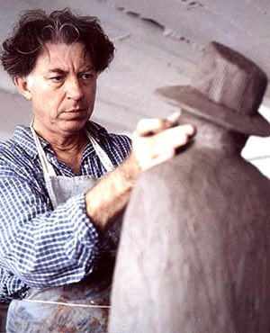
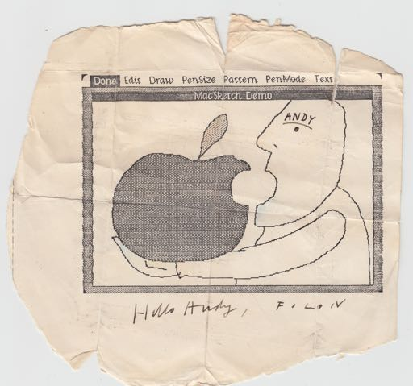

# Folon
* Author: Andy Hertzfeld
* Story Date: May 1983
* Topics: MacPaint, Celebrities
* Characters: Folon, Andy Hertzfeld, Steve Jobs, Susan Kare
* Summary: Early Mac art from Jean-Michel Folon

 

    
In early 1982, Steve Jobs had another one of his self-proclaimed crazy ideas.  He proposed contriving a surreptitious little animated character dubbed "Mr. Macintosh", who would lurk in the subterranean depths of the system software, surfacing every once in a while to startle the user (see Mister Macintosh)

The software team was swamped with more essential work, so we deferred implementing Mr. Macintosh for a while.  A few months later, Steve met a Belgian artist named Jean-Michel Folon, whose work was imbued with a humorous, playfully profound sensibility that Steve thought would be perfect for Mr. Macintosh.  He invited Folon to visit the Mac team in Cupertino for a demo and a potential commission.

We were excited to show the Mac to an accomplished artist like Folon, and curious to see his reaction to it.   In the summer of 1982, MacPaint was still just a gleam in the eye of Bill Atkinson, but we had an early prototype drawing application going called MacSketch, ported from Bill's work on Lisa, which allowed the user to sketch line drawings with the mouse and fill them with patterns (see Busy Being Born, Part 2).

Folon seemed fascinated by the embryonic Macintosh; after we demoed MacSketch to him, we could barely restrain him from taking over the mouse for himself.   After experimenting for a few minutes, he found a pen size that he liked, cleared the screen and started drawing in his inimitable style.  He quickly sketched a cartoon featuring a man holding a gigantic Apple on his outstretched arm, with a bite taken out of it in the same place as the Apple logo.  The man's mouth was wide open, mimicking the hole in the apple.

It was an amazing first try and was definitely worth preserving for posterity, but we hadn't gotten around to implementing a "Save" command in MacSketch yet.   Fortunately, we did have a rudimentary "Print" command working, so we were able to capture it on paper.   I folded up a copy and kept it in my wallet to occasionally use as an example of what could be done with the Mac.   Apple rewarded Folon with a commission to try to come up with a look for Mr. Macintosh and other marketing materials.

Almost one year later, in the spring of 1983, Folon returned to Cupertino for another visit with the Mac team.   He showed us a number of sketches he made for Mr. Macintosh, as well as other stuff he was working on, mostly rendered with a set of pastel colored pencils that he was carrying with him.  I had the presence of mind to remember the MacSketch drawing he did the previous year, which was still in my wallet, so I took my creased, tattered copy out and requested him to sign it.

Jean-Michel was happy to oblige, but I was surprised when he pulled out his set of pastel colored pencils and began coloring in some parts of the drawing with a subtle shading, making the stem of the Apple red, and the chin of the man blue.  I was shocked when he labeled the man "Andy" on his forehead.   Finally, he signed it at the bottom, "Hello Andy, Folon".

We had abandoned our ambitions for Mr. Macintosh due to the scarcity of ROM, disk space and development time,  but we eventually used some of Folon's drawings on buttons given away at trade shows, and a small rendition of his Mr. Mac was emblazoned on the first digital printed circuit board next to the copyright notice.   Steve Jobs remained friendly with Folon and visited with him during the Mac rollout in Paris the following year, instead of attending a French developer's conference like he was supposed to do.

 I kept the amended drawing in my wallet for a while, until Susan Kare got tired of me ruining it by frequently refolding it, so she had it mounted in a small glass frame, which helped to preserve it.   Unfortunately, the frame eventually broke and I misplaced the drawing, so I couldn't find when preparing my book in 2004.   It recently surfaced, so I'm happy to be able to present it here.   If you look closely, you can still see most of Folon's subtle colored pencil shading, now more than 30 years old.

