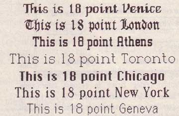

# World Class Cities
* Author: Susan Kare
* Story Date: August 1983
* Topics: Software Design, Personality
* Characters: Steve Jobs, Bill Atkinson, Andy Hertzfeld, Susan Kare
* Summary: We needed to come up with a naming scheme for our fonts

 

    
Landing in the Macintosh group as a bitmap graphic designer was a lucky break for me, and one interesting part of the job was designing screen fonts. It was especially enjoyable because the Macintosh was able to display proportional typefaces, leaving behind the tyranny of monospace alphabets with their narrow m's and wide i's.

The first Macintosh font was designed to be a bold system font with no jagged diagonals, and was originally called "Elefont". There were going to be lots of fonts, so we were looking for a set of attractive, related names.   Andy Hertzfeld and I had met in high school in suburban Philadelphia, so we started naming the other fonts after stops on the Paoli Local commuter train: Overbrook, Merion, Ardmore, and Rosemont.  (Ransom was the only one that broke that convention; it was a font of mismatched letters intended to evoke messages from kidnapers made from cut-out letters ).

One day Steve Jobs stopped by the software group, as he often did at the end of the day. He frowned as he looked at the font names on a menu. "What are those names?", he asked, and we explained about the Paoli Local.

"Well", he said, "cities are OK, but not little cities that nobody's ever heard of.  They ought to be WORLD CLASS cities!"

So that is how Chicago (Elefont), New York, Geneva, London, San Francisco (Ransom), Toronto, and Venice (Bill Atkinson's script font) got their names.

