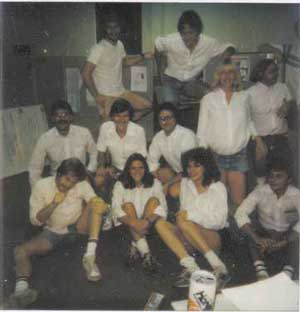

# Steve Capps Day
* Author: Andy Hertzfeld
* Story Date: December 1983
* Topics: Personality, Apple Spirit
* Characters: Jerome Coonen, Steve Capps, Bruce Horn, Larry Kenyon
* Summary: We all dress up in honor of Steve Capps

 

    
The Macintosh software finally seemed to be coming together as the fall of 1983 wore on.  The ROMs containing most of the system software were finished, and they seemed to mostly be holding up.  Larry Kenyon devised a clever technique for fixing problems in the ROM by patching the nearest system trap to the problem, with the patch code looking on the stack for the ROM address of the caller, which allowed us to fix problems with tiny, surgical incisions, adding some code snippets here or there, without needing to replace large chunks of the ROM with precious RAM as we had originally envisioned.

By the middle of November 1983, MacPaint was already stable enough to ship, even though it was always skirting on the edge of running out of memory if we changed something in the system.  MacWrite still had lots of bugs, but its core functionality seemed to be ready, as long as you weren't pushing memory limits.  The only vital application that seemed like it could delay our target date in mid-January was the Finder, which was the shell application responsible for launching other applications and managing files.

Bruce Horn was the only programmer working on the Finder, and he was bogging down with a variety of problems, especially involving file copying in low memory conditions.  The Finder was built on top of Bruce's resource manager, using features that were barely finished before the ROM freeze.  It probably should have been at least a two man project, but Bruce was a brilliant, passionate, independent perfectionist who insisted that he would get it done in time by himself.

Jerome Coonen, the Macintosh software manager, was afraid that Bruce wasn't going to make it.  Clearly, Jerome needed to assign someone else to help Bruce finish, but Bruce's perfectionism and high strung temperament made it hard for someone else to dive in and be helpful, especially this late in the game.  But luckily, Steve Capps was the perfect man for the job.

Capps was an extraordinarily talented, creative and prolific programmer, who had transferred over to the Mac team from the Lisa printing group in January 1983, giving us a new burst of energy as the original team members began to tire as our sprint to finish slogged into a marathon.  Stockily built, with long brown hair and a bushy beard, Capps was one of the few people around who Bruce respected enough to really listen to, and best of all, he possessed a cheerful, easy-going disposition that was the perfect complement to Bruce's high strung intensity.

To minimize distractions, which were mounting as Apple's marketing machine kicked into high gear as the introduction approached, Jerome arranged for Bruce and Capps to move into a small office a few blocks away, on Bubb Road.  Capps dove in quickly and took over a bunch of tasks from Bruce.  It wasn't always easy, but by the end of December it looked like the Finder was getting more or less back on track.

Jerome thought of a unique way for the software team to show our appreciation for Capps' heroic effort.  Like many hackers, Capps dressed idiosyncratically, almost always wearing a long sleeved, white dress shirt with cut-off denim shorts, white socks, and a distinctive type of checkered sneakers called Vans.  In fact, Capps had just given everybody on the team a pair of Vans as Christmas presents.  Jerome had the idea that we should pay homage to Capps by declaring "Steve Capps Day", and all come in to work dressed up exactly like him for a day.

I had to go to Macy's to buy a white dress shirt, but I managed to come up with a reasonable fascimile of Capps' attire.  It was hilarious to see everyone else as we gathered in our "fishbowl" office in Bandley 3 the next morning, all dressed in Capps' unique sartorial style.  Even the French and German translators who were visiting us for the month to get European versions underway joined in.  The funniest person was probably Patti Kenyon, who was over 8 months pregnant at the time, wearing an extra large white shirt.

Jerome went to get Capps and Bruce from their enclave, telling them there was an important meeting that required their attendance.  We could hardly hold back the laughter as an unsuspecting Capps walked in, and then we finally cracked up and gave him a round of applause when he realized what was going on.

