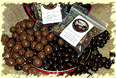

# Real Artists Ship
* Author: Andy Hertzfeld
* Story Date: January 1984
* Topics: Management, Software Design, Allnighters
* Characters: Andy Hertzfeld, Bill Atkinson, Steve Capps, Jerome Coonen, Bob Belleville, Steve Jobs, Donn Denman, Randy Wigginton, Mike Murray
* Summary: The final push to finish the software

 

    
By the fall of 1983, we had committed to announcing and shipping the Macintosh at Apple's next annual shareholder's meeting, to be held on January 24th, 1984.  The failure of the Twiggy disk drive almost caused us to be late (see Quick, Hide In This Closet!), but it seemed like the new Sony 3.5 inch drive solved all of our problems, and the rest of the hardware was ready to go. The Macintosh ROM was frozen in early September and sent out for fabrication.  All that remained was finishing the System Disk, and our two applications, MacWrite and MacPaint.

The software team worked hard over the Christmas break of 1983. The Finder still wasn't finished, and there were lots of performance problems, especially when copying files between disks, which seemed interminable.  There was lots of integration testing to do, like cutting and pasting between applications, or applications interacting with desk accessories.  As the New Year rolled around, it was clear that we were running out of time.

By the first week of January, the software team was working around the clock, testing and fixing problems that were found.  Every employee in the building was drafted as a tester, and we held a series of dinners where Apple bought catered food for anyone who stayed late to test (see 90 Hours A Week And Loving It!).

Finally, the deadline for finishing the software was less than a week away, and it seemed obvious that there were still too many bugs for us to ship it.  Late on Friday evening, we convinced ourselves that we needed an extra week or two to fix the remaining problems.   Steve Jobs was on the East Coast, along with Bob Belleville and Mike Murray, doing press for the introduction, so we arranged for a conference call early Sunday morning to tell him about the slip.

Jerome Coonen, our software manager, spoke for the team, as we gathered around the speakerphone.  We were exhausted, and progress was slow.   There were still bugs that we hadn't gotten to the bottom of yet, and it didn't seem possible that we could make it in the time remaining.  Jerome proposed that we ship "demo" software to the dealers for the introduction, and update all the customers with final software a few weeks later.  We thought Jerome was pretty persuasive as we held our breath waiting for Steve to respond.

"No way, there's no way we're slipping!", Steve responded.  The room let out a collective gasp.  "You guys have been working on this stuff for months now, another couple weeks isn't going to make that much of a difference. You may as well get it over with. Just make it as good as you can. You better get back to work!"

We did manage to wrangle an extra couple of days, by virtue of working the weekend and moving the deadline to 6am Monday morning, when the factory opened, instead of Friday afternoon.  We agreed to go home and rest up, and then come into work on Monday ready for the final push.

The final week was one of the most intense I ever experienced.  Steve wanted Bill Atkinson and myself to fly to New York to present a Mac to Mick Jagger, but I decided that I needed to stay in Cupertino to help with the bug fixing.  Some of us were pausing work to get photographed for magazines like Newsweek and Rolling Stone, which made others on the team feel terrible that they were being left out.  At times, the atmosphere got pretty tense.

Friday finally rolled around and it was clear that there were still too many bugs in both the Finder and MacWrite.  Randy Wigginton brought in a gigantic bag of chocolate covered espresso beans, which, along with medicinal quantities of caffeinated beverages, helped us forgo sleep entirely for the last couple of days.   We starting doing release cycles that were only a few hours apart, re-releasing every time we fixed a significant problem.

When a new release was ready, we would all grab it and start testing again.  At one point, around 2am on Sunday night, I stumbled across a bug in the clipboard code.  I thought I knew what it might be, but I was so tired that I didn't want to deal with it.  I tried to pretend that I didn't see the problem, but Steve Capps was watching my expression and knew there was something wrong. I also was too tired to sustain a pretense; he grilled me about the problem and then helped me craft a fix, since I was too tired to do it on my own.

Around 4am, we had a release where everything seemed to go wrong - even MacPaint was crashing, which was usually rock solid.  But our final release, around 5:30am seemed to be much better; the worst problems seemed to have receded and we thought we might actually have a decent release candidate.

We all focused on testing the final release as much as we could until 6am, when Jerome would have to leave to drive it to the factory.  It looked pretty good, but soon someone found a potential show stopper -  the system seemed to hang when a blank disc was inserted during MacWrite - the disk didn't start formatting like it should.  I realized that it was probably hung up waiting for an event, so I reached out and tapped on the space bar, and formatting commenced.  Jerome thought the bug was bad enough to hold up the release, but he left to drive it to the factory anyway, figuring they needed to start duplication even if it was just going to be a demo release.

The sun had already risen and the software team finally began to scatter and go home to collapse.  We weren't sure if we were finished or not, and it felt really strange to have nothing to do after working for so hard for so long.  Instead of going home, Donn Denman and I sat on a couch in the lobby in a daze and watched the accounting and marketing people trickling into work around 7:30am or so.  We must have been quite a sight; everybody could tell that we had been there all night (actually, I hadn't been home or showered for three days).

Finally, around 8:30 Steve Jobs arrived, and as soon as he saw us he immediately asked if we had made it.  I explained the formatting bug to him, and he thought that it wasn't a show stopper, which meant that we were actually finished.  I finally drove home to Palo Alto around 9am and collapsed on my bed, thinking that I'd sleep for the next day or two.

