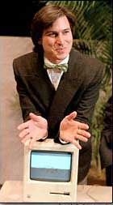
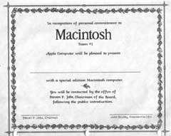

# The Times They Are A-Changin'
* Author: Andy Hertzfeld
* Story Date: January 1984
* Topics: Marketing, The Launch
* Characters: Steve Jobs, John Sculley, Burrell Smith, Andy Hertzfeld, Mike Markkula
* Summary: The big day finally arrives

 

    
January 24, 1984 - the big day had finally arrived.  We had looked forward to the date for so long that it didn't seem real to be actually experiencing the long-awaited public unveiling of the Macintosh at Apple's 1984 annual shareholder's meeting. We were excited, of course, but also nervous about our hastily contrived demo software, and still exhausted from the final push to finish the system software (see Real Artists Ship)

    I attended one of the rehearsals held over the weekend, to help set up the demo, and it was fraught with problems.  Apple rented a powerful video projector called a LightValve, that projected the Macintosh display larger and brighter than I thought possible.  But the Mac had to be connected to the projector through a special board that Burrell cooked up to compensate for the Mac's unique video timings, and the LightValve seemed to be quite tempermental, taking eons to warm up and then sometimes shutting down inexplicably.  Plus, Steve wasn't into rehearsing very much, and could barely force himself into doing a single, complete run-through.

    Most of the software team usually didn't come to work until after 10am, but this morning we gathered in our fishbowl office in Bandley 3 at 7:30am, so we could walk over together to the big auditorium at Flint Center, which was a half mile away.  We got to the cavernous room (which seated up to 2,500) early, but it was already filling up, and soon it was packed tight, with standing room only.  The software team sat up close in the second row, in a section reserved for Macintosh division employees.

    Finally, the lights dimmed, and Steve Jobs appeared at a podium on the left side of the stage.  He was resplendent in a finely tailored black suit complete with a prominent bow tie, looking more like a Las Vegas impresario than a computer industry executive.  You could tell that he was nervous as he quieted the rousing applause and began to speak.

    "Welcome to Apple's 1984 Annual Shareholders meeting.  I'd like to begin by reading part of an old poem by Dylan, that's Bob Dylan", Steve flashed a big smile as he started to recite the second verse of "The Times They Are A-Changin'", stretching an occasional vowel in a Dylanesque fashion:

> **Come writers and criticsWho prophesize with your penAnd keep your eyes wide,The chance won't come againAnd don't speak too soonFor the wheel's still in spinAnd there's no tellin' who that it's namin'.For the loser nowWill be later to winFor the times they are a-changin'.**

He thanked Apple's board of directors individually by name for their support in a turbulent year, and then turned the meeting over to Apple's chief counsel, Al Eisenstadt, to run the formal part of the shareholders' meeting.  Al ran through some procedural stuff, and then he introduced Apple's CEO, John Sculley, who was just hired nine months ago, for a report on the business.

John reported on Apple's latest quarter, which saw disappointing Lisa sales more than balanced by a fantastic Christmas for the Apple IIe, whose sales had more than doubled from the previous year.  But the crowd seemed distracted, impatiently waiting for the main event that was now imminent.  John seemed to sense that, and hurried through the bulk of his presentation.  Finally he concluded by thanking Mike Markkula and the executive staff for supporting him during his first few months at Apple, thanking one individual in particular.

"The most important thing that has happened to me in the last nine months at Apple has been a chance to develop a friendship with Steve Jobs.  Steve is a co-founder of Apple, and a product visionary for this industry, and its my pleasure now to reintroduce Steve Jobs."

Steve reappeared on the left side of the stage  as the lights dimmed again. "It is 1958", he began, speaking slowly and dramatically. "IBM passes up a chance to buy a young fledgling company that has invented a new technology called xerography.  Two years later, Xerox was born, and IBM has been kicking themselves ever since".  The crowd laughs, as Steve pauses.

Steve had cooked up this spiel for the sales meeting in Hawaii last fall, to introduce the 1984 commercial.  I had seen him do it a few times by now, but never with as much passion, intensity and emotion, dripping from his voice.

"It is ten years later, the late sixties", he continued, speaking faster now. "Digital Equipment Corporation and others invent the mini-computer.  IBM dismisses the mini-computer as too small to do serious computing, and therefore unimportant to their business.  DEC grows to be a multi-hundred million dollar company before IBM enters the mini-computer market."  Steve pauses again.

"It is now ten years later, the late seventies. In 1977, Apple Computer, a young fledgling company, on the West Coast, introduces the Apple II, the first personal computer as we know it today. IBM dismisses the personal computer as too small to do serious computing, and therefore unimportant to their business," Steve intoned sarcastically, as the crowd applauds.

"The early 1980s.  1981 - Apple II has become the world's most popular computer, and Apple has grown to a 300 million dollar corporation, becoming the fastest growing company in American business history.  With over fifty companies vying for a share, IBM enters the personal computer market in November of 1981, with the IBM PC."  Steve is speaking very quickly now, picking up momentum.

"1983.  Apple and IBM emerge as the industry's strongest competitors, with each selling approximately one billion dollars worth of personal computers in 1983.  The shakeout is in full swing.  The first major personal computer firm goes bankrupt, with others teetering on the brink.  Total industry losses for 1983 overshadow even the combined profits of Apple and IBM."

He slows down, speaking emphatically.  "It is now 1984.  It appears that IBM wants it all.  Apple is perceived to be the only hope to offer IBM a run for its money. Dealers, after initially welcoming IBM with open arms, now fear an IBM dominated and controlled future and are turning back to Apple as the only force who can ensure their future freedom."

Steve pauses even longer, as the crowd's cheering swells.  He has them on the edge of their seats.  "IBM wants it all, and is aiming its guns at its last obstacle to industry control, Apple.  Will Big  Blue dominate the entire computer industry?  The entire information age? Was George Orwell right?"

The crowd is in a frenzy now, as the already famous 1984 commercial (see 1984), which was shown for the first and only time during the Superbowl two days ago, fills the screen, featuring a beautiful young woman athlete storming into a meeting of futuristic skinheads, throwing a sledge-hammer at Big Brother, imploding the screen in a burst of apocalyptic light.  By the time the commercial is finished, everyone in the auditorium is standing and cheering.

Steve describes the Macintosh as the third industry milestone product, after the Apple II and the IBM PC. "Some of us have been working on Macintosh for more than two years now, and it has turned out insanely great!"

All this time, a lone Macintosh has been sitting in its canvas carrying case near the center of the stage.  Steve walks over to the bag and opens it up, unveiling the Mac to the world for the very first time.  He pulls it out and plugs it in, inserting a floppy, and the demo begins to run, flawlessly (see It Sure Is Great To Get Out Of That Bag!).  The Macintosh becomes the first computer to introduce itself, speaking in a tremulous voice:
    

> **Hello, I am Macintosh.  It sure is great to get out of that bag!  Unaccustomed as I am to public speaking, I'd like to share with you a maxim I thought of the first time I met an IBM mainframe: Never trust a computer that you can't lift!Obviously, I can talk, but right now I'd like to sit back and listen.  So it is with considerable pride that I introduce a man who has been like a father to me... Steve Jobs!**

Pandemonium reigns as the demo completes.  Steve has the biggest smile I've ever seen on his face, obviously holding back tears as he is overwhelmed by the moment.  The ovation continues for at least five minutes before he quiets the crowd down.

The rest of the meeting was an anti-climactic blur, as Steve runs through some marketing material and introduces new versions of the Lisa.  He shows a slide-show tribute to the Mac team, with voice-overs from the most important contributors.  Finally, he turns the meeting back to Al Eisenstadt, to announce the shareholder tallies and complete the formal portion of the shareholders' meeting.

Every member of the audience was given a copy of the first issue of MacWorld magazine, with Steve on the cover, as they departed.  Most of the Mac team hung around near the stage, congratulating each other, waiting for the crowd to disperse.

A little bit later, after we returned to Bandley 3, we were surprised by a large Apple truck that pulled up in the parking lot near the back of the building.  It contained 100 brand new Macintoshes, one for each member of the team, personalized with a little plaque on the back. Steve presented one at a time to each team member with a handshake and a smile as the rest of us stood around cheering.

We were so keyed up that it was impossible to get back to work that afternoon, but most of us didn't want to go back home, either.  The Macs were supposed to go on sale that very day, immediately following the introduction.  I thought that it would make it more real to me if I actually could go out and buy one, so five or six of us walked to the nearest Apple dealer, to see if that was possible.  The first, closest dealer didn't have any units in stock, and said that they weren't for sale yet, but we didn't give up, and the next dealer was willing to sell me one, even though he didn't have any units in yet either.

