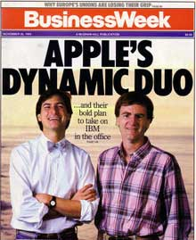

# The End Of An Era
* Author: Andy Hertzfeld
* Story Date: May 1985
* Topics: Management, Personality, Personality Clashes, Quitting
* Characters: Bob Belleville, Joanna Hoffman, John Warnock, Mike Scott, Bud Tribble, Steve Jobs, John Sculley, Steve Capps, Bill Atkinson, Burrell Smith, Mike Murray, Jean-Louis Gassee, Andy Hertzfeld
* Summary: The Mac division undergoes an inconceivable reorganization

 

    
The original Macintosh enjoyed robust sales following its spectacular launch in January 1984 (see The Times They Are A-Changin').  Steve Jobs defined success as selling 50,000 units in the first 100 days, which was a high hurdle for a brand new computer with only a handful of applications available.   In fact, Apple was able to sell more than 72,000 Macintoshes by end of April, and continued to ramp up to sell over 60,000 units in June 1984 alone.

I travelled to the 1984 National Computer Conference show in June 1984 with the Mac team, sharing a hotel room with Burrell Smith, even though I was on leave of absence (see Leave Of Absence).  Apple had assembled over a dozen small software developers who had written cool applications for the Macintosh, to display them at the trade show.  Steve Jobs was ebullient, and thought that the sprouting applications and blossoming sales meant that we had turned the corner. When I ran into him on the floor of the show, he put his arm around my shoulder and exclaimed, "Look at all these applications! We did it! The Macintosh has made it!"

High sales spurred even rosier predictions for the upcoming holiday season.  But as summer turned into fall, Macintosh sales began to decline.   For a couple of months, the University Consortium (see What's A Megaflop?) kept volumes high by selling tens of thousands of low cost Macs to college students, but by Thanksgiving 1984, sales had slowed significantly.  The marketing team forecast selling over 75,000 Macs per month for the important holiday season, but actually they didn't even break 20,000 units per month.  In December 1984, the Apple II still accounted for about 70% of Apple's revenues.

As the new year dawned, Steve Jobs seemed oblivious to the slowing sales, and continued to behave as if the Macintosh was a booming, unqualified success.  His lieutenants in the Macintosh division, which had swelled to more than 700 employees, had to deal with a growing reality gap, reconciling the ever-changing audacious plans for world domination emanating from their leader with the persistent bad news from the sales channel.

Meanwhile, the Macintosh engineering team had not been very productive.  The Mac was crying out for an internal hard drive, and some kind of high bandwidth port to attach it to, but there weren't any significant upgrades on the horizon, even though the basic hardware hadn't changed (except for additional RAM) for a year.  In the fall of 1984, Steve Jobs tried to rally the remains of the original Mac team around the "Turbo Mac" project, featuring a new digital board with custom chips and fast I/O for an internal hard drive to be designed by Burrell Smith.  But Burrell felt that engineering manager Bob Belleville was flinging lots of gratuitous obstacles in his path, and it eventually became so frustrating that he quit the company in February 1985 (see Are You Gonna Do It?).

The only upcoming new product was the LaserWriter printer, based on Canon's 300 dots/inch laser printing engine, with a digital board designed by Burrell Smith and software written by Adobe, a new company founded by Xerox alumni John Warnock and Chuck Geschke.  Like the Macintosh itself, Adobe's Postscript software at the heart of the LaserWriter was years ahead of its time, and was capable of producing exquisitely beautiful pages.  Unfortunately, the LaserWriter had one major flaw:  its retail price was over $7,000, almost triple the cost of a Macintosh.

Joanna Hoffman, the Mac team's original marketing person, transfered from international marketing back to the main product marketing group in early 1985, to help deal with the growing crisis.  At the first sales meeting that she attended, she was surprised to see that the sales forecasts for the upcoming quarter were unchanged from six months ago, when things were still looking good, and were almost four times what they were currently selling.  Everybody was informally assuming more realistic numbers, but no one had the heart to cut the official forecast, because they were afraid to tell Steve about it.  Joanna immediately slashed the forecasts, to the relief of the sales and manufacturing team.

The weak sales were beginning to put pressure on the relationship between Steve Jobs and John Sculley for the very first time.  They had gotten along fine when everything was going well, but hitherto they never had to deal with much adversity.  Unfortunately, in early 1985 the personal computer market was descending into one of its periodic downturns, and even Apple II sales were starting to falter.   Steve did not take criticism very well, and sometimes reacted to suggestions for improving Macintosh sales as if they were personal attacks. Their relationship began to sour as John put pressure on Steve to address the Macintosh's problems.

Steve Jobs had never suffered fools gladly, and as the pressure mounted, he became even more difficult to work with.  Employees from every part of the company began to approach John with complaints about Steve's behavior, including some of Steve's direct reports in the Macintosh Division.  John felt especially strongly about building more compatibility bridges with the IBM PC, an approach which Steve disdained.  John began to view Steve as an impediment toward fixing Apple's problems, and the board of directors were urging him to do something about it.

Steve had often professed that he preferred working with small teams on new products, and that he didn't really want to run a large organization with hundreds of employees.  Apple's board felt that he should hand the reins of the Macintosh division over to a professional management team, and return to his core strength as a new product visionary.  

Steve had recently met an interesting character named Steve Kitchen, who was introduced to him by Steve Capps.  Steve Kitchen was a fast talking, enthusiastic entrepreneur who had developed a couple of successful Atari video games.  He claimed to have recently invented a revolutionary flat screen display technology that could facilitate portable computers.  Steve Jobs was intrigued by the prospect of developing a lightweight portable computer, years ahead of its time, and he considered having Apple buy the technology and start a research organization called "Apple Labs" to develop it.  But he seemed ambivalent, sometimes enthusiastic about starting Apple Labs, but other times he seemed determined to prove that he could manage the large division.

The conflict came to a head at the April 10th board meeting.  The board thought they could convince Steve to transition back to a product visionary role, but instead he went on the attack and lobbied for Sculley's removal.  After long wrenching discussions with both of them, and extending the meeting to the following day, the board decided in favor of John, instructing him to reorganize the Macintosh division, stripping Steve of all authority.  Steve would remain the chairman of Apple, but for the time being, no operating role was defined for him.

John didn't want to implement the reorganization immediately, because he still thought that he could reconcile with Steve, and get him to buy into the changes, achieving a smooth transition with his blessing.  But after a brief period of depressed cooperation, Steve started attacking John again, behind the scenes in a variety of ways.  I won't go into the details here, but eventually John had to remove Steve from his management role in the Macintosh division involuntarily.  Apple announced Steve's removal, along with the first quarterly loss in their history as well as significant layoffs, on Friday, May 31, 1985, Fridays being the traditional time for companies to announce bad news.  It was surely one of the lowest points of Apple history.

I was shocked when I heard the news that morning from a friend at Apple, and immediately drove down to Cupertino to see what was going on, and commiserate with my friends.  I was aware of the problem with Macintosh sales, but it was still inconceivable to me that the board could oust Steve Jobs, who was clearly the heart and soul of the company, difficult as he may sometimes be. It was almost impossible to imagine the Macintosh team without him at the helm.  I thought that perhaps I wasn't hearing the whole story, and that something would emerge to help it make more sense.

I arrived at the Apple campus soon after Sculley's communication meeting finished, where he explained the nature of the reorganization and the accompanying layoffs.  The way that people were milling around listlessly reminded me of Black Wednesday four years earlier (see Black Wednesday), when Mike Scott unexpectedly purged the Apple II group.  A few folks from the Apple II division who resented Steve's superior attitude seemed elated, and a few others saw the shake-up as an opportunity for personal advancement, but most of Apple's employees were sombre and depressed, feeling sad and uncertain about the future.

Lots of people had varying stories about what had actually happened.  I thought that maybe it meant that Steve had decided to pursue AppleLabs, and that maybe I could come back to Apple to work on a small team again.  I was anxious to talk to Steve himself, and find out his take on it, and I wasn't the only one.  Bill Atkinson, Bud Tribble, Steve Capps and myself arranged to visit Steve at his house in Woodside for dinner on Sunday evening, two days after the reorganization was announced.

I had never been to Steve's house in Woodside before.  It was a 14-bedroom, 17,250 square foot Spanish colonial style mansion built in 1926 that Steve had purchased around a year ago, in 1984.  We knocked on the door and waited a few minutes before Steve appeared and led us inside.  The massive house was almost completely unfurnished, and our footsteps echoed eerily as he led us to a large room near the kitchen, with a long table, one of the few rooms that had any furniture.

We stood around the kitchen chatting, as Steve prepared some food.  His girlfriend Tina was there, who I had met a few times before; I was impressed by her mix of kindness and intelligence.  Bill started chatting with Tina as I finally got a chance to ask Steve about the reorganization.

"So what really happened at Apple?", I asked him, even though I was scared to bring it up so directly.  "Is it really as bad as it looks?"

"No, it's worse", Steve replied with a pained expression.  "It's much worse than you can imagine."

Steve was adamant about blaming John Sculley for everything that had happened.  He felt that John had betrayed him and he had little faith that Sculley or anyone else could manage Apple without him.  He said that his role as chairman was completely ceremonial, and it left him with no actual responsibilities.  In fact, Apple had already moved his office from Bandley 3 to Bandley 6, a small building across the street that was almost empty.  The new office was so remote from day to day operations that it later was nicknamed "Siberia".

We had a pleasant dinner, huddled around one end of the long table, mainly reminiscing about the good old days developing the Mac but occasionally engaging in grim speculation about Apple's future.  Steve had arranged for some gourmet vegetarian food to be delivered, and we drank some excellent wine.  Dessert consisted of handfuls of locally grown Olson's cherries, grabbed from a large wooden crate that Steve kept in the kitchen.

After dinner, we retired to another room that had an expensive stereo system and an elaborate model of the mostly underground house that Steve planned to build to replace the one we were standing in.  I had brought along a copy of Bob Dylan's new album with me, "Empire Burlesque", which was just released earlier that week, because I knew that Steve, like myself, was a big Bob Dylan fan, although Steve thought that Dylan hadn't done anything worthwhile since "Blood on the Tracks" a decade ago.  I placed the album on a hi-tech turntable that seemed to be mounted on aluminum cones and played the last song, "Dark Eyes", which was slow and mournful, with a sad, fragile melody and lyrics that seemed relevant to the situation at Apple.  But Steve didn't like the song, and wasn't interested in hearing the rest of the album, reiterating his negative opinion of recent Dylan.

Later, when it was time to leave, we lingered outside under the beautiful summer night sky.  We were all pretty emotional by then, especially Steve.  I tried to convince him that the change wasn't necessarily so bad, and that I would be excited about returning to Apple to work with him on a small team again. But Steve was inconsolable, and more depressed than I had ever seen him before.  As we left, I thought that it was lucky that he had Tina there to keep him company in the cavernous mansion.

It took a while for me to understand the consequences of the reorganization.  The best news for me was that my nemesis Bob Belleville had resigned from Apple, because he had sided with Steve during the recent infighting and burned too many bridges to continue.  Most of the rest of Steve's staff stayed on to work for Jean-Louis Gassee, who replaced Steve in the reorganized division, although Mike Murray resigned soon thereafter.  Steve Jobs spent most of the summer traveling, trying to figure out what to do next.   He was still the chairman of Apple Computer, but he was so at odds with the rest of its leadership that it was hard to see how he could remain there much longer.

