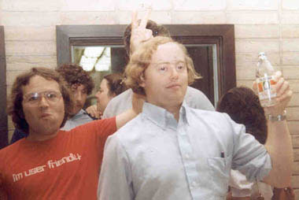

# I'll Be Your Best Friend
* Author: Andy Hertzfeld
* Story Date: August 1979
* Topics: Origins, Personality, Hardware Design, Apple II
* Characters: Burrell Smith, Andy Hertzfeld, Wendell Sander, Steve Wozniak
* Summary: Burrell Smith was creative in more than just engineering.

 
    
Toward the end of my first week as an Apple employee in August 1979, I noticed that someone had left a black binder on my desk, with a hand-written title that read, "Apple II: Principles of Operation".  It contained a brilliant, concise description of how the Apple II hardware worked, reverently explaining details of Woz's epic, creative design hacks, in a clearer fashion than I'd ever read before.  I didn't know who left it there, but the title page said it was written by "Burrell C. Smith".

Later that day, in the late afternoon, I was approached by a young, animated, slightly nervous guy with long, straight, blond hair, who entered my cubicle and walked right up to me.

"Are you Andy Hertzfeld?  Wow, it's amazing to meet you.  I read your articles in Call A.P.P.L.E. and Dr. Dobb's.  Apple's lucky they got you to work here. I want to shake your hand."

With exaggerated formality, he extended his right arm stiffly, almost in a parody of a handshake offer.  "I'm Burrell.  Burrell Carver Smith.  Pleased to meet you.  I wrote that manual I left on your desk.", he said, pointing to the black binder on my desk. We shook hands and then he suddenly turned around nervously and darted off, without explanation.  "See you later!", he said, without looking back.

My cubicle in Bandley 1 was in the hardware engineering section, since my first project was writing the firmware for the Silentype thermal printer.  It was across the aisle from Wendell Sander's office.  Wendell was the designer of the Apple III and an extremely brilliant and seasoned engineer, who used to design RAM chips for Fairchild and understood the Apple II hardware design inside out.  All the other hardware engineers on the team, except for Woz, usually came to Wendell for advice.

I began to notice that Burrell, even though he was supposed to be working in the service department in a different building, often hung around outside of Wendell's office, sometimes for hours at a time, waiting for Wendell to have a free moment, so he could ask him to verify his latest insight about the Apple II timings.  Sometimes, when Wendell was busy, he would try the insight out on me instead, or discuss a fine point of the Apple II firmware.   Soon, we started to occasionally go out for lunch together.

The first time we went to lunch, I found out that Burrell's creativity extended beyond his engineering work.  He would often try to convince our waitress to concoct variations of the standard fare on the menu, thinking of something different every time.

For example, after he successfully persuaded a waitress to divide his pizza toppings into thirds, he asked her to do fifths the next time. Or he would sometimes try to order mixed sodas as if they were cocktails, in ever varying proportions, like three quarters Coke, and one quarter Sprite. Often, the waitress would balk but Burrell was sometimes charming enough to eventually convince her to comply.  He would also obsess on certain foods, becoming fixated on Bulgarian Beef sandwiches from Vivi's for a while, and then a Pineapple Pizza phase (see Pineapple Pizza), evolving to his most enduring favorite, sushi, which provided a new range of interesting choices and combinations.

Burrell also had a distinctive way of expressing himself, applying technical jargon to ordinary life (like a situation that was "meta-stable", or someone being a "state machine"), mixed with a dash of baby talk (like adding plurals to people's names).  An attractive woman was referred to as a "good prototype", or a "good proto" for short. Burrell had a great sense of humor and periodically performed hilarious impressions of everyone else on the team, caricaturing their personality quirks with an incisive phrase or nickname (see I Invented Burrell).  He also liked to make fun of various language conventions; for example, if he was pleased with new software, he'd say "Happiness comma software".

One of his favorite expressions was "I'll be your best friend".  He offered "best friendship" for a wide range of activities, like making some change in the software for him or getting him a Coke from the gas station.  "Best friendship takes place", he would declare if pleased with the results.  He also had a habit of reducing things to initials, like "B.F.R." for "Best Friendship Relationship".  

Once, right after Burrell conferred best friendship upon me, I heard him offer best friendship to someone else, for a different favor.  "Wait a second", I challenged Burrell, "How can you give out best friendship to someone else?  There can be only one best friend at a time, can't there?"

Burrell had a quick reply, delivered with a smile.  "Of course there can be only one "best" friend  at a given instant of time.  But best friendship relationships may be highly dynamic. The average length of a best friendship is three to five milliseconds.  So there's no problem in having a new B.F.R. a second or two later."