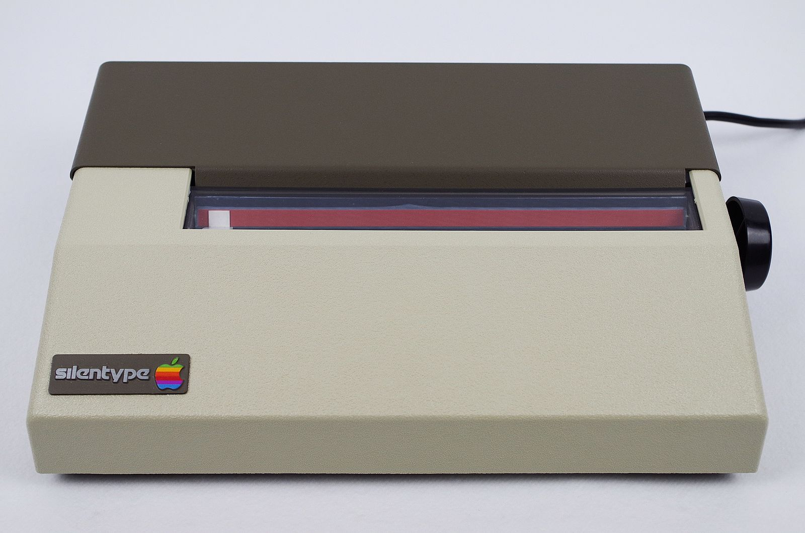

# What Hath Woz Wrought
* Author: Andy Hertzfeld
* Story Date: September 1979
* Topics: Apple II, Prototypes, Printers
* Characters: Andy Hertzfeld, Steve Wozniak, Victor Bull
* Summary: The first product I developed for Apple

 

In the summer of 1979, I abandoned grad school to start working at Apple Computer as a systems programmer. I was already thoroughly obsessed with their main product, the Apple II, so it was a dream come true to become an Apple employee and meet the amazing people behind the company.

I became even more excited when I found out about the first project that I was slated to work on: an inexpensive little graphical printer.  Most printers were large, loud and expensive, printing by impacting an inky ribbon.  Apple collaborated with a small, local start-up named Trendcom that had a different approach, relying on coated thermal paper that darkened when heat was applied. The "print-head" was a column of seven tiny thermal elements that got hot when enabled. It was almost silent as it glided across the page, printing up to 80 characters per line at 40 characters per second.

Trendcom controlled their printer with a relatively expensive digital board that included a microprocessor and memory chips.  Apple planned to buy printer mechanisms from Trendcom bereft of their digital board, saving almost a third of the total cost of the printer.  Instead, we planned to use software on the Apple II to do most of the controlling. My job was to write that software.

I was pleased by the similarities between the printer project and Apple's floppy drive, an awesome design that was peak Woz, his crowning glory. Woz had taken a standard Shugart floppy drive, and discarded most of its pricey controller board, using the Apple II to do the work instead, which saved cost while increasing capacity, flexibility and performance.  We were going to do essentially the same thing with the Trendcom printer, only this time I got to be Woz, or at least the software side of him.

The only other engineer on the project was Victor Bull, who was the hardware designer and project leader. Vic, who was smart with a dry sense of humor and a soft spoken, laconic manner, sat down with me on my second day of work and introduced me to the details of my new project.   The printer software that I was to write would live on a 2K byte ROM chip on the interface board that Vic was designing.  It needed to provide an easy way for the user to print the contents of their graphics screen and also to print 80 columns per line of text, from both Basic and Pascal.  It also needed to be finished within a couple of months, so we could ship it in time for Christmas 1979, now less than five months away.

It took about a week to write the low level routines that managed the position and temperature of the thermal elements and paper.  We decided that sending a "control-Q" to the printer should print whatever was displayed on the Apple II's 280 by 192 graphics screen.  After some coding and debugging, it was thrilling to watch the embryonic prototype print a sharp, clear rendition of the current hi-res screen.

Finally, we were ready to try to print some text (which was harder than graphics since you had to worry about character generation and layout). I started considering what the Silentype's initial utterance should be. Being a programmer, the first thing I thought of was "Hello, World!" but I knew we could probably do better than that so I started asking around for suggestions.  

Someone mentioned that the first message ever sent electronically, tapped out in Morse code by Samuel Morse himself on May 24, 1844, was a bible quote, "What Hath God Wrought?". In homage to both Samuel Morse and Steve Wozniak, we decided that the first official text printed by the printer should be "What Hath Woz Wrought?".  I wrote an Integer Basic program to print it out about 20 times and I saved the print-out for years but unfortunately lost it at some point, after it had mostly faded out anyway.

I occasionally thought about what Apple marketing was going to call our new printer, but I never heard any discussion about it.  I was afraid they would name it something generic, like "Apple Thermal Printer", so I was pleased when George Johnson, the marketing person assigned to the project, stopped by and told me they had decided to christen it the "Apple Silentype".  As a lifelong punster I approved, even if it wasn't a reference to the 5th verse of "Tangled Up In Blue" as I hoped. 

Vic was worried about the possibility of the software crashing while it was printing.  It was possible for a thermal element to be inadvertently left on indefinitely, which could potentially ruin the thermal elements or even cause a fire.  Vic solved the problem by adding a bit of hardware to cut current to elements that were left on for more than 10 milliseconds. He asked me to write a test to verify that his precaution was working as intended.

I wrote code to intentionally leave each thermal element on, to verify that Vic's safety measure was effective. I was pleased to see that it worked perfectly, but also a little disappointed to miss more exciting behavior if it hadn't.  I thought of something else to try:  what if I left an element on for 9.9 milliseconds, before turning it off for only 30 microseconds, then turning it back on again. It would effectively be on for more than 99% of the time while sidestepping Vic's remedy.  I couldn't resist coding it up to see what would happen, so I fired up the modified test and nervously awaited the results.

At first nothing seemed to happen, except for a low volume humming sound emanating from the printer.  Suddenly, after about five seconds, the paper started turning a deep, inky black, spreading out from the print-head organically, almost like a liquid, darker than I had ever seen before. I started smelling an acrid odor and noticed there were open flames near the print-head beginning to spread. I quickly reset the Apple II as I smothered the fire with my jacket. The foul smell drew a small crowd but mercifully no fire alarm.

Unfortunately, the experiment seemed to permanently damage the print-head; it burned out or possibly melted some of the thermal elements. The printer could no longer print text or graphics, but it still was able to set the paper on fire, so I kept it around for the occasional incendiary demo.

I finished the Silentype firmware around mid-September, which was theoretically early enough to meet our goal of a Christmas 1979 release, but Trendcom had a series of production issues that delayed shipments in any significant volume until early 1980.   It sold pretty well for a while as the official printer for the Apple II, before it was replaced by the ImageWriter dot matrix printer around the end of 1983.