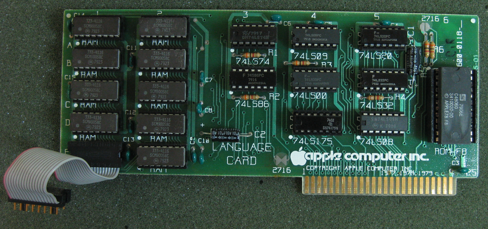

# We'll See About That
* Author: Andy Hertzfeld
* Story Date: November 1979
* Topics: Hardware Design, Technical, Apple II
* Characters: Burrell Smith, Bill Atkinson, Jef Raskin, Steve Wozniak
* Summary: Burrell proves his mettle with the 80k language card.

 
    
Burrell Smith was a 23 year old, self-taught engineer, without a college degree, who was drawn to Apple by the sheer elegance of the Apple II design.  He was hired into Apple in February 1979, as Apple employee #282, a lowly service technician responsible for fixing broken Apple IIs that were sometimes returned by customers.  As he debugged broken logic boards, sometimes more than a dozen in a single day, he began to develop a profound respect and empathy for Steve Wozniak's unique, creative design techniques.

Meanwhile, the Lisa team had been writing their first code in Pascal, running on Apple IIs, because the Lisa hardware wasn't ready yet.  They had been at it for almost a year, and they had written more code than would fit in the 64 Kbytes of memory in a standard Apple II.  In fact, the Apple II only had 48 Kbytes on its main board, but it used a "language" card to give it an extra 16 Kbytes used to run Pascal.  To accomplish this, the language card had to "bank switch" its RAM over the ROM on the Apple II motherboard.

Bill Atkinson was the main programmer for both the Apple II Pascal system as well as the new Lisa system.  He was in the service department picking up some extra language cards when Burrell heard him lamenting about overflowing the Apple II's memory limitations.

"Well, why don't you add more memory to the language card?", Burrell suggested.

Bill was intrigued, but he complained, "You can't add any more memory because we're out of address space.  64K is the limit of what we can address."

Burrell had already thought of that.  "Well, the language card is already bank-switching the RAM, even double-banking the last 2K where the monitor ROM is.  We'll just make it bank-switch another bank."

Bill was enthusiastic, so Burrell built him a prototype while Bill modified the Pascal run-time to support the extra bank switching.  It worked like a charm, so soon Burrell was busy manufacturing 80K language cards for all the Lisa programmers.

Around this time, Bill ran into Jef Raskin.  Jef had been writing a series of papers about a consumer-oriented computer that would be  extremely inexpensive and radically easy to use.  He was ready to start building a hardware prototype so he was looking for a talented hardware designer who could pull off his vision of a brutally simple, ultra low cost machine.

"I've got someone who you ought to meet", Bill told Jef.  He made arrangements to bring Burrell over to Jef's house in Cupertino over the weekend.

Bill and Burrell showed up at Jef's house at the appointed time.  Bill introduced Burrell to Jef, saying.  "Jef, this is Burrell.  He's the guy who's going to design your Macintosh for you."

"We'll see about that", Jef replied.  "We'll see about that."