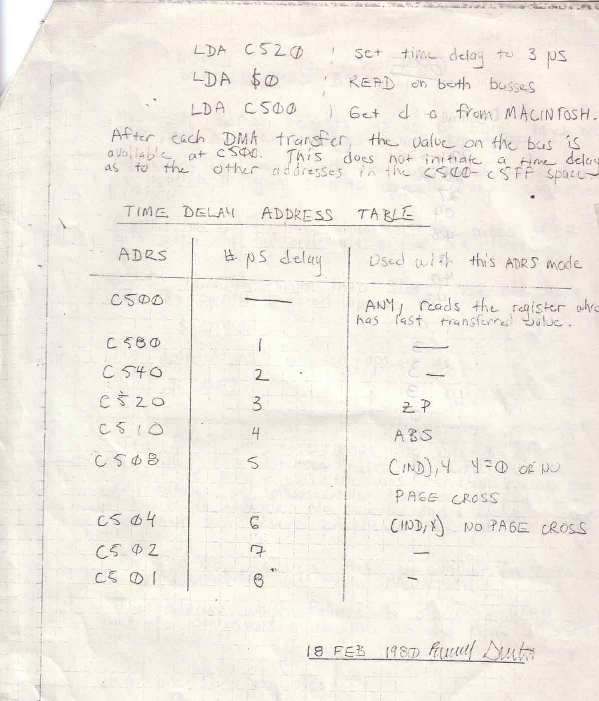

# Scrooge McDuck
* Author: Andy Hertzfeld
* Story Date: February 1980
* Topics: Origins, Hardware Design, Prototypes
* Characters: Burrell Smith, Andy Hertzfeld, Jef Raskin, Tom Whitney, Bob Bishop, Cliff Huston, Dick Huston
* Summary: The very first image on the very first Macintosh

 
    
Burrell Smith liked to do intensive design work over the Christmas break, so the very first prototype of the very first Macintosh sprung to life early in the first month of the new decade, in January 1980.  It wasn't really a stand-alone computer yet, as the prototype resided on an Apple II peripheral card, but it already contained the essential hardware elements of Jef Raskin's Macintosh dream: a Motorola 6809E microprocessor, 64K of memory, and a 256 by 256 bit-mapped graphic frame buffer, which was hooked up to a cute, tiny 7 inch black and white display.  Burrell used the Apple II host to poke values into the memory of the prototype, so he could initialize the control registers and run small programs with the 6809.

I went out to lunch with Burrell a few weeks later and, knowing my appreciation for Woz-like hardware hacks, he explained the crazy way that he contrived for the Apple II to talk with the prototype.  He didn't want to waste time designing and wiring up hardware to synchronize the memory of the two machines, since that wouldn't be needed by the real product.  Instead, he delegated the memory synchronization to the software, requiring the Apple II to hit a special memory address to tell the prototype how many microseconds later to grab data off of the common data bus.   It was weird enough to make me interested in seeing if it really worked.

By now, Burrell thought that he had the graphics running properly, but he wasn't really sure; he still needed to write some software to try it out.  I told him that I'd look into it when I had some time. He gave me a copy of a handwritten page that contained the magic addresses that I'd have to use, hoping that I'd get around to it soon.

I was used to coming back to the lab at Apple after dinner, to see if anything interesting was going on and working on various extra-curricular projects.  I had some spare time that night, so I got out Burrell's instructions and wrote an Apple II (6502) assembly language routine to do the necessary bit-twiddling to transfer whatever was on the Apple II's hi-res graphic display to the Mac prototype's frame-buffer, using Burrell's unusual synchronization scheme.

One of my recent side projects involved using Woz's new, one-to-one interleave floppy disk routines to make very fast slideshow disks on the Apple II.  I had just made one full of Disney cartoon characters, that were scanned by Bob Bishop, one of the early Apple software magicians.  Bob adored the work of Carl Barks, the Disney artist who specialized in Donald Duck, and he had scanned dozens of Barks' Donald Duck images for the Apple II.  I selected an image of Scrooge McDuck sitting on top of a huge pile of money bags, blithely playing his fiddle, with a big grin on his beak. I'm not sure why I picked that one, but it seemed to be appropriate for some reason.

Even though it was starting to get late, I was dying to see if my routine was working properly, and it would be very cool to surprise Burrell when he came in the next day with a detailed image on the prototype display.  But when I went to try it, I noticed that Burrell's Apple didn't have a disk controller card, so there was no way to load my program.  Damn! I couldn't shut the computer down to insert the card, because I didn't know how to reinitialize the Macintosh board after power-up; Burrell hadn't left the magic incantation for that.  I thought I was stuck, and would have to wait until Burrell came in tomorrow.

The only other person in the lab that evening was Cliff Huston, who saw the trouble I was having.  Cliff was another early Apple employee, who was Dick Huston's (the heroic programmer who wrote the 256-byte Apple II floppy disc boot ROM) older brother and an experienced, somewhat cynical technician.  I explained the situation to him and was surprised when he started to smile.

Cliff told me that he could insert a disk controller card into Burrell's Apple II with the power still on, without glitching it out, a feat that I thought was miraculous - you'd have to be incredibly quick and steady not to short-circuit any of the contacts while you were inserting it, running the risk of burning out both the Apple II and the card.  But Cliff said he'd done it many times before: all that was required was the confidence that you could actually do it.  So I crossed my fingers as he approached Burrell's Apple like a samurai warrior, concentrating for a few seconds before holding his breath and slamming the disk card into the slot with a quick, stacatto thrust.

I could barely make myself look, but amazingly enough Burrell's machine was still running, and the disk booted up so I could load the Scrooge McDuck image and my new conversion routine.  And even more surprising, my routine actually worked the first time, displaying a crisp rendition of Uncle Scrooge fiddling away on the Mac's tiny monitor.   The Apple II only had 192 scan-lines, while the embryonic Macintosh had 256, so I had some extra room at the bottom where I rendered the message "Hi Burrell!" in a nice-looking twenty-four point, proportional font.

By the time I came in the next morning, an excited Burrell had already showed the image to everyone he could find, but then he accidentally reset the prototype somehow, and didn't know how to get the image back on the screen.  I loaded it again so he could show it to Tom Whitney, the engineering VP.  I think Jef was pretty pleased to see his new computer start to come alive, but I don't think he was very happy about me giving the demo, since he thought I was too much of a hacker, and I wasn't supposed to be involved with his pet project.