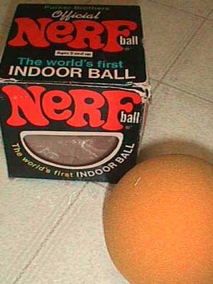

# Good Earth
* Author: Andy Hertzfeld
* Story Date: October 1980
* Topics: Apple Spirit, Origins, Management, Buildings
* Characters: Bud Tribble, Steve Jobs, Jef Raskin, Bill Atkinson, Rod Holt, Burrell Smith, Joanna Hoffman, Brian Howard, Steve Wozniak, Mike Scott, Mike Markkula
* Summary: The original Mac team's original office

 
    
In 1979 and 1980, Jef Raskin's Macintosh project was a four person research effort with a tenuous existence.  It wasn't considered to be very important within Apple, and was almost cancelled a couple of times.  When Apple had another major reorganization in the fall of 1980, it was terminated again, but Jef pleaded with Mike Scott and Mike Markkula for more time, and was granted three more months to show that he was really onto something. As part of the re-org, the four person Macintosh team (Jef Raskin, Brian Howard, Burrell Smith, Bud Tribble, soon to be joined by Joanna Hoffman) relocated to a small office building a few blocks from the main Apple campus.

The new office, located at 20863 Stevens Creek Boulevard, was called the "Good Earth" building, because it was adjacent to a Good Earth restaurant.  In fact, the office used to be Apple's very first office in Cupertino, after they moved out of Steve Jobs' parents' house, and was later used as the first office of the Lisa project, when the Lisa team had fewer than ten employees.  The Mac team moved in, outfitting it with lots of bean bag chairs and all kinds of interesting toys.

Jef was very playful and always encouraged his team to express themselves creatively, so the office quickly began to look more like a day care center than an engineering lab, overflowing with playthings.  Periodically, work would cease and the entire team, plus any visitors who might be on the premises, would play some organized game, usually led by Jef and Brian.

The favorite game, which was usually played at least once a day, just after lunch, was a form of tag played with Nerf balls.  There were dozens of brightly colored Nerf balls scattered around the office. The rules would be improvised, but usually the person who was "it" had to confer it-hood on someone else by hitting them with a Nerf ball.  This inspired everyone to surround their work area with barricades made out of cardboard, to provide cover during the game, making part of the office look like a cardboard maze.

Jef and Brian were both serious musicians, so the office was also littered with a variety of musical instruments, sometimes erupting in spontaneous concerts.  Another one of Jef's interests was model airplanes and automobiles, especially radio controlled ones.  It wasn't unusual to see a radio controlled car dart underneath your desk, and occasionally everyone would go outside to see the maiden voyage of the latest plane.

Jef was writing his "Book of Macintosh" during much of 1979 and all of 1980, articulating his vision in ever finer detail.  Burrell's 6809-based prototype came alive in the early part of 1980, but then he went off to work on the low cost Apple II project.  Jef hired Marc Lebrun to write software in early 1980, but Marc was more interested in Lisp machines than a limited memory microcomputer like the Mac, so nothing much happened until he was replaced by Bud Tribble in September 1980.

Bud knew Jef from UCSD, and was also good friends with Bill Atkinson.  They had a part time, two person consulting company together in Seattle called Synaptic Systems while they were both graduate students. Bill and Jef convinced Bud to take a one year leave of absence from the M.D/Ph.D. program he was pursuing at University of Washington at Seattle. Bud was in the fifth year of a seven M.D/Ph.D. program.  Instead of returning to med school, Bud moved into a spare room at Bill Atkinson's house, and started work on the Mac project at Apple.  He quickly began to breathe life into Burrell's languishing prototype, writing some graphics routines for the 6809.

So even though the Mac project had been going for more than a year, the move to Good Earth in October 1980 came at an interesting time, with a new but limited lease on life, and software finally starting to happen.  But the Good Earth era was rather short lived.

Around two months  after the move, Bud convinced Burrell to consider using the 68000 processor instead of the 6809.  Burrell came up with a brilliant design, catching the attention of Steve Jobs.  Steve took over the project and quickly recruited most of the early Apple II crew that he trusted, including Steve Wozniak and Rod Holt, and moved the project to larger offices a half mile away, in Texaco Towers (see Texaco Towers).