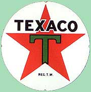

# Texaco Towers
* Author: Andy Hertzfeld
* Story Date: January 1981
* Topics: Origins, Lisa, Buildings
* Characters: Steve Jobs, Dan Kottke, Brian Howard, Bud Tribble, Jef Raskin, Burrell Smith, George Crow
* Summary: The office where the Mac became real

 
    
The main Apple buildings on Bandley Drive in Cupertino had boring numerical appellations (Bandley 1, Bandley 3, etc.), but from the beginning the Lisa team gave the buildings they inhabited more interesting names.  The original office for the Lisa team was adjacent to a Good Earth restaurant (in fact, it was Apple's original office in Cupertino), so it was called the "Good Earth" building.  When the team grew larger and took over two nearby office suites, they were designated "Scorched Earth" (because it housed the hardware engineers, who were all smokers) and "Salt of the Earth".

When the Lisa team became a separate division in 1980, they moved to a larger, two-story office building a block or two away from the main building on Bandley Drive.  Everyone was so impressed at having two stories (all the other Apple buildings were single story) that the building was dubbed "Taco Towers", although I'm not sure where the "Taco" part came from.

In December 1980, the embryonic Macintosh team was residing in the Good Earth building, which was abandoned by the Lisa team for Taco Towers earlier in the year.  When Steve Jobs took over the project, he moved it to a new building that was large enough to hold about fifteen or twenty people, a few blocks away from the main Apple campus at the southeast corner of Stevens Creek Boulevard and Saratoga-Sunnyvale Road.

There was a Texaco gas station at the corner, and a two-story, small, brown, wood paneled office building behind it, the kind that might house some accountants or insurance agents.  Apple rented the top floor, which had four little suites split by a corridor, two on a side.   Because of the proximity of the gas station and the perch on the second story, as well as the sonic overlap between "Taco" and "Texaco", the building quickly became known as "Texaco Towers".

Burrell Smith and Brian Howard took over the side of the building closest to the gas station and built a hardware lab, while Bud Tribble and Jef Raskin set up shop on the other side, installing desks with prototype Lisas to use for software development.  Bud's office had four desks, but he was the only one occupying it at first.   Steve didn't have an office there, but he usually came by to visit in the late afternoon.

 In the corner of Bud's office, on one of the empty desks, was Burrell's 68000 based Macintosh prototype, wired-wrapped by Burrell himself, the only one currently in existence, although both Brian Howard and Dan Kottke had started wire-wrapping additional ones.   Bud had written a boot ROM that filled the screen with the word "hello", rendered in a small bitmap that was thirty two pixels wide for easy drawing, which showed off the prototype's razor sharp video and distinctive black on white text.

When I started on the project in February 1981, I was given Jef's old desk in the office next to Bud's.  Desk by desk, Texaco Towers began to fill up, as more team members were recruited, like Collette Askeland to lay out the PC boards, or Ed Riddle to work on the keyboard hardware.  When George Crow started, there wasn't an office available for him, so he set up a table in the common foyer and began the analog board design there.

Burell and I liked to have lunch at Cicero's Pizza, which was an old Cupertino restaurant that was just across the street.  They had a Defender video game, which we'd play while waiting for our order.   We'd also go to Cicero's around 4pm almost every day for another round of Defender playing; Burrell was getting so good he would play for the entire time on a single quarter (see Make a Mess, Clean it Up!).

In May of 1981, Steve complained that our offices didn't seem lively enough, and gave me permission to buy a portable stereo system for the office at Apple's expense.  Burrell and I ran out and bought a silver, cassette-based boom box right away, before he could change his mind.   After that we usually played cassette tapes at night or on the weekends when there was nobody around that it would bother.

By early 1982, the Mac team was overflowing Texaco Towers and it was obvious that we'd have to move to larger quarters soon.   Steve decided to move the team back to the main Apple campus, into Bandley 4, which had enough space for more than 50 people.   The 68000 based Macintosh was born in the Good Earth building, but I still think of Texaco Towers as the place where it came of age, transitioning from a promising research project into a real, world-changing commercial product.