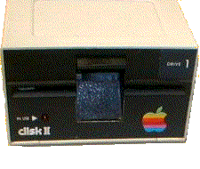

# Nybbles
* Author: Andy Hertzfeld
* Story Date: February 1981
* Topics: Hardware Design, Prototypes, Software Design, Early Programs, Technical
* Characters: Andy Hertzfeld, Steve Wozniak, Burrell Smith, Brian Howard
* Summary: My first job on the Macintosh project

 

    
My very first job on the Mac project was to help Burrell Smith and Brian Howard verify that the disk controller was working properly. They had just wired up a Woz-style disk controller to the Macintosh prototype, but they had no way to test if it was working properly without writing a fairly complicated program.

When I arrived on the scene, they were trying to debug a small 68000 routine that they had written together.  They had written a simple loop to access the disk controller and were watching it execute with a logic analyzer.  But neither of them were much of a programmer, so I was able to help right away, even though I had never programmed the 68000 before.

The Apple II disk controller, designed six months after the Apple II itself was complete, was Steve Wozniak's crowning achievement.  His five chip disk controller card out-performed competitive controllers that were four times as expensive by shifting most of the responsibilities from hardware to software.  In Woz's approach, the software was responsible for doing all of the encoding and decoding, head stepping, etc.  This allowed Woz to improve the capacity and performance over standard techniques.

In those days, most floppy disks used a recording technique called FM encoding, where one clock bit would precede each data bit to improve reliability.  But that was overkill, it was possible to get more data on a disk if you used some of the clocks for data.  So Woz used a technique called "group encoding" (although Woz called it "nybblizing") to get five bits out of every eight transitions instead of four.  He later figured out how to use six bits out of eight (the "16 sector" format vs. the earlier "13 sector" - non-Wozian drives used 10 sectors) improving the density further.

The software stored eight transitions at a time into the disk controller's shift register.  Since each transition was 4 microseconds long, each "nybble" of data had to be provided every 32 microseconds.   Eventually, Woz figured out how to decode the data on the fly, in between fetching nybbles, so he could achieve the ultimate in performance, one to one interleave.  But he never could figure out how to encode on the fly, since the Apple II's microprocessor just wasn't fast enough, and the timing had to be more precise for writing.

But the Macintosh's microprocessor was at least four times faster than the Apple II, more like 10 times if you were manipulating 32 bit values, so writing one-to-one interleave disk routines was simple on the Macintosh.  It was fun for me to achieve the holy grail of disk performance without breaking into a sweat.  But first there was a big problem to solve.

Woz's disk technology required that the software feed it new data every 32 microseconds exactly.  If we were even a single microsecond early or late, it would cause a glitch in the data and ruin it.  In order to write the routines, I needed to know how fast the Macintosh executed each instruction.  The manual gave the number of clocks for each instruction, but I wasn't sure how long it took to fetch from memory.  So of course, I asked Burrell what the timings were, but I was surprised at his response.

"I don't know. The Mac is synchronous, just like the Apple II, so each instruction has the same timing, every time you execute it, so you will be able to write disk routines that have exact timing.  I don't know what it is, so we'll just measure it.  Why don't you write your routine and we'll measure it with the logic analyzer."

So I spent a couple of days writing the basic routines, and then sat down with Burrell and Brian in front of the logic analyzer and we watched each instruction execute, writing down how long each instruction took.  They usually worked like we expected, but occasionally some things were surprising and I had to adjust the code.  After a few fixes, I had the raw disk routines both reading and writing, doing the encoding and the decoding on the fly, achieving Woz's long sought after one-to-one interleave.

I expected to feel elated when I finally got the disk reading and writing, but it didn't feel that satisfying, because you couldn't really see it in action.  The previous year, soon after Woz wrote his one-to-one interleave read routines, I made some fast slideshow disks for the Apple II, where the screen was filled with a new image in less than a second, twice as fast as previously possible.  I thought it would be fun to use the new disk routines to read the slideshow disks on the Mac.

By this time, it was around 7pm and everyone else was going out to dinner.  I was invited to come, but I was so close to getting the slideshow working, that I didn't think that I could concentrate on eating until I got it done.  I was alone in the office when I finally got it working, the embryonic Mac reading and displaying images from an Apple II disc as fast as possible.  It was far and away the coolest thing a Mac could do so far.  It was fun to show it to everyone when they came back from dinner.

