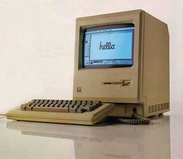

# More Like A Porsche
* Author: Andy Hertzfeld
* Story Date: March 1981
* Topics: Industrial Design, Hardware, Prototypes
* Characters: Terry Oyama, Jerry Manock, Steve Jobs, Jef Raskin
* Summary: The design of the Macintosh case

 
    
In March 1981, I had been working on the Mac team for only a month.  I was used to coming back to the office after dinner and working for a few hours in the evening.  Even though many of the early Mac team members usually worked late, and we often went out to dinner together, I was by myself one evening when I returned to Texaco Towers after dinner around 8pm.  As soon as I entered the building, I heard loud voices emanating from Bud's office, which was adjacent to mine, apparently engaged in a spirited discussion.

"It's got to be different, different from everything else." I recognized Steve Jobs' voice before I saw him as I passed by the door of Bud's office.  He was standing near the doorway, near our only working prototype, conversing with someone who I didn't recognize, that Steve introduced to me as James Ferris, Apple's director of Creative Services.  "James is helping me figure out what the Mac should look like," he told me.

The plan of record for the Macintosh industrial design was still the one conceived by Jef Raskin, which chose a horizontally oriented, lunch-box type shape, with the keyboard folding up into the lid of the computer for easy transportability, kind of like the Osborne I, which we weren't aware of at the time. But Steve had a real passion for industrial design, and he never seriously considered following Jef's recommendations.

I went into my office and started to program, working on improving the code that drove the serial link between the Mac and Lisa, at Bud's request.  But I couldn't help but overhear the passionate discussion taking place next door between Steve and James Ferris.  For some reason, they were talking about cars.

"We need it to have a classic look, that won't go out of style, like the Volkswagen Beetle", I heard Steve tell James.

"No, that's not right.", James replied. "The lines should be voluptuous, like a Ferrari."

"Not a Ferrari, that's not right either", Steve responded, apparently excited by the car comparison.  "It should be more like a Porsche!"   Not so coincidentally, in those days Steve was driving a Porsche 928.

I thought it was kind of pompous to compare computers with sports cars, even metaphorically.  But I was impressed with Steve's passion for elegance in the industrial design and his powers of discrimination continually amazed me as the design took shape.

Steve recruited Jerry Manock to lead the industrial design effort.  Jerry was the early Apple employee who had designed the breakthrough plastic case for the Apple II, initially as a contractor before signing up as an employee.  For the Macintosh, Jerry recruited a talented designer named Terry Oyama, to do most of the detailed drafting of the actual design.  The hard tooling for the plastic case was the component with the longest lead time, so we had to get started right away.

A week or so after the car conversation, Steve and Jerry decided that the Macintosh should defy convention and have a vertical orientation, with the display above the disk drive instead of next to it, in order to minimize desktop footprint, which also dictated a detachable keyboard.  That was enough of a direction for Terry to draft a preliminary design and fabricate a painted, plaster model.

We all gathered around for the unveiling of the first model.  Steve asked each one of us, in turn, to say what we thought about it.   I though it was cute and attractive, looking a lot like an Apple II, but with a distinctive personality all its own.  But, after everyone else had their say, Steve cut loose with a torrent of merciless criticism.

"It's way too boxy, it's got to be more curvaceous.  The radius of the first chamfer needs to be bigger, and I don't like the size of the bezel.  But it's a start."

I didn't even know what a chamfer was, but Steve was evidently fluent in the language of industrial design, and extremely demanding about it.   Over the next few months, Jerry and Terry iterated on the design.  Every month or so, there was a new plaster model.  Before a new one was unveiled to the team, Jerry lined up all of the previous ones, so we could compare the new one with past efforts.  One notable improvement was the addition of a handle at the top of the case, to make it easier to carry.   By the fourth model, I could barely distinguish it from the third one, but Steve was always critical and decisive, saying he loved or hated a detail that I could barely perceive.

At one point, when we were almost finished, Steve called up Jerry over the weekend and told him that we had to change everything.   He had seen an elegant new Cuisinart at Macys' on Saturday, and he decided that the Mac should look more like that.   So Terry did a whole new design, based around the Cuisinart concept, but it didn't pan out, and soon we were back on the old track, after a one-week diversion.

After five or six models, Steve signed off on the design, and the industrial design team shifted gears to do the laborious engineering work necessary to convert the conceptual model into a real, manufacturable plastic case.  In February 1982, it was finally time to release the design for tooling.  We held a little party, complete with champagne (see Signing Party) to celebrate sending off the design into the world, the first major component of the Macintosh to be completed.