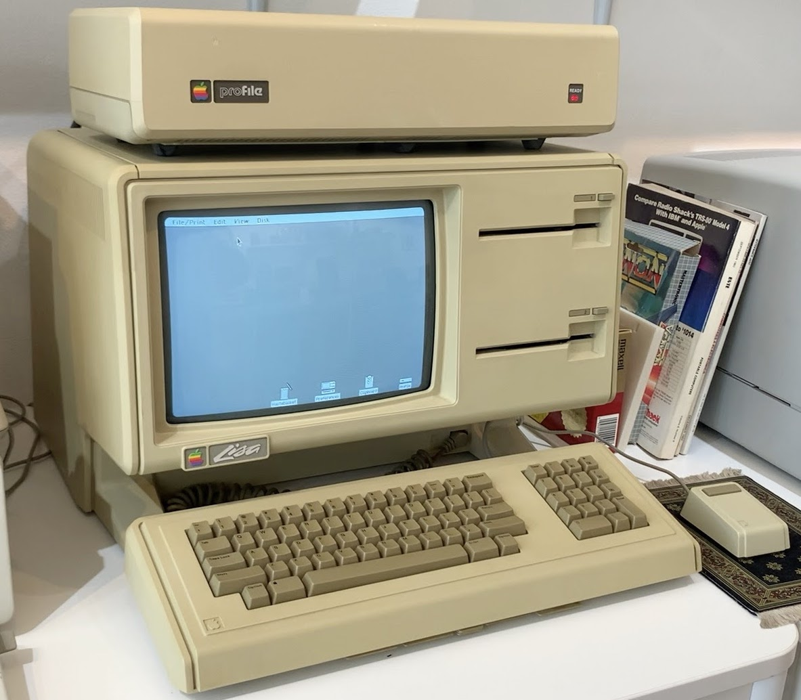

# Square Dots
* Author: Andy Hertzfeld
* Story Date: April 1981
* Topics: Hardware Design, Management, Lisa
* Characters: Bill Atkinson, Burrell Smith, Rich Page, Wayne Rosing, Tom Malloy
* Summary: The Lisa had a different screen resolution than the Macintosh

 

From the very beginning, even before it had a mouse, the Lisa was designed to be an office machine, and word processing was considered to be its most important application.  In the late seventies, the acid test for an office computer (as compared with a hobby computer) was the ability to display 80 columns of text.

The Lisa team decided to optimize their display for horizontal resolution, in order to be able to display 80 columns of text in an attractive font. The vertical resolution wasn't as important, because vertical scrolling works much better for text than horizontal scrolling.  The designers decided to endow Lisa with twice as much horizontal resolution as vertical, using a 720 by 360 pixel display, with pixels that were twice as high as they were wide. This was great for text oriented applications like the word processor, but it made things somewhat awkward for the more graphical applications.

When Burrell redesigned the Macintosh in December 1980 to use the same microprocessor as Lisa, the Motorola 68000, it set off shock waves within Apple.  Not only was Burrell's new design much simpler than Lisa, with less than half the chip count, but it also ran almost twice as fast, using an 8 megahertz clock instead of a 5 megahertz clock.   Among other advantages was the fact that the Mac's 384 by 256 pixel display had the identical horizontal and vertical resolution, a feature that we called "square dots".  Square dots made it easier to write graphical applications, since you didn't have to worry about the resolution disparity.

Bill Atkinson, the author of Quickdraw and the main Lisa graphics programmer, was a strong advocate of square dots, but not everyone on the Lisa team felt the same way.  Tom Malloy, who was Apple's first hire from Xerox PARC and the principal author of the Lisa word processor, thought that it was better to have the increased horizontal resolution.  But Burrell's redesign moved the debate from the theoretical to the pragmatic, by creating a square dots machine to compare with the Lisa.

The Lisa hardware was scheduled to go through a final round of design tweaks, and Bill tried to convince them to switch to square dots.  He mentioned his desire to Burrell, who responded by working over the weekend to sketch out a scaled up version of the Macintosh design that featured a full 16-bit memory bus with a 768 by 512 display and square dots, that would also run twice as fast as the current Lisa design.  Bill convinced the Lisa engineering manager, Wayne Rosing, that he should at least consider adopting some of Burrell's ideas, and arranged for the leadership of the Lisa team to get a demo of the current Macintosh, and learn about Burrell's new scaled-up design.

Wayne Rosing led a delegation of his top hardware and software guys over to Texaco Towers for a demo on a Monday afternoon, including hardware guys Rich Page and Paul Baker and software manager Bruce Daniels.  We ran various graphics demos, with Bill Atkinson doing the talking, and then Burrell gave a presentation on the Mac design, and his ideas for scaling it up to 768 by 512 display. Everyone seemed pretty impressed and Bill was optimistic that they would make the change.

After a few days, Bill told us the disappointing news that Wayne had decided that there wasn't enough time to embark on such a radical redesign, since at that point the Lisa was scheduled to ship in less than a year.  It ended up shipping around two years later with the original 720 by 360 resolution and relatively slow microprocessor, which became a problem when Apple decided to offer a Macintosh compatibility mode for Lisa in 1984. The emulation software didn't try to compensate for the different resolutions, so the applications were distorted by the resolution disparity, almost like looking at a fun-house mirror.   It would have continued to be a problem for Apple if the Lisa hadn't been discontinued in 1985.