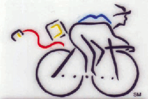

# Bicycle
* Author: Andy Hertzfeld
* Story Date: April 1981
* Topics: Management, Apple Spirit
* Characters: Rod Holt, Steve Jobs, Jef Raskin
* Summary: Rod wants to change the name of the project

 
    
Jef Raskin chose the name "Macintosh", after his favorite kind of apple, so when Jef was forced to go on an extended leave of absence in February 1981, Steve Jobs and Rod Holt decided to change the name of the project, partially to distance it from Jef. They considered "Macintosh" to be a code name anyway, and didn't want us to get too attached to it.

Apple had recently taken out a two page ad in Scientific American, featuring quotes from Steve Jobs about the wonders of personal computers.  The ad explained how humans were not as fast runners as many other species, but a human on a bicycle beat them all.  Personal computers were "bicycles for the mind."

A month or so after Jef's departure, Rod Holt announced to the small design team that the new code name for the project was "Bicycle", and that we should change all references to "Macintosh" to "Bicycle".  When we objected, thinking "Bicycle" was a silly name, Rod thought that it shouldn't matter, "since it was only a code name".

Rod's edict was never obeyed.  Somehow, Macintosh just seemed right.  It was already ingrained with the team, and the "Bicycle" name seemed forced and inappropriate, so no one but Rod ever called it "Bicycle".   For a few weeks, Rod would reprimand anyone who called it "Macintosh" in his presence, but the new name never acquired any momentum.  Finally, around a month after his original order, after someone called it "Macintosh" again, he threw up his hands in exasperation and told us, "I give up!  You can call it Macintosh if you want.  It's only a code name, anyway."

But it was a code name that proved to be sturdy and resilient.  In the Fall of 1982, Apple paid tens of thousands of dollars to a marketing consulting firm to come up with a themed set of names for Lisa and Macintosh.  They came up with lots of ideas, including calling the Mac the "Apple 40" or the "Apple Allegro".  After hearing all the suggestions, Steve and the marketing team decided to go with Lisa and Macintosh as the official names.   They did manage to reverse engineer an acronym for Lisa, "Local Integrated Systems Architecture", but internally we preferred the recursive "Lisa: Invented Stupid Acronym", or something like that. Macintosh seemed to be acroynm proof.

But there was still a final hurdle to clear - the name was too close to a trademark from the McIntosh stereo company.  I'm not sure how the situation was resolved (I suspect that Apple paid them a modest amount), but toward the end of the retreat in January 1983, Steve announced to the team that we had gotten rights to use the name.  He dashed a champagne bottle against one of the prototypes, and declared, "I christen thee Macintosh!"