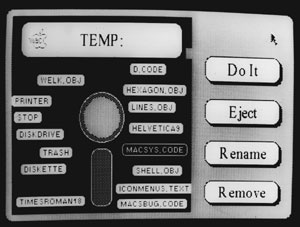

# Early Demos
* Author: Andy Hertzfeld
* Story Date: April 1981
* Topics: Hardware Design, Prototypes, Software Design. Early Programs
* Characters: Andy Hertzfeld, Bud Tribble, Rich Page, Bob Bishop, Bill Atkinson, Bruce Horn
* Summary: Various demos showed off what the hardware could do

 

    
The first demo program for the 68000-based Macintosh was written by Bud Tribble, as part of the original boot ROM.  It filled the screen with the word 'hello' in tiny letters, more than a hundred times.  When the Mac was switched on, it performed some hardware diagnostics, filled the screen with 'hello', and then listened to its serial ports for commands to execute.  The 'hellos' told us that everything was working OK.

The boot ROM allowed us to download other programs from the Lisa to the Mac over a serial line, to try out new code and test or demo the prototype.  There was a ton of work to do: writing an operating system, hooking up the keyboard and mouse, getting Bill's graphics and UI routines running, and many other tasks, but we also sometimes just did things for fun.

In early March of 1981, I wrote a fast, disk-based slideshow for the Mac the same night that I got the disk routines going (see Nybbles).  It was exciting to see detailed, relatively high resolution images parading across the display so quickly.

By April, I was experimenting with writing custom graphics routines, to show off the raw graphical horsepower of the system.  I had written a few ball-bouncing routines on the Apple II, and I thought it would be interesting to see how many balls could the Mac animate smoothly.  I wrote some 68000 code to draw 16 by 16 images very quickly, and I found that I could keep more than one hundred balls animating smoothly, which seemed pretty impressive.  I also wrote a small sketch program with a seed fill using Bill Atkinson's 8 by 8 pattern bitmaps, as well as an entertaining Breakout game, where I implemented Bud's idea of having to dodge the bricks when they fell down after you hit them.

Bob Bishop had experimented with a variety of graphical special effects on the Apple II, so I thought I'd try some of them out on the Mac.   The idea was to transfer an image onto the screen in an entertaining way.  The one that I liked best was a kind of waterfall effect, where you copied an image onto the screen using a varying number of multiple copies of successive scan lines, stretching the image vertically.  The image looked like it poured onto the screen like water going over a waterfall; it somehow was rather hypnotic.  I often used it with an image of the Muppets I converted from the Apple II, and the "Stretching Muppets" demo became pretty well known.

In May 1981, Bud stayed up all night and ported QuickDraw and some pull-down menu code from the Lisa to the Mac (see Busy Being Born, Part 2).  For the first time, we were running mouse-based software with real pull-down menus.  The best part of the demo was the pattern menu, which showed off the extensibility of the menu routines to draw an entirely graphical menu.

In June 1981, we realized that it would be worthwhile to create a stand-alone demo environment, where the Macintosh booted and ran programs from its own disk, even though we'd only use it temporarily.  Our own operating system wasn't close to usable yet, but Rich Page had written a simple operating system called the "Lisa Monitor" which was based on UCSD Pascal, that was pretty easy to port - all we had to do was integrate our I/O drivers.  Soon, using the Monitor, a Mac could boot up and run demos without help from a Lisa.

In the Lisa Monitor environment, it was easy for us to run QuickDraw-based programs.  Soon, we had a Window Manager demo, featuring balls bouncing in multiple windows (see Bouncing Pepsis), as well as a nice icon editor and MacSketch, an early ancestor of MacPaint going.

I think the most interesting early demo was an early prototype for the Finder, written by Bruce Horn and myself in the spring of 1982, and pictured above.  Its window was filled with an image of a floppy disc, over which the files were represented as draggable tabs.  You could select files and perform operations on them by selecting them and then clicking on command button.  Bruce also made a second mock-up, with folder icons, which influenced Bill's design for Lisa's Filer (see Rosing's Rascals), which we eventually adopted instead.  It provides an interesting glimpse of possibilities that we might have chosen instead of what seems so familiar today.

