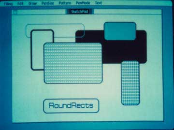

# Round Rects Are Everywhere!
* Author: Andy Hertzfeld
* Story Date: May 1981
* Topics: Software Design, Inspiration, QuickDraw
* Characters: Steve Jobs, Bill Atkinson
* Summary: Steve inspires Bill by pointing out something about the real world

 
    
Bill Atkinson worked mostly at home, but whenever he made significant progress he rushed in to Apple to show it off to anyone who would appreciate it.   This time, he visited the Macintosh offices at Texaco Towers to show off his brand new oval routines, which were implemented using a really clever algorithm.

Bill had added new code to QuickDraw (which was still called LisaGraf at this point) to draw circles and ovals very quickly.  That was a bit hard to do on the Macintosh, since the math for circles usually involved taking square roots, and the 68000 processor in the Lisa and Macintosh didn't support floating point operations.  But Bill had come up with a clever way to do the circle calculation that only used addition and subtraction, not even multiplication or division, which the 68000 could do, but was kind of slow at.

Bill's technique used the fact the sum of a sequence of odd numbers is always the next perfect square (For example, 1 + 3 = 4, 1 + 3 + 5 = 9, 1 + 3 + 5 + 7 = 16, etc).  So he could figure out when to bump the dependent coordinate value by iterating in a loop until a threshold was exceeded.  This allowed QuickDraw to draw ovals very quickly.

Bill fired up his demo and it quickly filled the Lisa screen with randomly-sized ovals, faster than you thought was possible.  But something was bothering Steve Jobs.  "Well, circles and ovals are good, but how about drawing rectangles with rounded corners?  Can we do that now, too?"

"No, there's no way to do that.  In fact it would be really hard to do, and I don't think we really need it".  I think Bill was a little miffed that Steve wasn't raving over the fast ovals and still wanted more.

Steve suddenly got more intense.  "Rectangles with rounded corners are everywhere! Just look around this room!". And sure enough, there were lots of them, like the whiteboard and some of the desks and tables.  Then he pointed out the window.  "And look outside, there's even more, practically everywhere you look!".  He even persuaded Bill to take a quick walk around the block with him, pointing out every rectangle with rounded corners that he could find.

When Steve and Bill passed a no-parking sign with rounded corners, it did the trick.  "OK, I give up", Bill pleaded.  "I'll see if it's as hard as I thought."  He went back home to work on it.

Bill returned to Texaco Towers the following afternoon, with a big smile on his face.  His demo was now drawing rectangles with beautifully rounded corners blisteringly fast, almost at the speed of plain rectangles.  When he added the code to LisaGraf, he named the new primitive "RoundRects".   Over the next few months, roundrects worked their way into various parts of the user interface, and soon became indispensable.