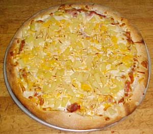

# Pineapple Pizza
* Author: Andy Hertzfeld
* Story Date: May 1981
* Topics: Hardware, Prototypes, Management
* Characters: Burrell Smith, Brian Howard, Dan Kottke, Steve Jobs, Bud Tribble
* Summary: We stay late to bring up the first printed circuit board

 
    
When I began working on the Mac project in February 1981, there was still only one single 68000-based Macintosh prototype in existence, the initial digital board that was wire-wrapped by Burrell himself.  It was now sitting in the corner of Bud Tribble's office, on one of the empty desks, attached to a small, seven-inch monitor.  When powered up, the code in the boot ROM filled the screen with the word 'hello', in lower case letters and a tiny font, rendered crisply on the distinctive black-on-white display.

Dan Kottke and Brian Howard were already busy wire-wrapping more prototype boards, carefully following Burrell's drawings. In a week or so, I received the second prototype for my office, so I could work on the low level I/O routines, interfacing the disk and keyboard, while Bud worked on the mouse driver and porting Bill's graphics routines.

The next big step for the hardware was to lay out a printed circuit board.  We recruited Collette Askeland, the best PC board layout technician in the company, from the Apple II group.  Burrell spent a week or two working intensely with Collette, who used a specialized CAD machine located in Bandley 3 to input the topology and route the signals, eventually outputting a tape containing all the information needed to fabricate the boards.

Burrell and Brian Howard checked and rechecked the layout, which was tediously expressed as thousands of node connections, and after a day or two they decided they were ready to send it out for fabrication.   We were hoping to get the first sample boards back before the weekend, but it looked like they weren't going to make it.  Finally, around 4:30pm on a Friday afternoon, they arrived.

Burrell figured that it would take at least two or three hours to assemble a board, and then even longer to troubleshoot the inevitable mistakes, so it was too late to try to get one working that evening.  Maybe they would come in on Saturday to get started, or maybe they'd wait until Monday morning.  While they were discussing it, Steve Jobs strolled into the hardware lab, excited as usual.

"Hey, I heard that the PC boards finally arrived.  Are they going to work?  When will you have one working?"

Burrell explained that the boards had just arrived, and that it would take at least a couple of hours to assemble one, so they were thinking about whether to start tomorrow morning or wait until Monday.

"Monday? Are you kidding?", replied Steve,  "It's your PC board, Burrell, don't you want to see if it works tonight?  I'll tell you what, if you can get it to work this evening, I'll take you and anyone else who sticks around out for Pineapple Pizza."

Steve knew that Pineapple Pizzas had recently replaced Bulgarian Beef as Burrell's current food obsession (which, as a staunch vegetarian, he thought was a positive development) and that Burrell wanted a Pineapple Pizza pretty much every chance he could get.   Burrell looked at Brian Howard and shrugged.  "OK, we may as well give it a shot now.  But I don't think we'll be able to get it working before the restaurants close."

So Burrell and Brian got busy, selecting a board and stuffing it with sockets, carefully soldering them in place, while five or six of the rest of us, including Steve, sat around and kibitzed.   Burrell seemed a little tense and impatient, since he didn't like the pressure of bringing up a board in front of so many spectators.   Every five minutes or so, he referred to the awaiting Pineapple Pizza, speculating about how good it was going to taste.

Finally, around 8pm or so, the board was assembled enough to try to power it on for the very first time.  The prototype was hooked up to an Apple II power supply and a small monitor, and fired up as we held our breath.  The screen should have been filled with 'hellos', but instead all that was there was a checkerboard pattern.

We were all disappointed, except for Burrell.  "That's not too bad", he commented, "It means the RAM and the video generation are more or less working.  The processor isn't resetting, but it looks like we're pretty close."  He turned to look directly at Steve.  "But I'm too hungry to keep working - I think it's time for some Pineapple Pizza."

Steve smiled and agreed that it was good enough for the first night, and it was time to celebrate.  The seven or eight of us who stayed late drove in three cars to Burrell's favorite Italian restaurant, Frankie, Johnny and Luigi's in Mountain View, ordering three large Pineapple Pizzas, which tasted great.

