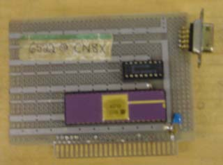
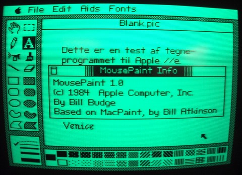

# Apple II Mouse Card
* Author: Andy Hertzfeld
* Story Date: June 1981
* Topics: Software Design, Apple Spirit, Prototypes, Technical, Apple II, Compensation
* Characters: Andy Hertzfeld, Burrell Smith, Dan Kottke, Bill Budge, Steve Jobs, Bud Tribble, Bill Atkinson
* Summary: We hooked up a mouse to the Apple II

 

    
Burrell's Macintosh design was elegant and clever in many different ways, always using minimal hardware resources for maximal value.  The mouse interface was a typical example, using just a fraction of the general purpose 6522 VIA chip that Burrell had incorporated.  The mouse is hooked up to the 6522 so that it generates an interrupt each time the mouse moved a notch horizontally or vertically, with a one bit line to sense the mouse button.  That was it - the rest was done in software.

Meanwhile, my good friend Bill Budge, who was an amazing Apple II games programmer, came up with an incredibly fast way to draw proportional text on the Apple II graphics screen, using seven pre-shifted tables.  He also wrote a very fast BitBlit routine (BitBlit was the most important graphics primitive in GUIs).  It was crying out for a way to interface the mouse, so you could have a complete graphical user interface on the Apple II.

Bud Tribble had written the initial code to drive the mouse on the Macintosh, but I had to maintain it, so I was familiar with how it worked.  I had used a 6522 chip the previous year, since the Apple III had one, which I had programmed to shift bits out to the Silentype thermal printer.  I realized that all that was required to interface a mouse to the Apple III was to make a simple connector to route the appropriate signals to the proper pins.

I asked Dan Kottke to wire up a connector.  Once that was finished, it only took a few hours to write cursor routines and a driver.  We had the beginnings of a full graphical user interface going on the Apple III, with no additional hardware required.

It was exciting enough that I started helping Bill Budge flesh out the program, careful to work on it only after regular hours.  Pretty soon, we had pull-down menus going, and then a simple proportional text word processor.  The only problem was that  Apple IIIs weren't selling very well; we really needed to get it running on the Apple II somehow.

I talked to Burrell about the problem, which basically came down to making a peripheral card for the Apple II that included a 6522 VIA chip on it.  Burrell came back the next day with a brilliant two chip design, just the VIA and a tiny dual flip-flop chip to synchronize it.

To move the mouse cursor without flickering, both the Mac and the Apple III code used a vertical blanking interrupt, which drew the cursor during the time interval when no video was being painted.  Unlike the Mac and Apple III, the Apple II didn't have a vertical blanking interrupt.  The most brilliant part of Burrell's design involved how it synchronized with the video, without running a wire to pick up the video signal.

The 6522 chip had a timer which could generate an interrupt at a specified interval.  The problem was synchronizing it with the video, since the video generation was not accessible to the processor.  Burrell solved the problem by wiring up the spare flip flop to the low bit of the data bus, using it to latch whatever data the video was displaying so the processor could read it.

To synchronize with the video, Burrell had me fill the Apple II's frame buffer so the low bit was on most of the time, but set off at the end of the last scan line.  I wrote a routine to sit in a tight loop, reading the latch.   When the low bit changed, we would know the vertical blanking interval had just begun.

The Apple II wasn't fast enough to keep up with its own frame buffer.  A new byte of video data flew by every microsecond, which was only one processor cycle.  It took at least 10 processor cycles to iterate through a loop, so we ran the risk of never seeing the low bit change.  Burrell had a way around this, though - if the loop time was relatively prime to the display frequency, it eventually had to slip into place.  I wrote a 17 microsecond loop that fit the bill, and we were delighted to see it work perfectly.

Bill Atkinson had told Steve that you couldn't pull off a decent graphical user interface on the Apple II because of the weakness of its 6502 processor and the complexity of Woz's convoluted frame buffer. But, after a little more work on the software, we had a cool little GUI for the Apple II, with a proportional text word processor, in the summer of 1981.  We thought that we had had a potentially valuable product on our hands.

We were reluctant to show it to Steve, knowing that he would want to commandeer it, but he heard about it from someone and demanded to see it.  We showed it to him, and, unfortunately, he loved it.  But he also insisted that Apple owned all the rights to it, even though we had developed it in our spare time.

Steve couldn't insist that Apple owned all of it, because Bill Budge wasn't an Apple employee at the time.  But Steve could claim complete ownership of the interface card, which he said was developed with Apple resources.  Burrell and I were pretty upset, because we did it on our own time and thought that we should be compensated, but it's really hard to argue with Steve, especially about money.

We ended up turning over Burrell's design to the Apple II division, but they didn't think the Apple II could deal with interrupts properly (even though we had demonstrated that it could), so they added tons of hardware and ended up with more than a dozen chips.  Steve made a deal with Bill Budge that eventually resulted in MousePaint, a MacPaint clone for the Apple II which was bundled with the mouse card.  Burrell and I got over it quickly, but a bit of bitterness lingered, and the whole episode whetted our appetites for eventually working on our own.