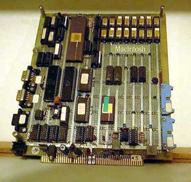
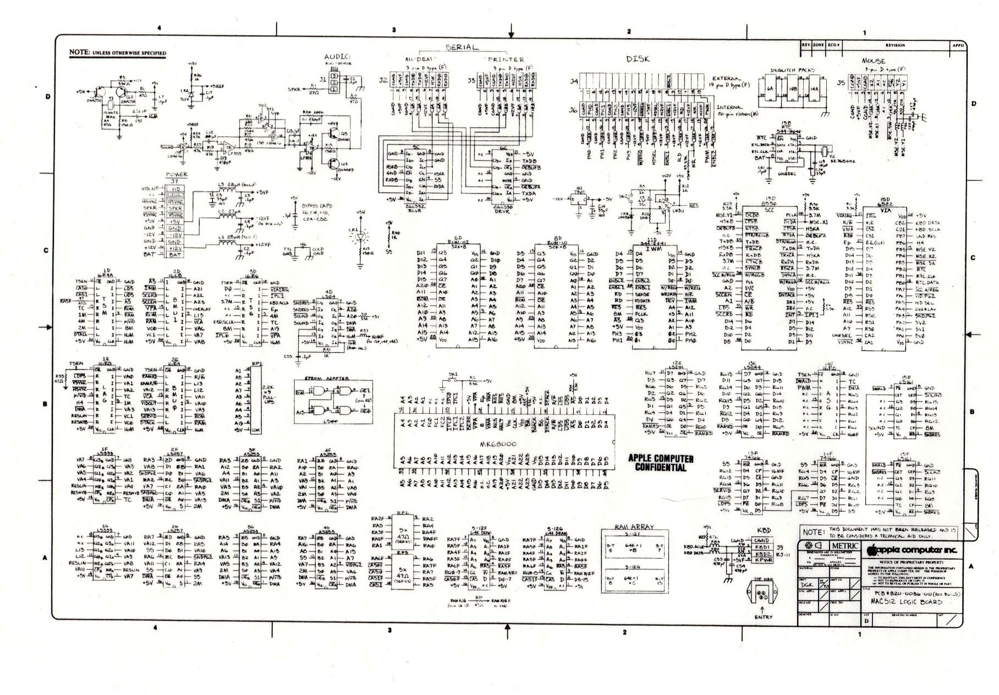

# Macintosh Prototypes
* Author: Daniel Kottke
* Story Date: June 1981
* Topics: Hardware Design, Prototypes, Technical
* Characters: Dan Kottke, Burrell Smith, Brian Howard, Folon, Jerry Manock, George Crow, Steve Jobs, Wendell Sander, Colette Askeland
* Summary: The evolution of the Macintosh digital board

 
    
When I started with the Mac team in Jan '81 there was just one wire-wrapped 68000 prototype, so my first job was to start making more protos along with Brian ('Uncle Dougie') Howard - who technically was a writer working under Jef but had been handling many of the hardware build-and-debug tasks for Burrell. Between the two of us Brian and I built another 4 or 5 prototypes for use by the programmers. These were built using some generic 8" x 9" printed circuit cards we found. One of these wire-wrap protos could be built in a couple of days if you had all the parts on hand, and they had the advantage of being readily modifiable.  Actually, these protos were undergoing fairly continual modification and the one I that I held on to, #5, had been updated in 1982 with the Z8530 SCC (Serial Comm Controller), the IWM (Integrated Woz Machine) disk controller, and the STF (Special Task Force) clock, which were improvements over the original design.

The basic Mac architecture was very spare, (**"TIGHT!"** as the teenagers now say): about 32 ICs not counting the 68000 and the 16 RAM chips. There was the Timing State Machine (TSM), made out of a PAL and some flipflops; the Linear Address Generator (LAG) made out of a PAL and a couple of counters; the Bus Mgmt Unit (BMU) PAL, 4 multiplexors for the RAM addressing, 2 EPROMs, some bus drivers, a video output shift register, and the 6522 Peripheral Interface Adapter (PIA) which had 16 programmable I/O lines, which handled the keyboard and mouse interfaces and some other tasks. That was the core architecture, to which was added the dual serial ports, the internal and external floppy drive ports, the real-time clock chip, and the sound output. The PALs were the Programmable Array Logic parts made by MMI, which allowed one to write output logic equations to define each of the 8 outputs. They were fairly power-hungry (by today's standards at least) but were cheap and flexible and Burrell put them to good use.

The underside of the wire-wrap protos was of course a maze of wires. One morning we were amazed to find that one of the protos was badly scorched... it turned out that late the night before, Burrell had been making some changes and managed to get power and ground shorted together somehow, and in his impatience to get the proto back up, he decided to use 'brute force' by removing all the chips and connecting 120VAC across the power and ground in an attempt to 'burn out' the short.... a misguided attempt, as one would expect! I don't that proto was ever revived.

Later in 1981 we brought Colette Askeland over from the Apple-II/III division to lay out a Mac PCB - the first of eight iterations of the board between 1981 and the final version in late 1983. Looking at these boards now, they seem like quaint antiques indeed. Not one surface mount component! Here's a list of the 8 board iterations:

* **#1 First PCB 1981  MC1001-00**  no silkscreen... big holes around the perimeter for mounting the 'fence', the solid copper bus bar that was to run around the perimeter of the board and be tied to cold or chassis ground in an attempt to minimize the RF energy radiation from the digital logic. We eventually were able to cut the 'fence' back to just run along the back edge of the board.

* **#2 First Build, 1981  MC1001-01** --33 ICs (not counting CPU, 128k RAM).  3 Eproms, dual 6551 UARTs (serial ports), 6522 PIA 3 PALs: BMU (Bus Mgmt Unit), LAG (Linear Address Gen.), TSM (Timing State Machine)

* **#3 MC1001-02  Feb1982    build of 50** --32 ICs (not counting CPU, RAM). Z8530 SCC, word-wide RAM (instead of byte-wide), and only 2 EPROM sockets now. At the specific request of our esthetic guru Steve Jobs, the RAM array was spread out to match the regular grid spacing of the other chips, which didn't work out so well: the increased trace lengths caused a troublesome increase in noise on the high-speed RAM signals, so the next board went back to the more densely packed array. This board also included the new STFCLK ('Special Task Force' clock chip) which was a custom chip, dedicated to keeping track of real time and able to store some system preference values. The mouse connector was moved to the back of the board. The Z8530 was a very new part from Zilog which incorporated dual serial ports with a new high-speed synchronous serial mode AND a hardware header-recognition compare register, so that incoming packets could be qualified by the hardware and the processor would only be interrupted to service packets addressed to that Mac -- this was to be key to implementing Appletalk (after a few more years of software development). The Z8530 was a cool new high-performance chip which, like the 68000, seemed over-powered for a small consumer-oriented machine - but Steve Jobs once again successfully negotiated a remarkably low price for the part based on our projections of buying millions of them. This board also marked a change from the old Apple-II 6-pin power connector to a 10 pin power/video connector, no doubt because we finally had George Crow on the team and his 'analog board' integrated the switching power supply and the video CRT electronics. We didn't have the IWM floppy controller ICs yet so this board still uses the old Apple-II floppy disk controller circuit (a state machine made of a prom and a latch).

* **#4 MC1019-00   IBM board, summer 1982** --The 'IBM' (Integrated Burrell Machine) was the custom 64 pin VLSI chip, (same size as the 68000 uP), which integrated a great deal of the core parts of the Mac, in an effort to make the design more cost-effective and resistant to reverse engineering. Unfortunately there were 'low level' problems with the design and the part never worked properly before the project was dropped as being too expensive and risky. This board has the IWM (Integrated Woz Machine), the custom floppy controller chip that Wendell Sander had designed as an improvement over Woz's original Apple-II floppy disk controller.

* **#5 MC1023-00   MAC512 board, 1982** Now supporting 512k of RAM (still only 16 chips).
--Close to the final version, this board now has 5 PALs: the TSM, LAG, BMU0 and BMU1, and the ASG (Analog Sound Generator). It also has a 4-pin connector (J8) that I recall we added to enable bringing out a few key video signals to allow for creating color or grey-scale video in the future.

* **#6 820-0086-00   MAC512, 200 build, May 1983** Folon 'MacMan' logo --Now a 6th PAL has been added, the TSG (Timing Signal Generator).

* **#7 820-0086-B** The 'MacMan' logo has been dropped, along with the J8 external video connector.

* **#8 820-0086-C** final board, 1983  It's not clear what changes were made for this last rev except a few components appear to have been moved to make room for a 'Macintosh' logo along the rear left side.

**Macintosh Schematics**

The Macintosh schematics were drawn by Dave Root (I think) in the CAD group, under the direction of lead mechanical designer Jerry Manock. Following industry practice, the set of official Mac schematics comprised something like 3 or 4 large 'D' size drawings, with many signals crossing from one page to the other and back again. As the Mac electrical design became frozen in early 1983 I was thinking we needed a simplified condensed schematic, a one-page version that could be reduced and hung on the wall when troubleshooting the logic board. Since so much of the Mac architecture was incorporated in PALs and every input and output of a PAL has a name, it occurred to me to make a new kind of hybrid schematic, where the signal paths were not actually drawn (except in a few cases), but there's a name for every input and output of every chip on the board. This would be a hybrid of the assembly drawing, which shows every part in its actual location and orientation on the board, and the schematic, which shows what connects to what. 

The problem with traditional schematics is that what you usually want to know is where to find a particular signal to look at it, so what you really need is an easy way to find the pin number and where on the chip it is - something the traditional schematics are not that helpful for since the pins on each chip are usually drawn in a function-oriented (or else random) way, rather than drawing the pinout as it actually appears when you look at the part. Imagine a stylized assembly drawing, where each pin of each part has a named signal - that's the schematic I made. Along with a netlist which listed what each pin connects to, of course - but usually you'd pretty much have that memorized if you were familiar with the architecture.

The Mac CAD Dept didn't have any use for this kind of hybrid document, and asked me to put a note on it to the effect that it wasn't a released document but a technical aid only. That was fine with me, I just found it really satisfying to be able to work on diagnosing board problems with just that one piece of 11 x 17 paper (reduced from one 'D' page) instead of fumbling around with multiple D-size drawings. Nowadays schematics ARE a lot more like that, except still they're usually spread over many 8.5 x 11" pages and still don't give any help w/r to finding pins on large surface-mount chips.