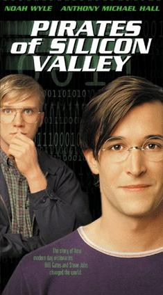

# Shut Up!
* Author: Andy Hertzfeld
* Story Date: July 1981
* Topics: 3rd party developers, Microsoft, Prototypes
* Characters: Andy Hertzfeld, Bud Tribble, Steve Jobs, Bill Gates, Charles Simonyi
* Summary: The first time we demoed the Macintosh to Microsoft

 
    
Apple had already learned the value of having a thriving third party software market with the Apple II, whose sales increased more than ten-fold when Visicalc, developed by a tiny company called Software Arts, caught on in the business market.  The Macintosh intended to replicate the success of the Apple II as an industry standard platform, so it was very important to bring third party developers into the picture as soon as possible.

Microsoft was an obvious choice for one of the first companies for us to talk to.  Both companies were started around the same time during the infancy of the personal computer industry, and they already had a business relationship, since Apple licensed Microsoft's Applesoft Basic for the Apple II.  Bill Gates and Steve Jobs were born in the same year and shared a similar vision for the potential of personal computers.   Each one thought he was smarter than the other one, but Steve generally treated Bill as someone who was slightly inferior, especially in matters of taste and style.  Bill looked down on Steve because he couldn't actually program.

Steve had mentioned the Macintosh project to Bill at an industry conference in April, which led to a meeting in Seattle in June, where Steve spun an intriguing vision of pumping out Macintoshes by the millions in an automated factory.  The plan was for Microsoft to develop a series of applications for the Macintosh, to be ready at launch.  Things went well enough to schedule a meeting in Cupertino in July, where we promised a demo of the actual machine.

Unfortunately, there was one small snag.  We were using the Lisa as the development machine for writing the software for Macintosh, and we hadn't yet reached the point where the Macintosh could run stand-alone.  The Macintosh needed to be hooked up to a Lisa, in order to download software from it.  But the Lisa group was writing all of its own applications for Lisa and didn't want Microsoft to see a Lisa.  They made us promise that we wouldn't let Microsoft see the Lisa.

We finally came up with a solution where we'd use a twenty-five foot cable and keep the Lisa in a different room that the Microsoft guys weren't allowed to enter.  I would start up the programs on the Lisa in the other room, and Bud Tribble would operate the Macintosh. I would usually run into the main room to see their reaction.

Bill Gates showed up in the early afternoon with three other colleagues: Charles Simonyi, who had recently joined Microsoft from Xerox PARC, Jeff Harbers, who would manage the Macintosh development team, and Mark Matthews, who was to be the technical lead on the project.   They crowded around the prototype, and we started to run our various demos for them, with Steve doing most of the talking.

You could tell that Bill Gates was not a very good listener - he couldn't bear to have anyone explain how something worked to him - he had to leap ahead instead and guess about how he thought it would work.  

We showed him how the Macintosh mouse cursor moved smoothly, in a flicker-free fashion. 

"What kind of hardware do you use to draw the cursor?", he asked.  Many current personal computers had special hardware to draw small bitmaps called "sprites", and he thought we might be doing something similar.

Of course, the Macintosh didn't use any special hardware at all.  It did everything in software, which was more flexible anyway, during the vertical blanking interval to eliminate the possibility of flicker.  In fact, Burrell and I had recently gotten a mouse to run smoothly on an Apple II, using a similar technique (see Apple II Mouse Card).

"We don't have any special hardware for it!" I blurted out, probably with a proud sneer in my voice. "In fact..."  I was about to mention that we got it running on an Apple II, which had one tenth the processing horsepower of a Macintosh, when Steve guessed what I was about to say.

"Shut up!", he yelled as loud as he could, looking directly at me.  He yelled it again, possibly trying to drown me out in case I kept on going.  But I understood what he wanted, changing what I was going to say, "In fact, doing it in software is better anyway".

The rest of the demo went pretty well, and both teams shared their excitement about how the Macintosh was going to take the industry to another level.  We went out to dinner at a fancy restaurant in Los Gatos to celebrate working together, and we agreed to a framework of a deal where we would give them a stand-alone Mac prototype to develop with in the fall.  We were very excited to be working with a third-party company that seemed to understand and appreciate what we were doing.