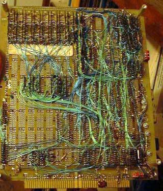

# PC Board Esthetics
* Author: Andy Hertzfeld
* Story Date: July 1981
* Topics: Hardware Design, Personality
* Characters: Steve Jobs, Burrell Smith, George Crow, Brian Howard, Dan Kottke
* Summary: Steve is concerned with the esthetics of the PC board

 
    
The first Mac prototypes were hand-made using a technique called "wire-wrapping", where each individual signal is routed by wrapping an individual wire around two pins.   Burrell wire-wrapped the first prototype himself, and then others were done by Brian Howard and Dan Kottke.  But wire-wrapping is time consuming and error prone.

By the spring of 1981, the Mac's hardware design was stable enough for us to make a printed circuit board, which would allow us to make prototypes much more quickly.  We recruited Collete Askeland from the Apple II group to lay out the board, and after working with Burrell and Brian for a couple of weeks, she taped out the design and sent it off for a limited production run of a few dozen boards.

We started having weekly management meetings in  June 1981, which were attended by most of the team, where we discussed the issues of the week.  At the second or third meeting, Burrell presented an intricate blueprint of the PC board layout, which had already been used to build a few working prototypes, blown up to four times the actual size.

Steve started critiquing the layout on a purely esthetic basis.  "That part's really pretty", he proclaimed. "But look at the memory chips.  That's ugly.  The lines are too close together".

George Crow, our recently hired analog engineer, interrupted Steve.  "Who cares what the PC board looks like?  The only thing that's important is how well that it works.  Nobody is going to see the PC board."

Steve responded strongly.  "I'm gonna see it! I want it to be as beautiful as possible, even if it's inside the box.  A great carpenter isn't going to use lousy wood for the back of a cabinet, even though nobody's going to see it."

George started to argue with Steve, since he wasn't on the team long enough to know that it was a losing battle.  Fortunately, Burrell interrupted him.

"Well, that was a difficult part to layout because of the memory bus.", Burrell responded.  "If we change it, it might not work as well electrically".

"OK, I'll tell you what," said Steve.  "Let's do another layout to make the board prettier, but if it doesn't work as well, we'll change it back."

So we invested another $5,000 or so to make a few boards with a new layout that routed the memory bus in a Steve-approved fashion.  But sure enough, the new boards didn't work properly, as Burrell had predicted, so we switched back to the old design for the next run of prototypes.