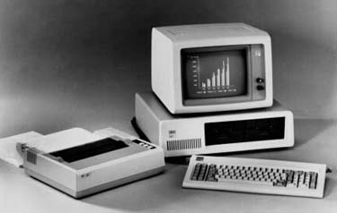

# Donkey
* Author: Andy Hertzfeld
* Story Date: August 1981
* Topics: Microsoft
* Characters: Bill Gates, Neil Konzen, Steve Jobs, Charles Simonyi
* Summary: We discover who wrote an awkward game for the PC

 

    
The first version of the IBM PC was introduced in August 1981.  Apple responded by running an ad in the Wall Street Journal with the headline "Welcome, IBM.  Seriously."   Even though he was usually tight with money, Steve Jobs allowed the Mac team to buy an early unit to dissect and evaluate.  The day it became available, we ran to the store and purchased one to take back to the lab.

Needless to say, we were not very impressed with it.  From the perspective of the Macintosh that we were already in the midst of bringing to life, it seemed like ancient history the day it came out.  There was little, if any, Woz-like cleverness in the hardware design, using dozens of extraneous chips without having any cool features.  The 8088 was a decent processor compared to the 6502, but it paled next to the 68000 we were using in the Mac.
But the most clunky part of the system was the software.  MS-DOS seemed like a clone of an earlier system, CP/M, and even the demo programs lacked flair.  It came with some games written in BASIC that were especially embarrassing.

    The most embarrassing game was a lo-res graphics driving game called "Donkey".  The player was supposed to be driving a car down a slowly scrolling, poorly rendered "road", and could hit the space bar to toggle the jerky motion.  Every once in a while, a brown blob would fill the screen, which was supposed to be a donkey manifesting in the middle of the road.  If you didn't hit the space bar in time, you would crash into the donkey and lose the game.

    We thought the concept of the game was as bad the crude graphics that it used.  Since the game was written in BASIC, you could list it out and see how it was written.  We were surprised to see that the comments at the top of the game proudly proclaimed the authors:  Bill Gates and Neil Konzen.  Neil was a bright teenage hacker who I knew from his work on the Apple II (who would later become Microsoft's technical lead on the Mac project) but we were amazed that such a thoroughly bad game could be co-authored by Microsoft's co-founder, and that he would actually want to take credit for it in the comments.

