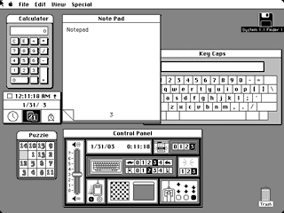
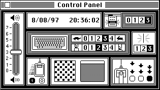

# Desk Ornaments
* Author: Andy Hertzfeld
* Story Date: October 1981
* Topics: Software Design, User Interface, Personality
* Characters: Bud Tribble, Chris Espinosa, Donn Denman, Larry Kenyon, Steve Capps, Bill Atkinson, Steve Jobs, Susan Kare
* Summary: A brief history of desk accessories

 

    
One of the first architectural decisions that Bud and I made for the Macintosh system software in the spring of 1981 was that we were only going to try to run one application at a time.  We barely had enough RAM or screen space to do even that, and we thought that we'd benefit from the resultant simplifications.  Besides, multi-tasking was supposed to be Lisa's forte, and we didn't want to usurp all of the reasons for buying a Lisa.

Bud Tribble was usually on an even keel, but one afternoon in the fall of 1981 he came into my office, unusually excited. "You know, I've been thinking about it.  Even if we can only run one major application at a time, there's no reason that we can't also have some little miniature applications running in their own windows at the same time."

That sounded intriguing to me.  "What kind of little programs?  How are they different?", I wondered.

Bud smiled.  "You'd want tiny apps that were good at a specific, limited function that complements the main application.  Like a little calculator, for example, that looked like a real calculator.  Or maybe an alarm clock, or a notepad for jotting down text.  Since the entire screen is supposed to be a metaphorical desktop,  the little programs are desk ornaments, adorning the desktop with useful features."

"But where do we draw the line?", I asked. "What are the differences between an ornament and a real application?"

"Well, ornaments have to fit into the world of the main application", Bud responded, "but not the other way around.  The main application owns the menu bar, for example, but maybe the ornaments can have a menu when they're active.   The main application would still run its event loop, but it would occasionally pass events to the little guys. And of course you can cut and paste between them."

That sounded good to me, but we had plenty of other stuff to work on first.  Bud left Apple in December 1981 to return to medical school, but I explained his concept to new team members and considered them to be part of our plan.  Chris Espinosa liked the idea when we explained it to him, and he worked on a visualization of the calculator as part of learning to program with QuickDraw, culminating in a calculator construction set (see Calculator Construction Set).   Eventually, after getting the initial implementations of the window, menu and event managers going, by May 1982 we had enough of the rudiments done to give desk ornaments a try.

The nascent Mac operating system already had an implementation of loadable device drivers, where installable code could be loaded from disk to manage optional peripherals.  I decided to cast desk ornaments as a special kind of driver, adding a few extra calls so they could maintain a window on the screen, receive events from the host application, and occasionally get some processing time to accomplish something.   Applications were required to make a system call periodically to yield some time for ornaments to run, and had to occasionally pass events to them and follow a few other conventions for co-existing.  The very first desk ornament was a boring one, called "TestOrn", that displayed a rectangular window with an incrementing counter, showing that it was capable of doing background processing, even when it wasn't the top-most window.  It wasn't very impressive, but it became the template from which all the others sprung.

In the fall of 1982, the first pass of the User Interface Toolbox was completed, so I had time to work more on ornaments, which by this time were renamed "desk accessories" by the pubs group who thought that the term "ornament" was too ornamental.  I wrote a simple clock, and got the calculator going, modeled after Steve Jobs' design from the calculator construction set.  The most interesting one that I wrote in that spurt was a desktop pattern editor, which was a sort of miniature icon editor that let you edit an 8 by 8 pixel pattern by clicking to toggle the dots on and off.  When you made a pattern that you liked, you could make it the desktop pattern, filling the background of the screen with your new creation instead of the standard gray.

Within a couple of months, other people wanted to take a crack at writing desk accessories.  Someone asked me if they could write one in Pascal, which wasn't easy because you had to pass parameters to the underlying driver in registers, which the Pascal compiler couldn't manipulate directly.   I realized that you could write a little bit of standard glue code in assembly language to do the dirty work, and have most of your desk accessory written in Pascal.  I wrote a number puzzle in Pascal as a test case, to prove that it could be done (see The Puzzle).

But once again I had to get back to other things and the desk accessories languished.  But by the spring of 1983, the ROM was beginning to stabilize, and we realized that we had to get serious about the desk accessories that would ship with the initial system.  Jerome assigned Donn Denman, who was taking a hiatus from working on Basic to help us finish the system, to help with desk accessories.  Donn and I collaborated on finishing the calculator, with Donn doing the back-end that interfaced with the floating point routines.  Donn was also responsible for the alarm clock and notepad.

Now that we had cut and paste working, I realized that it would be useful to have a desk accessory that could hold commonly used snippets of text and graphics, so they could be pasted into any application.  I wrote a desk accessory called the "Gallery" that allowed you to manage a set of clippings using cut and paste, building it on top of the resource manager so it was easy to implement.  Everyone seemed to like the functionality but not the name.  I was explaining the situation to Larry Kenyon when he suggested that we call it the "Scrapbook", which was perfect, so the Scrapbook joined our growing armada of useful desk accessories.

The Macintosh's character encoding scheme allocated the upper half of the 8-bit character set to occasionally useful but obscure characters that were not portrayed on the keys, accessed with the option key, that were nearly impossible to remember.   Steve Capps conceived of a desk accessory called "Key Caps" (named partially after himself?) that displayed a picture of the keyboard, with the keycaps changing depending on the meta-keys that were pressed, which allowed you to hunt for the special characters visually.  He coded it up quickly and it became another great addition.

We needed a way to control various system parameters like the sound volume, or the mouse scaling parameters.   We decided that a desk accessory would be perfect for that, since it would be easy to access no matter what application you were in.   So the last desk accessory that I worked on before shipping, in November 1983, was the Control Panel.  Susan Kare came up with a beautiful, highly graphical design (with no text whatsoever) that I implemented using a separate purgable resource for each section, so they didn't have to be in memory at once.   It had a little rabbit and tortoise to represent a range of speeds, and lots of other graphical embellishments; after the Mac was released, one review described it as a crib toy, which I took more or less as a compliment.

The most controversial part of the Control Panel was the desktop pattern editor, which I had rescued from its earlier stand-alone incarnation.  Users could select from a couple dozen prefabricated desktop patterns or edit their own in fat bits.  It was this latter capability that caused problems, as it was pretty easy to create ugly, abominable patterns.

Bill Atkinson complained to me that it was a mistake to allow users to specify their own desktop patterns, because it was harder to make a nice one than it looked, and led directly to ugly desktops.  But I thought that users should be free to do as they pleased, since it was their desktop, and it was easy to revert to one of the built-in patterns.  Bill cared most about MacPaint, and didn't want a potentially ugly desktop pattern marring his creation.  So he made MacPaint allocate a window that was the size of the screen when it started up, and filled it with the standard 50% gray pattern, making his own desktop covering up the real one,  thus protecting the poor users from their rash esthetic blunders, at least within the friendly confines of MacPaint.

