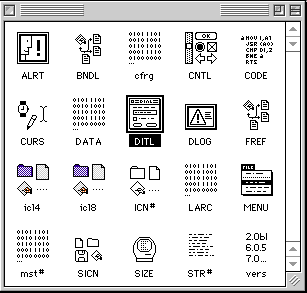

# The Grand Unified Model (1) - Resources
* Author: Bruce Horn
* Story Date: December 1981
* Topics: Software Design, Origins, Technical, User Interface
* Characters: Andy Hertzfeld, Bob Belleville, Bruce Horn, Alan Kay, Steve Capps, Bill Atkinson, Dan Smith, Frank Ludolph, Larry Kenyon, Joanna Hoffman, Ted Kaehler, Steve Jobs
* Summary: The creation of resources

 

    
Imagine the challenge: designing and implementing a brand new, graphical user interface, operating system, and core applications for a small personal computer to compete with the IBM PC.  That's what we were going to do with the Macintosh.

The year was 1981, and I had just graduated from Stanford University.  The past eight years I had spent as much time as possible working in the Learning Research Group at the Xerox Palo Alto Research Center.  PARC was the place where everybody who was anybody in computer science wanted to go work, or at least visit.  And I had just decided to leave PARC to join Apple (see Joining the Mac Group).

I was used to working on Altos and Dorados, powerful workstations with bitmapped displays, mice, networking, and the most advanced software development system of the time, Smalltalk.  These machines had lots of memory, at least 3MB of fast disk storage (remember, this was 1981), and were very fast.  To build one of the Altos cost over $15,000, and Dorados much more.  At Apple, the Macintosh was going to be a much more limited machine, with a tiny bitmapped display, no hard disk, and a mere smidgen of memory.  It would have to be able to be built for under $1000 if we were to compete with the IBM PC and other personal computers of the time.  And we were going to try to build a graphical user interface and operating system that would work acceptably on an 8Mhz 68000 microprocessor. 

Fortunately, I had worked on a 8086-based system at PARC, the NoteTaker (see Joining the Mac Group), so I knew what the limitations of small systems were.  Still, I was used to the Smalltalk user experience, and wanted to do whatever I could with the Finder to approach the friendliness, flexibility, and ease of use that Smalltalk provided.

Smalltalk was an integrated object-oriented language and programming environment, decades ahead of its time.  The class library (one of the first of its kind) was extremely sophisticated, with high-level frameworks for interface support, windowing, and graphics.  Programming in Smalltalk was (and still is, in many ways) unlike any other system; making changes to code was fast and easy, and the turnaround time was very short, since the system incrementally incorporated changes as you made them.  I was spoiled by the availability of well thought-out class library code that could be leveraged, and by the flexibility and ease with which new code could be written and existing code changed.

But now I was facing a new reality.  Macintosh programs would be written in assembly code and Pascal, in a traditional edit-compile-link-debug cycle, and the dynamic nature of a system like Smalltalk was nowhere to be found.  And my project was to be the Finder, the program that every Macintosh user would interact with to organize and manage their files, folders, and applications,  which would be the "face" of the Macintosh.

The rigid nature of traditional programming bothered me.  The idea of an application frozen in code, with no way to change anything dynamically, was anathema to my ideals.  I wanted to be able to change as much as possible at runtime.  Of course, the application code itself couldn't be changed, but what could be changed without having to recompile the code? The Finder, in particular, was going to need to maintain dynamic information about the files on the disk, and their relationships to the programs that created them and some of this information, such as a program's application and document icons, would have to be extracted from the program itself.  How would this information be stored?
 
Alan Kay always said that any problem in Computer Science could be solved by adding another level of indirection.  I thought that if we could refer to the program \*data\* separately and indirectly -- the strings, bitmaps, window and dialog layouts, and other non-code information -- we could make it possible for this information to be changed by people who would not have access to the source code.  These people -- translators, artists, and designers -- would be able to change the text strings (to translate menu items from English to Norwegian, for example), modify the application and document icons, and replace graphical elements in the program, if the program were written such that these items were factored out of the application.

The ability to easily localize applications and the operating system would be novel, especially in the early 1980's.  None of the systems that I had used, including Smalltalk, had this ability; it was just assumed that everybody using the system would be English-speaking, and that other countries would be building their own systems.  If the Mac were able to be released in other countries, with menus, icons, dialogs, dates, and sorting orders translated to different languages, it would make a big improvement in our potential market share.  I can't even remember when I started to recognize that the localization ability was necessary; it was a meme (probably started by Joanna Hoffman) that infected us all in the Mac group.

I figured that the Mac should provide this facility for all developers as a part of the User Interface Toolbox: a way to both provide for factoring out non-program data to make it easy to write modifiable applications, as well as manage memory on a fine-grained basis, object by object.  Thus the idea for Resources was born.

**Resources**

The Resource Manager was a solution to several problems: managing dynamic data for the Finder; factoring out localizable information (strings, icons, and so on) from applications, and finally, managing memory use as frugally as possible.  The Mac had relatively little memory, only 128K, for both the system and whatever application was running.  The floppy drive was only 400K, and would have to store the system, applications, and documents, so anything that could reduce the amount of space required, by sharing data, would have a big impact.  Graphics were notoriously memory-hungry, and the Finder, in particular, would have to juggle icons, swapping their bitmaps in and out of memory as required.  The Resource Manager would have to handle each of these small entities separately.  Thankfully, I knew of a similar system in Smalltalk, an object-oriented virtual memory called OOZE that was designed by Ted Kaehler, that swapped objects in and out of main memory as required.  This was my inspiration for the Resource Manager.  Find out more about OOZE here.

Like OOZE, the Resource Manager maintained objects in a resident object table, called the resource map.  A resource file was the on-disk representation of the resources.  Resources would be typed: a menu object would be of type MENU, and a text string would be of type TEXT.  Resource types were four bytes, to fit within a single 32-bit word as well as to be somewhat human-readable.  All resources would have a resource ID, unique within the type domain of the resource file, and any resource could also be named, for the convenience of the programmer.

As it happened, our memory manager provided a mechanism that the Resource Manager could leverage for in-memory storage of a resource object: the handle.  A handle was a relocatable block of memory, referenced by an indirect pointer (a pointer to a pointer).  To allow resources to be purged from memory, blocks could be reclaimed, releasing memory for other uses, while maintaining the original indirect pointer which would then point to a nil value, indicating that there is no block of memory reserved.  This allowed objects to be referenced by unique handles whether or not they were currently in memory, greatly simplifying the task of managing dynamically-loadable objects. 

I wanted to make sure that we could leverage resources throughout the system, but with maximum flexibility.  I felt that it was important that there be a mechanism for system resources to be overridden by the application, and for application resources, in turn, to be overridden by the application's open documents.  We could then have documents that carried their own fonts, images, and so on; applications with application-specific resources, such as (again) fonts and images; and system resources that would be shared by all applications.  So, resource files would be linkable, staging resource lookup: searching first the document, then the application, and finally, the system.

One of my faults as a software designer is that I seem to try to solve the biggest problems, and to do it bottom-up; that is, I end up doing lots and lots of work with no apparent results, as I build the foundation for the rest of the system.  I ended up making the Finder dependent on the Resource Manager, which, while logical in fact, unnecessarily made things a bit more exciting than they otherwise would have been in the development of the Mac, as the Finder's development was pushed out later and later in the schedule.  And of course, I didn't come up with these ideas all at once, but as I gained experience with the idea of resources, and as others in the group began to use resources in the rest of the system, the features needed became apparent.  And the concepts behind the Resource Manager widely influenced the handling of data throughout the Mac in a sort of Grand Unified Model.

When I started talking with the rest of the team, Larry Kenyon and Andy Hertzfeld realized immediately the importance of resources, and realized that they'd have to make changes in the rest of the system to take advantage of the Resource Manager.   Larry was writing the memory manager, and Andy was writing much of the rest of the Toolbox;  both were rather far along and the Toolbox, in particular, needed significant changes to use resources.  We were all in agreement...but I failed to mention this to Bob Belleville, thinking that it wouldn't take that long to finish anyway, so why bother?

I started writing the code.  Some weeks later, Bob Belleville asked me what I was doing, and I told him about the Resource Manager and why we needed it.  He told me to stop working on it.  I was flabbergasted.  I tried to explain to him that the Resource Manager was the keystone of the entire data architecture of the Mac--that the Toolbox, Segment Loader, and the Finder were all dependent on it, and I couldn't think of a way to solve all the problems we needed to solve without something like the Resource Manager.

Bob told me to abandon the project, that we didn't need it, and that I should focus on the Finder (see Resource Manager Countdown).  Of course, the way I planned to fit all the pieces together with the Finder also required the Resource Manager, and I thought it would take much longer to try to code the system without it.  I told Bob that I was going to do it anyway.  (see You Can't Fire Bruce!).

It was quite a job, since we only had 64K bytes of ROM for the entire Toolbox.  By writing in assembly code, I was able to implement the complete Resource Manager in only 3K bytes of code, leaving a few bytes left over in the ROM for the inevitable bug fixes and feature additions.  But it had taken quite a bit longer than I had hoped it would, and the delay put time pressure on all of us.

We were lucky: it turned out that resources were the answer to quite a few questions we hadn't known to ask.  Andy used the Resource Manager to swap code segments dynamically, so that large programs could run in the tiny amount of RAM; he rewrote the Font, Menu, and Control managers to store and retrieve their data from resource files; and more and more shared data in the system ended up being stored as resource objects.  Because it was relatively simple to use resources to store text strings and menus in the system and in applications, it became much easier to provide localized systems for different languages and countries.  Joanna Hoffman and Alain Rossmann designed a resource-based system for handling special time and date formats for different countries, and the Mac became a truly multilingual system.

Almost every piece of data in the Macintosh ended up being touched by the Grand Unified Model.  Even transient data, data being cut and pasted within and between applications, did not escape.  The Scrap Manager labeled each piece of data on the clipboard with a resource type.  In another Mac innovation, multiple pieces of data, each of a different type, could be stored on the clipboard simultaneously, so that applications could have a choice of representation of the same data (for example, storing both plain and styled text).  And since this data could easily be stored on disk in a resource file, we were able to provide cutting and pasting of relatively large chunks of data by writing a temporary file called the Clipboard.  

So, in late 1982, with the Resource Manager finished, more or less, I finally turned my attention back to the Finder (see The Grand Unified Model (2) - The Finder).

