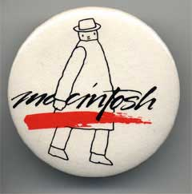

# Mister Macintosh
* Author: Andy Hertzfeld
* Story Date: February 1982
* Topics: Software Design, Personality
* Characters: Steve Jobs, Andy Hertzfeld, Susan Kare, Folon
* Summary: Steve has a unique idea for the software

 
    
Steve Jobs often came by Texaco Towers after dinner, to see what was new, and we'd usually show him whatever recent progress we made. Sometimes he'd be pissed off about something, but other times he'd be really excited about a new idea.

I was the only one in the office one evening when he burst in, exclaiming that he had a flash of inspiration.

"Mr. Macintosh! We've got to have Mr. Macintosh!"

"Who is Mr. Macintosh?", I wondered.

"Mr. Macintosh is a mysterious little man who lives inside each Macintosh.  He pops up every once in a while, when you least expect it, and then winks at you and disappears again.  It will be so quick that you won't be sure if you saw him or not.  We'll plant references in the manuals to the legend of Mr. Macintosh, and no one will know if he's real or not."

Engineers like myself always daydream about building surreptitious little hacks into the software, but here was the co-founder and chairman of the company suggesting something really wild.  I enthusiastically pressed him for details.  Where should Mr. Macintosh appear? How often? What should he do when he shows up?

"One out of every thousand or two times that you pull down a menu, instead of the normal commands, you'll get Mr. Macintosh, leaning against the wall of the menu.  He'll wave at you, then quickly disappear.  You'll try to get him to come back, but you won't be able to."

I loved the idea and promised that I would implement Mr. Macintosh, but not right away, since there were still so many more basic things to get done.  Steve told the idea to the marketing team, and eventually recruited the French artist Folon to do some renditions of Mr. Macintosh.  I also asked my high school friend Susan Kare, who hadn't started with Apple yet, to try to draw some Mr. Macintosh animations.

Most of the Macintosh system software had to be packed into a 64 KByte ROM, and ROM space got more scarce as development proceeded and the system grew.  Eventually, it was clear  that we'd never be able to fit bitmaps for Mr. Macintosh into the ROM, but I wasn't willing to give up on him yet.

I made the software that displayed the menus look at a special low memory location called the "MrMacHook", for an address of a routine.  If the routine is present, it's called with parameters that let it draw in the menu box, and it returns a result that tells the menu manager if it did anything.  Using this, an application or system module could implement Mr. Macintosh (or perhaps his evil twin) if they saw fit.

I'm not sure if anybody ever actually implemented Mr. Macintosh or used the "MrMacHook" for something worthwhile.