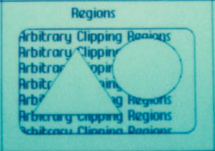

# I Still Remember Regions
* Author: Andy Hertzfeld
* Story Date: April 1982
* Topics: Software Design, QuickDraw, Personality
* Characters: Bill Atkinson, Steve Jobs
* Summary: We almost lose Bill in a car accident

 
    
The single most significant component of the original Macintosh technology was QuickDraw, the graphics package written by Bill Atkinson for the Lisa project, which pushed pixels around the frame buffer at blinding speeds to create the celebrated user interface.  One of QuickDraw's main jobs was to provide the primitives for quickly drawing text and graphics into overlapping windows, when the window that you're drawing into may be partially obscured by other windows.  Applications could just draw without worrying if their window was obstructed because Quickdraw, with a little help from the window manager, would take care of the clipping to make sure pixels stayed inside in their window.

Overlapping windows can form complex shapes, especially if their corners are rounded.  The key data structure in QuickDraw was called a "region", which compactly represented an area of the screen.  QuickDraw provided routines that allowed the programmer to define regions by using the built-in drawing primitives, and to perform operations with them like union and intersection.  Most importantly, all of the QuickDraw drawing primitives clipped to the intersection of three different regions, to allow drawing into obscured windows. We considered QuickDraw's speed and deftness at region handling to be the most significant "crown jewel" in Apple's entire arsenal.

The region data structure was a variable-sized list of what Bill called "inversion points", the coordinate values where black changed to white or vice versa.  Since most regions were mostly rectangular, there weren't many inversion points, so regions were quite compact.  But occasionally, there were lots of inversions, like in a circle, so regions grew as necessary.

QuickDraw was written entirely by Bill Atkinson, and in the spring of 1982 it was still evolving.  He had recently sped up region operations by more than a factor of four. The concept of "pictures", a set of drawing operations grouped together for easy playback, was just added to the package, and hadn't really settled down yet.  At this point, the Lisa applications were beginning to come together and Bill was changing QuickDraw in response to what they needed. 

One morning, we were shocked to hear that Bill had gotten into a really bad car accident on his way into work.  Apparently, he had turned a corner and not seen a parked truck, and slammed his little Corvette into the truck, shearing the roof off the top of his car.  Bill was knocked unconscious and got pretty banged up, although he was still in one piece - one of the police officers who surveyed the wrecked Corvette commented that it was a miracle that Bill wasn't decapitated.  This was a little more than a year after Woz's plane crash, but it brought back memories of that.

When Steve Jobs heard about the accident, he immediately jumped into his car and drove to the hospital where they had taken Bill.  He was in a hospital bed, and had only recently regained consciousness by the time Steve arrived.  He sustained a head injury and lost some blood, but luckily there were no major problems.

Steve entered the hospital room and was relieved to see that Bill had regained consciousness.  "Is everything OK?", Steve asked.  "We were pretty worried about you."

Bill turned his head and looked at Steve.  He managed a painful smile.  "Don't worry, Steve, I still remember regions."