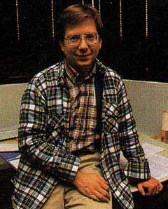

# And Then He Discovered Loops!
* Author: Andy Hertzfeld
* Story Date: April 1982
* Topics: Software Design, Management
* Characters: Bob Belleville, Rich Williams
* Summary: Bob has written many lines of code

 

    
We interviewed quite a few candidates to replace Bud as the software manager before encountering Bob Belleville, who was one of the main hardware designers of the Xerox Star, the first commercial computer with a graphical user interface.  He was intelligent and soft-spoken, and dryly skeptical about human nature.  One of his many aphorisms was "The Law of Conservation of Misery" (no matter what course of action is taken, the total human misery in any given situation is maintained), which seemed particularly applicable to large computer companies.

Bob's background looked to be a lot stronger in hardware than software, so we were somewhat skeptical about his software expertise, but he claimed to be equally adept at both.  His latest project was a rebellious, skunk-works type effort to make a low cost version of the Star called "Cub" that used an ordinary Intel microprocessor (the 8086), which was heresy to the PARC orthodoxy, who felt that you needed custom, bit-slice processors to get sufficient performance for a Star-type machine.  Bob had written much of the software for Cub himself.

"I've got lots of software experience", he declared, "in fact I've personally written over 350,000 lines of code."

I thought that was pretty impressive, although I wondered how it was calculated.  I couldn't begin to honestly estimate how much code I have written, since there are too many different ways to construe things.

That evening, I went out to dinner with my friend Rich Williams, who started at Apple around the same time that I did.  Rich had a great sense of humor.  I told him about the interview that I did in the afternoon, and how Bob Belleville claimed to have written over 350,000 lines of code.

"Well, I bet he did", said Rich, "but then he discovered loops!"