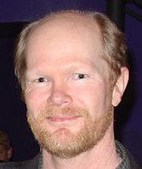

# You Can't Fire Bruce!
* Author: Andy Hertzfeld
* Story Date: May 1982
* Topics: Management, Personality Clashes
* Characters: Bob Belleville, Bud Tribble, Alan Kay, Steve Jobs, Bruce Horn, Ted Kaehler
* Summary: The software team has a personality clash

 
    
Even though he was only twenty two years old when he joined the Mac team, Bruce Horn already had seven years of experience tinkering with graphical user interfaces.  He was recruited as a 14-year-old by Ted Kaehler to do some programming experiments in Smalltalk at Alan Kay's Learning Research Group in the mid-seventies, and he took to it so well that he had worked part-time at Xerox PARC ever since.  By the time he joined the Mac team in late 1981, he was an expert in object-oriented programming and graphical user interfaces.

Bruce was a bright, idealistic and uncompromising programmer who fit right in with the prevailing values of the team, and he quickly became an important contributor to the Macintosh system software effort.  He was slated to work on the application that graphically represented files, which Bud Tribble had dubbed the "Finder", but after a few weeks he convinced us that we were missing a crucial level of the system that he called the "Resource Manager", which was a way to manage the various chunks of data (like text strings and images) that an application relied on, and which was going to be needed for the Finder application as well for managing icons and bindings between documents and applications (see Resource Manager Countdown).

Bruce was busy implementing the resource manager when Bob Belleville arrived on the scene as the new software manager in April 1982, replacing Bud Tribble, who had to return to medical school at the end of 1981.  Bob was also a Xerox alumnus, but otherwise they couldn't have been more different.  Bob was pragmatic and somewhat authoritarian, with his world-view substantially forged by his stint in the Navy, and he immediately began to clash with Bruce's idealism.

I spent a lot of time with Bob when he first started on the project, helping him to get up to speed, and we got along well at first, even though we had very different perspectives.  Bob was a little bit older than most of the core team, with a wife and family, and he was naturally skeptical.  He didn't understand why we were so excited about the Macintosh, which he saw as just another increment along a continuum.  "I don't get it", he complained to me, "This computer will be obsolete in a year, and then there will be another one, and another one after that.  What's so special about this one?"  

The first software team meeting that Bob presided over took place in the main conference room of our new building, soon after we moved from Texaco Towers to Bandley 4, around a long table that Burrell and I used for afterhours ping-pong.  Up to this point, the software team had a very loose management style, without formal meetings, so this was something new for us.  Bob had us go around the table, telling the group what each individual was currently working on, and when we were planning to complete it.

When it was Bruce Horn's turn, he described his Resource Manager work, but refused to give a date as to when it would be finished.  Bob visibly bristled, and asked him to make the best estimate that he could, which Bruce refused to do, claiming that it wouldn't be accurate.  Bob wanted Bruce to put the resource manager aside to work on the Finder, which Bob thought had much higher priority, but Bruce refused to go along with him, because of the dependence of the Finder design on the resource manager.  They were at an impasse, but finally Bob said he'd resolve it by talking with Bruce privately, and the meeting was able to move on.

I was worried about how the obvious tension between Bruce and Bob would be resolved.  A few days later, Bruce came up to me in the late afternoon, visibly shaken. 

"You wouldn't believe what just happened!  I finally had my meeting with Bob about the resource manager."

"So what happened?"

"We started off talking about the work that was needed to finish it, but I guess I said something that he didn't like.  He started getting all weird, and told me that I was insubordinate, and that he was my manager, and that I had to follow his orders or else.  Or else what?, I asked him.  You wouldn't believe what he did!"

"What did he do?", I asked him, not knowing what to expect.

"He threatened me!  Can you believe that?  For a second I thought we were going to have a fist fight, but he started smiling as if he was joking.  I didn't know what to think.  Finally, he said we'd talk more later and walked away."

The image of Bruce and Bob duking it out was ludicrous, as Bruce was at least 8 inches taller than Bob and probably more than 60 pounds heavier.  Bruce's father was an ex-professional football player before he became a doctor, and Bruce was built the same way.  I tried to calm him down and told him that I would help him get this resolved.  The next morning I went to Bob Belleville's office as soon as I arrived at work.

"Good.  I'm glad that you're here", Bob greeted me. "I need to talk to you about Bruce Horn."

"Yes, that's what I want to talk about", I responded.  "Bruce told me about the conversation that you had last night."

"Well, it's not a problem anymore", Bob said, flashing a cryptic smile.

"Why not?"  Something didn't sound right to me.

"I decided to fire him.  He doesn't respect authority enough to work on this team."

Now it was my turn to get upset.  "You can't fire Bruce!", stating something that I thought was obvious.  "He's doing really important work for us, and losing him would set us back months."

"Keeping him will set us back even more, because he's a trouble maker, and he'll cause more trouble in the future."

But I was adamant, defending Bruce until Bob got frustrated with me.  "Well, Andy, I am very disappointed in you.  I thought you had more sense than that."  I walked out of his office not knowing what was going to happen.

Later that day, when Steve Jobs came by for his usual early evening visit, I told him what transpired and repeated how bad it would be if we lost Bruce. I don't know what Steve eventually said to Bob, but he apparently dropped his plan to fire Bruce since he never mentioned it again. But I never thought of Bob the same way after that, and I think that was when he started to have problems with me as well.