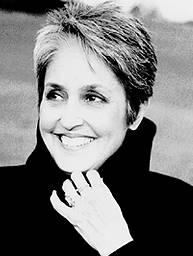

# Invasion of Texaco Towers
* Author: Jerry Manock
* Story Date: June 1982
* Topics: Celebrities, Industrial Design, Social Life
* Characters: Jerry Manock, Terry Oyama, Steve Jobs, Jef Raskin
* Summary: A double standard for secrecy

 
    
The Macintosh Team was sworn to the utmost secrecy about our project.  We were moved to the top floor of a nondescript two story office building about two blocks from the established Bandley Drive Apple complex.  There was no identification on our door.  Our view west was of a Texaco gas station... thus the name "Texaco Towers" spontaneously evolved for the new Macintosh-in-development headquarters (see Texaco Towers).  Steve Jobs would come over to visit us several times a day to stay on top of our progress.  On these visits he alternated between "cheerleader" and "strict parent."  Ever-present was his enthusiasm, his dedication to  excellent design, and his exhortation to keep our project confidential.

The Jef Raskin Macintosh hardware concept was of a "portable" computer with a keyboard that rotated up to cover and protect a small rectangular CRT screen next to the floppy disk drive.  One day Steve came bounding through our Texaco Towers door to announce that the overriding theme was now "minimal footprint on a desk" instead of "portability."  He had been to a mall over the weekend  and had been looking at "appliances."  This term was to have considerable marketing usage in the next few years.  Terry Oyama and I immediately started sketching a design that had the CRT above the floppy disk drive and motherboard, which gave the desired smaller footprint.  To avoid a boxy look with sharp edges we felt would be intimidating to the user, we employed radiuses on the side corners and a large chamfer on the back.  Another goal of ours was to make the back of the computer (which we realized could, in fact, be facing a visitor to user's office) as aesthetically pleasing as the front.  Terry and I had traveled to the Hanover (Germany) Fair previously and determined that this would be a radical departure from current practice.  For a similar reason we always tried to deal with "cable management" in an aesthetic way instead of the common "rat's nest" still seen today behind EDP equipment.  But I digress.

One afternoon, when the project was in its advanced stages, Steve burst through the door, unannounced, in an exuberant mood.  He had two guests... Joan Baez and her sister, Mimi Farina.  Steve had been to lunch with them nearby and apparently could not contain himself when Joan asked him for advice on which computer to buy for her son, Gabe.  Not only did he tell them about our Macintosh-in-development but he decided to SHOW it to them too.  We sat there doubly dumfounded at the disclosure of our secret project to an outsider... who happened to be a huge celebrity... that we actually got to meet!  Hopefully Steve had them sign a non-disclosure agreement, but I never saw it.

This was not the last time we saw Joan Baez.  Steve invited her to an Apple Macintosh Black Tie "Christmas" party one February at the St. Francis Hotel in San Francisco.  I have a vivid memory of being on the dance floor with my wife, waltzing between dinner courses to the music of the San Francisco Symphony Orchestra, and bumping into Joan and Steve as they went swirling by.  Apple sure knew how to throw a party!