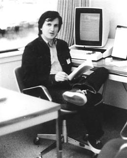

# Hungarian
* Author: Andy Hertzfeld
* Story Date: January 1982
* Topics: Software Design, Technical, Lisa
* Characters: Bud Tribble, Tom Malloy, Charles Simonyi, Bill Atkinson
* Summary: A curious style of programming

 
    
The Macintosh used the same Motorola 68000 microprocessor as its predecessor, the Lisa, and we wanted to leverage as much code written for Lisa as we could.  But most of the Lisa code was written in the Pascal programming language.  Since the Macintosh had much tighter memory constraints, we needed to write most of our system-oriented code in the most efficient way possible, using the native language of the processor, 68000 assembly language.  Even so, we could still use Lisa code by hand translating the Pascal into assembly language.

We directly incorporated Quickdraw, Bill Atkinson's amazing bit-mapped graphics package, since it was already written mostly in assembly language.  We also used the Lisa window and menu managers, which we recoded in assembly language from Bill's original Pascal,  reducing the code size by a factor of two or so.  Bill's lovely Pascal code was a model of clarity, so that was relatively easy to accomplish.

The Mac lacked the memory mapping hardware prevalent in larger systems, so we needed a way to relocate memory in software to minimize fragmentation as blocks got allocated and freed.  The Lisa word processor team had developed a memory manager with relocatable blocks, accessing  memory blocks indirectly through "handles", so the blocks could be moved as necessary to reduce fragmentation.  We decided to use  it for the Macintosh, again by recoding it from Pascal to assembly language.

The primary author of the Lisa word processor and its memory manager was Tom Malloy, an original member of the Lisa team and Apple's first recruit from Xerox PARC.  Tom had worked on the Bravo word processor at PARC under the leadership of Charles Simonyi, and used many of the techniques that he learned there in his Lisa code.

Even though Bud Tribble had to leave the Mac team in December 1981 in order to retain his standing in the M.D./Ph.D. program at the University of Washington, he decided that he could still do the initial implementation of the memory manager, as we were planning all along, hoping to finish it quickly after he moved back to Seattle, before classes started.  He obtained a copy of the memory manager source from Tom Malloy, but he was in for a shock when he began to read the code.

The memory manager source lacked comments, which was disappointing, but the biggest obstacle was the names selected for variables and procedures: all the vowels were gone!  Every identifier seemed to be an unpronounceable jumble of consonants, making it much harder to understand the code, since a variable's meaning was far from obvious.  We wondered why the code was written in such an odd fashion.  What happened to all of the vowels?

It turns out that Tom Malloy was greatly influenced by his mentor at Xerox, a strong-willed, eccentric programmer named Charles Simonyi.  Charles was quite a character, holding many strong opinions about the best way to create software, developing and advocating a number of distinctive coding techniques, which Tom brought to the Lisa team.  One of the most controversial techniques was a particular method of naming the identifiers used by a program, mandating that the beginning of each variable name be determined by the type of the variable.

However, most of the compilers in the early eighties restricted the length of variable names, usually to only 8 characters.  Since the beginning of each name had to include the type, there weren't enough characters left over to use a meaningful name describing the purpose of the variable.  But Charles had a sort of work-around, which was to leave out all of the vowels out of the name.

The lack of vowels made programs look like they were written in some inscrutable foreign language.  Since Charles Simonyi was born and raised in Hungary (defecting to the west at age 17), his coding style came to be known as "Hungarian".   Tom Malloy's memory manager was an outstanding specimen of Hungarian Pascal code, with the identifiers looking like they were chosen by Superman's enemy from the 5th dimension, Mr. Mxyzptlk.

Bud decided that it would be too error prone to try to translate the Hungarian memory manager directly into assembly language.  First, he made a pass through it to strip the type prefixes and restore the vowels to all the identifier names, so you could read the code without getting a headache, before adding lots of block comments to explain the purpose of various sub-components.

 A few weeks later, when Bud came back to attend one of our first retreats, he brought with him a nicely coded, efficient assembly language version of the memory manager, complete with easy to read variable names, which immediately became a cornerstone of our rapidly evolving Macintosh operating system.