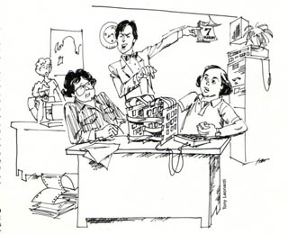

# Sound By Monday
* Author: Andy Hertzfeld
* Story Date: September 1982
* Topics: Hardware Design, Software Design, Management, Technical
* Characters: Burrell Smith, Andy Hertzfeld, Steve Jobs
* Summary: Steve threatens to remove Mac's sound capability

 
    
When Burrell redesigned the Macintosh digital board in August 1982 after the Integrated Burrell Machine effort fell apart, one of the most significant improvements involved the sound generation capability.  All of the extra logic available in the IBM chip allowed Burrell to implement four simultaneous channels of sound, each using a custom wavetable.   That was too expensive to keep without the custom chip, but he was able to maintain the fundamental capability, DMA-fetched sound using 8 bits per sample and a clever, pulse width modulated digital to analog converter.

Burrell figured that the Mac could still have the four simultaneous voices that he had envisioned for the Integrated Burrell Machine, only now we'll do most of the work in software instead of hardware. So he promised Steve that the redesign would feature great sound, including a four voice synthesizer.  Steve approved spending an extra dollar on an improved amplifier, to better match the improved sound generation capability.

But there were an enormous number of different things to work on in the summer of 1982, including getting the Mac Toolbox into good enough shape for developers to start writing applications.  Burrell bugged me about writing a sound driver, and especially his cherished "four voice engine", but I wasn't able to get around to it as a few weeks passed.

Steve Jobs started to get impatient about getting to hear our new sound capability for himself.  Finally, he pulled Burrell and myself aside late on a Friday afternoon.

"You told me that the new sound would be really great, right?", he asked Burrell.  "Well, if I don't hear great sound coming out of that prototype by Monday morning, we're going to remove the amplifier."

Then he looked at me.  "You've had long enough to get the sound going.  I want to hear great sound on Monday, or else."  Then he stormed off, leaving Burrell and me to figure out what to do.

"I think he's bluffing", I told Burrell.  "But what if he's not?"

Burrell didn't seem very upset, in fact he seemed kind of excited.  I think he was pleased that Steve was on our case about the sound, since he really wanted me to write the sound routines as soon as possible anyway.  He promised to buy me meals all weekend while we stayed at Apple to get the sound going.

I had already written a basic diagnostic that generated a simple square wave, which certainly didn't meet anyone's criteria for great sound, but at least it told us the hardware was working, and worked out the basic details of controlling the hardware.  Burrell wanted me to get to work right away on the four voice synthesizer, since he wasn't sure we could actually make that work.

As usual, Burrell's new design was very clever.  The Macintosh was already continuously fetching data from memory to drive the video display, interleaving memory bandwidth between the display and processor in a similar fashion to the Apple II.  But every 44 microseconds, there was a "horizontal blanking interval" where no video data was needed, so Burrell used that time to fetch data for the sound.  That gave us a sample rate of 22kHz, which would allow us to do frequencies up to 11kHz, which isn't too bad.

The sound driver worked at the interrupt level, so sound generation could proceed in the background while the processor performed some other task.  It arranged to receive control at the beginning of the vertical blanking interval, which occured every 16 milliseconds. It needed to generate all the sound data for the next 16 milliseconds, which worked out to 44 microseconds for every successive sample.  If our calculation took 22 microseconds per sample, for example, the sound generation would be soaking up half of the available processor cycles.

It only took a few hours to write a driver with a simple sound generation loop.  It could do two voices fine,  but it didn't run nearly fast enough to do four - it took too long to generate each sample, which caused audible glitches as well as making everything else run like molasses.  Burrell took a look at my code, and saw that I was using some memory locations during the sound calculation.

"Memory?  Are you kidding? You can't hit main memory, you'll never make it that way.  You've got to do everything in the registers!"

"Registers" are special locations that are part of the processor chip itself, where the action really happens.  They could be accessed four times faster than the bulk of memory, which was in separate memory chips.  The problem was that there were only 16 registers.  For each voice of sound, we needed a frequency, a waveform pointer, a position within the waveform, and an amplitude, plus some housekeeping data.  There weren't enough registers to do four voices.

I was able to rewrite the routine without touching main memory, but I was only able to get three voices since I ran out of registers.  But that wasn't good enough for Burrell.  By now it was late on Saturday evening, and I wanted to go home, but he felt that we had to get the fourth voice done before "head hits pillow" as he liked to say, or we'll never get the fourth voice.

Finally, I was able to leverage the fact that the registers were 32 bits long and we only were doing 16 bit calculations in some of them, to use some of the them to hold two different values.  Each sample took about 22 microseconds to calculate, so we were using roughly half of the CPU to get the four voices at the maximum sample rate.  The basic four voice capability was implemented, but we still needed an impressive demo to show it off.  We went home to sleep at around midnight, after agreeing to come back around noon to work on the demo.

The next day, we decided to write a demo called "SoundLab" that would let the user control the pitch and waveform of the four independent voices.  You could specify or edit a waveform by drawing it with the mouse, and control the frequency of each voice with a scrollbar.  The results didn't sound like music, because there was no envelope shaping, but you could make very eerie sounding noises, which we deemed impressive enough.  And it was fun to be able to hook an oscilloscope up to the sound output, and then draw a waveform with the mouse and see it on the scope.

When Steve came in on Monday, he was pleased that we could demonstrate the four voice capability, and impressed that he could edit a waveform with the mouse and see it on the scope, but I don't think he was satisfied, since he wanted high quality music.  There was a lot of potential in the Mac sound capability, but it would still take years, and the efforts of many third party developers, to fully exploit it.