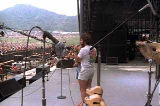
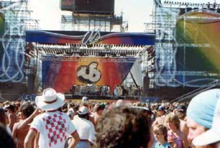

# US Festival
* Author: Andy Hertzfeld
* Story Date: September 1982
* Topics: Celebrities, Personality, Recreation
* Characters: Dan Kottke, Jerry Manock, Steve Jobs, Bill Budge, Rod Holt, Burrell Smith, Steve Wozniak, Andy Hertzfeld
* Summary: We travel to Woz's rock festival

 
    
As soon as Steve Jobs took over the Macintosh project in January 1981, he recruited many of the crucial early Apple employees who had worked on the Apple II, including Rod Holt, Jerry Manock, Dan Kottke, Randy Wiggington and Apple co-founder Steve Wozniak.

Woz was enthusiastic about the Macintosh and started hanging out at the Mac team's new office at Texaco Towers, reviewing Burrell's design and learning the 68000 instruction set.  But he was only working on the project for a couple of weeks when he crashed his Beechcraft Bonanza airplane while taking off near his home in Scott's Valley, sustaining a serious head injury and knocking out a couple of teeth.

The accident put Woz out of commission for almost two months.  While he was recuperating, he had time to rethink his priorities and he decided that he wanted to go back to college to earn his undergraduate degree, for which he needed just one more year of classes, instead of returning to Apple.  He enrolled in the engineering program at UC Berkeley, in the summer of 1981, under the assumed name of "Rocky Clark", in honor of his dog Rocky and his new wife, Candi Clark.

A couple of months after the crash, Woz was listening to his favorite radio station KFAT and had an inspiration about putting together a music festival, a "Woodstock West" featuring his favorite progressive country music performers. He realized that while he had the financial wherewithal, he didn't know the first thing about the music industry and filed the idea away, after mentioning it to a few friends. 

Later that fall, while he was attending classes at Berkeley, Woz was introduced to a new age entrepreneur named Dr. Peter Ellis.  Peter was a former college radical, who had organized a "survival fair" at San Jose State University in the 60s, where he presided over the burial of a Ford Pinto.  He hit it off with Woz, and was enthusiastic about Woz's Woodstock West idea.   Peter came up with the name "The US Festival" (in reaction to the "me" decade), and threw in other ideas like incorporating a technology fair and featuring a satellite linkup with rock musicians in Moscow.   Woz wrote a sizable check to fund a new corporation, Unuson (which stood for "Unite Nations Using Singing Over Network"), to create and produce the US Festival, with Peter as the executive director.

Peter put together a team, and plans began to take shape for an impressive 3 day music festival to be held over Labor Day weekend at Glen Helen park in San Bernardino, around an hour away from Los Angeles.  Unuson paid top dollar to hire the foremost rock promoter in the country, Bill Graham, to put together a superlative bill of first class bands, including the Police, Fleetwood Mac, Tom Petty, Santana and many others.

Woz encouraged his Apple friends to come to the US Festival by giving us special gold passes that got us in for free, and permitted us to hang around back stage.  Burrell Smith, Bill Budge and myself rented a camper and drove down together, skipping work to leave Friday morning so we could be there by the start of festivities that evening.

After the long drive, we parked the camper a half mile away from the festival site, and walked the dusty trail to the main concert area amid the gathering crowd.  We arrived just as the sun was setting and the first band, The Gang of Four, was taking the stage.  After their set ended, we made our way to the stage area, to test out our gold passes and see if we could find Woz.

The security guard at the stage door verified our gold passes and let us in, but he seemed to resent doing it. I had never been backstage at a rock concert before.  There was a nice spread of cold cuts and beverages in front of a line of trailers that served as dressing rooms for the bands.  Lots of people were milling around, including roadies, groupies, bodyguards and even the occasional rock star. 

Suddenly I heard a very loud noise, as someone rode into the backstage area on the largest motorcycle I had ever seen.   At first I thought it was a Hell's Angel, but it turned out to be Bill Graham in a black leather jacket and sunglasses, scowling as he ordered people around.   We didn't feel very welcome and were frequently asked to show our passes; it seemed like the festival staff was resentful that Woz's friends were allowed to be there.

We finally spotted Woz and waved to get his attention.  He came over to us, looking happy and excited.

"Do you guys want to introduce a band?  Which one?  I've got it worked out with Bill Graham so my friends can introduce their favorite band if they want to.  We still have plenty of slots left."

I was intrigued, since one of my favorite groups, the Kinks, were scheduled for Saturday afternoon.  But getting up on stage in front of hundreds of thousands of people sounded utterly terrifying to me.  I declined, but then I noticed that Burrell's eyes had lit up and he was very excited.

"Santana?  Can I introduce Santana?  That would be so cool..."  Carlos Santana was one of Burrell's favorite guitarists.

Woz pulled a piece of paper from his pocket and checked it.  "OK, Santana is still open," he told Burrell.  "I've got you down for introducing Santana.  Meet me here backstage, after Eddie Money finishes tomorrow and I'll show you what to do."  Santana was the third act scheduled for Saturday, after Dave Edmunds and Eddie Money.

That evening, when we got back to the camper, Burrell wrote a brilliant short, sweet and humorous introduction of Santana to use the next day, and started to memorize it by reading it aloud.  It was all he could talk about until we made our way backstage early on Saturday morning.  Burrell waited expectantly until Woz showed up.  He read Woz his introduction, which Woz really liked.

Woz led Burrell up onto the stage, trying to find Bill Graham to introduce him to Burrell and tell him about the upcoming Santana intro.  But lots of people wanted to talk with Woz, and he got distracted, leaving Burrell alone on stage for a few minutes, just as Bill Graham appeared, looking pissed off as usual.

Bill Graham took one look at Burrell and grimaced.  "Who the #$\*! are you?  What are you doing on the goddamn stage?"

Burrell explained that he was a friend of Woz's and was waiting onstage to introduce Santana.  He pulled out his notes for the introduction from his pocket and waved them for Bill Graham to see.

"Sure you are," Bill Graham responded sarcastically.  " I'm going to introduce Santana.  And you're gonna get the #%$\*! off the stage right now, this instant!"

Burrell looked around for Woz but couldn't spot him.  He started to argue but stopped short when he saw how furious Bill Graham became.

Bill Graham motioned to one of his ubiquitous bodyguards, a huge guy with long hair and tattoos covering his forearms.  "Please escort this gentleman from the premises", he ordered peremptorily, "and don't let him return!"  The bodyguard literally picked Burrell up off the ground by the back of his shirt collar and carried him off the stage and then completely out of the backstage area.

That was the last we saw of Burrell for the next six hours and we wondered what had happened to him. Finally, he reappeared just before Tom Petty started the final set of the day.  Bill Graham's thug had dragged him outside the festival gates and confiscated his gold pass.  Burrell didn't know what to do, but eventually he obtained another gold pass by walking a few miles to the house that Woz had rented for the weekend.   Woz was sorry about what had transpired and asked Burrell if he wanted to try again on Sunday to introduce another band, but this time Burrell was wary and quickly declined.  In fact, he had had enough of the US Festival and persuaded Bill and me to drive back home early on Sunday morning without attending the last day of shows.