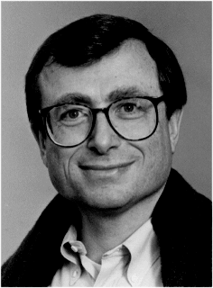

# What's A Megaflop?
* Author: Andy Hertzfeld
* Story Date: January 1983
* Topics: Marketing, Education, Personality
* Characters: Steve Jobs, Joanna Hoffman, Mike Boich, Andy Hertzfeld, Mike Murray, Dan'l Lewin, Andy van Dam
* Summary: We visit my alma mater to try to sell them Macs

 
    
Apple always had a natural affinity for education, and, almost from its inception, the Apple II became very successful in the K-12 education market.  In the late 1970's, Steve Jobs initiated a marketing program called "Kids Can't Wait" and personally paced the halls of Congress in Washington for three weeks, lobbying for legislation granting tax breaks for donating computers to schools.  Even though the national legislation got stymied by politics (it was blocked by Bob Dole), California eventually passed a similar bill and Apple soon donated almost 9,000 computers, one to every school in California.

In early 1982, Joanna Hoffman was still the only marketing person on the Mac team, and she was thinking about which market segments were likely to be early adopters of the Macintosh.  She realized that the Mac was almost perfect for college students,  and thought it would be worthwhile to put together a plan for selling Macs to higher education.

A few months later, after conferring with a number of consultants who understood the college market, a plan began to emerge.  One of the words that the consultants reiterated was "consortium"; it seemed like colleges loved to band together into various consortiums.  We knew that the paucity of software at launch would be a barrier to initial acceptance, but maybe not if we could get the colleges to form a Macintosh consortium, where members received steeply discounted Macs for students and faculty.  All we had to do is sign up a few of the most prestigious schools, and many of the rest would follow.

 Mike Murray (who was now the permanent interim Macintosh marketing manager) and Joanna realized that they needed a superb salesperson to take charge of recruiting customers for our consortium-to-be.  The best salesperson that Joanna knew on the Lisa team was Dan'l Lewin, a handsome, personable, ivy educated ex-competitive swimmer who was frustrated with his current job of selling the Lisa to corporations. Dan'l was intrigued, and, after some negotiation, was soon barnstorming around the country visiting the leading universities, with Mike Boich in tow to run the demo and answer technical questions, trying to convince universities to sign up with Apple and buy discounted Macs by the thousands.

Some of the universities, like Drexel University in Philadelphia, were easy sells, since they were already thinking about buying a computer for each freshman, and the Macintosh consortium was the answer to their prayers.  But others weren't that enthusiastic, and required lots of hand-holding to coax them into the fold.  But slowly Dan'l was able to build up a fairly impressive roster.

Toward the end of January 1983, I was asked to accompany Dan'l and Mike on one of the more unusual sales calls, to Brown University in Providence, Rhode Island, because Brown was my alma mater.  I hadn't been back there since I graduated in 1975.  Brown had a strong computer science program, especially in computer graphics, and was considered to be rather influential with the other universities.  They had recently splurged, buying dozens of powerful Apollo workstations, costing tens of thousands of dollars apiece, so we were afraid they'd think the Mac was underpowered.  It was thought to be so important that even Steve Jobs agreed to come along as part of the Apple contingent.

The most influential decision maker on the Brown faculty was a computer science professor named Andy van Dam.  I was one his teaching assistants during my senior year, so I got to know him pretty well.  He was high strung and hard driving, and a little bit like Steve in his tendency to think that the universe revolved around him.  I thought that it would be interesting to see how they interacted.

Introductions were exchanged, and we were taken for a tour of the Brown Computing Lab, where they proudly showed off their brand new Apollo workstations.  Then we were ushered into a conference room, where Dan'l talked about the consortium while we set up the Mac.  We put it through its paces for the benefit of a half dozen faculty members and grad students, with Steve doing most of the talking, eliciting oohs and ahhs in all the right places.  Finally, the demo was over and Steve asked them what they thought.

Andy van Dam cleared his throat and looked right at Steve.  "Well, its really impressive, Steve, and of course we'll want to join your program.  But it's not exactly what we've been waiting for."

Steve looked a little angry.  "What are you waiting for?  You're going to have to wait a long time to find something better than the Mac!"

"Well, 128K isn't nearly enough memory to do what we want, not even close, and the screen is just too small.  We're waiting for a 3M machine, and most of the other colleges are, too."

"A what?"

"A 3M machine.  There was a recently published paper that coined the term.  You know, a workstation with at least a megabyte of memory, a million pixel display, and a megaflop of computational horsepower.  We believe that's what we need for an effective educational workstation." 

 A megaflop was the ability to execute one million floating point operations per second.  The Mac didn't have any floating point hardware, so it was off by an order of magnitude.  In fact, we were off by around a factor of 10 in each of the three dimensions.

"Oh, we believe in that, too," Steve shot back, without skipping a beat.  "Apple will have an affordable 3M machine before anyone else.  I only have one question.  What's a megaflop?"