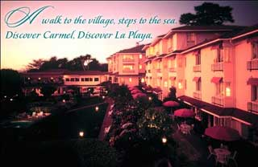

# Credit Where Due
* Author: Andy Hertzfeld
* Story Date: January 1983
* Topics: Marketing, The Launch, The Press, Retreats
* Characters: Bill Atkinson, Steve Jobs, Bob Belleville, Bruce Daniels, Larry Tesler, Wayne Rosing, Andy Hertzfeld, Rich Page, Rod Holt, Steve Wozniak, John Couch
* Summary: Why the Mac design team got credit for their work

 
    
The Macintosh team held a series of off-site retreats, every six months or so starting in January 1982.  A retreat usually lasted two full days, including an overnight stay.  We'd travel by bus to a naturally beautiful resort an hour or two from Apple's offices in Cupertino, like Pajaro Dunes near Monterey Bay. Every employee on the team was invited, as well as folks from other parts of the company who were contributing to the project. The retreats were a mixture of a divisional communications meeting, an inspirational pep talk and a company party, featuring chats with industry legends like Robert Noyce (inventor of the integrated circuit) or Ben Rosen (the VC who funded Compaq and Lotus), and entertainment from Wyndham Hill artists like Liz Story.

The third retreat was scheduled for January 27th and 28th, 1983 at the La Playa Hotel in Carmel, and it came at a pivotal time for the project.  The Lisa was just introduced the previous week, after four years of development, on January 19th (although it wouldn't actually ship for another five months), and it was becoming increasingly clear that it was time for the Mac team to shift gears, buckle down and change our focus to doing whatever it took to finish up and ship.

After the two hour bus ride from Cupertino, we gathered in a large meeting room to hear Steve Jobs' opening remarks, which set the agenda for the retreat.  Steve was fond of summarizing the themes of the day into a few succinct aphorisms, which he called "Quotations from Chairman Jobs".  The sayings from the previous retreat, held in September 1982, were "It's Not Done Until It Ships", "Don't Compromise!" and "The Journey Is The Reward".  This time, they were "Real Artists Ship", "It's Better To Be A Pirate Than Join The Navy", and "Mac in a Book by 1986" (see Pirate Flag).

Even though he was technically a member of the Lisa team, Bill Atkinson attended the Macintosh retreats.  Actually, now that the Lisa was finally completed, he planned to shift to working full-time on the Mac, to create a killer graphics application to be bundled with every machine (see MacPaint Evolution).  He was going to start working on it soon, and we were all excited to see what he would come up with.

The first day of the retreat was focused on engineering, and it went by quickly, as each member of the engineering team gave a short talk about their recent and upcoming work in the form of panel discussions, moderated by engineering manager Bob Belleville.  At 4PM, the formal part of the meeting ended for the day, and we had a couple of hours of free time to enjoy before dinner.  I was about to join a group going for a walk on the nearby beach when I was pulled aside by Bill Atkinson.  It was obvious that something was bothering him.

"Do you have a minute?", Bill asked me urgently, looking kind of somber.  "I want to show you something privately."  We picked one of the small conference rooms, went inside and closed the door.

Bill was carrying three magazines, which he laid out in front of me on the table.  Two of them were very recent issues of personal computer magazines, like Byte and Popular Computing, while the third was more business oriented.  They all contained articles about the recently introduced Lisa.  He opened one of them and showed me an article, with a sidebar entitled "An Interview with Lisa's Designers".

"Hey, that's cool," I told Bill, "You made it into Byte!"

"Look closer", Bill told me, with a pained expression on his face.

I started to browse the article, and noticed that it interviewed engineering manager Wayne Rosing, software manager Bruce Daniels, and applications group manager Larry Tesler.  I finally saw why Bill looked so upset - he wasn't included as one of Lisa's designers, which was absurd, since he did more of the design than everyone else combined.

All three magazine articles featured quotes from Wayne, Bruce and Larry, as well as Steve Jobs and John Couch, the top Lisa executive, but apparently, no one thought to include Bill, even though he designed and implemented the most important parts of Lisa almost singlehandedly, possibly because he wasn't a manager.  He was very disheartened, especially because something like this had happened to him once before.

Bill told me that he was haunted by a similar incident that occurred six or seven years earlier.  He did some groundbreaking work to create a detailed 3D animation of the human brain.  He scanned a series of brain slices, and then wrote software to reconstitute them in an animated sequence, rendering them frame by frame to produce a spectacular movie that depicted important brain structures in stunning detail.  The movie won various awards, and a frame from it graced the cover of the October 1978 issue of Scientific American, but one of the professors that he was working for stole most of the credit, acknowledging Bill as only a minor collaborator in the published papers.  Now it seemed to be happening all over again.

I tried to cheer him up, telling him that the press was usually wrong about everything anyway, and that everyone at Apple understood his leading role in both the Lisa and Macintosh projects, and that there would be plenty of opportunities to talk with the press in the future.  He told me that he was so upset that he was thinking about quitting, unless Apple rectified the situation somehow.  We both knew that he needed to talk with Steve Jobs about it, but he was nervous about bringing it up with Steve.  I told him that I thought he was completely justified, and that Apple ought to try to make it up to him.

A few hours later, after dinner, Bill told me that he arranged to meet with Steve in private early the next morning, before the day's meetings commenced, but he surprised me by asking me to accompany him.  I told him that it wasn't my business, and that I felt that it was inappropriate for me to attend, but Bill insisted, telling me that he needed my support, if only to have someone else present to help ground Steve's infamous reality distortion field (see Reality Distortion Field).  Even though I knew it would be awkward, I told him I would do it.

We both were nervous as Bill knocked on the door of the small office that Steve was using, in the back of the large meeting room where breakfast was being served to the team, at the appointed time.  Steve opened the door, but he looked angry when he noticed that I was present.

"What is he doing here?", he asked Bill, before turning to face me.  "Go away.  This isn't any of your business!"

"No, I need to have Andy here," Bill intervened.  "He didn't want to come, but I asked him to be here to support me."

Steve shrugged, and decided to continue as if I wasn't there.  "OK, let's hear it, and you need to be quick, because we have to start the meeting soon.  What's the big problem?"

Bill explained how upset he was that he didn't get any recognition for his work on Lisa, his voice hesitant at first, but picking up conviction as he started to get emotional.  He told Steve that he was thinking about leaving Apple, because he was treated so unfairly.

Even though Steve had enormous respect for Bill, he began to get annoyed, although you could tell that he was trying not to.

"Hey, listen, I'm sorry, but you're overreacting and blowing things out of proportion," Steve replied in a dismissive tone. "Who cares about a couple of magazines?  You should have been included, but you weren't. Someone made a mistake.  It's not such a big deal."

"That's easy for you to say," Bill retorted, upset at the lack of sympathy.  He raised his voice, which was full of emotion.  "I'm not going to work here anymore if you don't appreciate what I've done and treat me fairly."

Steve took a step toward the door.  He seemed impatient.  "I don't have time to deal with this now.  We'll straighten it out when we get back.  I have 60 other people out there who are pouring their hearts into the Macintosh, and they're waiting for me to start the meeting."  He opened the door and left the room without saying another word.

Bill and I remained in the small office, unable to speak, emotionally exhausted from the intense encounter.  After a few minutes, we heard a loud cheer, as Steve made a number of announcements to kick off the second day of the retreat.  Bill sighed, and we left the office to attend the rest of the meeting.

The following week, Steve arranged for Bill to meet with Apple's HR team, to discuss what was bothering him.  Bill reiterated that his main complaint was getting recognition for his work.  After more discussions with Steve, they came up with something that was mutually acceptable to everyone.

The solution was to appoint Bill as an Apple Fellow, in recognition for his work on the Lisa.  Apple Fellow was the most prestigious technical position at Apple, awarded to only two employees so far: Steve Wozniak and Rod Holt.  Now there would be two more, Bill Atkinson and Rich Page, who also made seminal contributions to Lisa.  A fringe benefit of being appointed an Apple Fellow was a fresh pile of stock options, which could be quite valuable if Apple's stock price continued to rise.

But most importantly of all, Steve promised Bill that he would receive public recognition for his work on Macintosh.  Mac programs had an "About Box", a descriptive dialog box invoked by the first command in the leftmost menu, which would display the author's name.  Furthermore, Bill could display his name in the title bar of the main window each time his graphics application was launched.  Finally, Steve promised that the Macintosh introduction would acknowledge the folks who actually created the design, rather than the managers who supervised them.

Steve was true to his word, and the seven people that he designated as the "design team" were featured in various ways during the Macintosh launch.  Chiat-Day even filmed us for a series of television commercials, which never aired because they were deemed too self-congratulatory.  It was fun to get our pictures in the national press (see Can We Keep The Skies Safe?), but it was also problematic, because there wasn't a fair way to draw the line.  At least a dozen individuals made crucial contributions to the design, so there were some hard feelings from the people who didn't make the cut.

In fact, Steve eventually decided that giving recognition to the designers was a bad idea.   Nowadays, Apple has abolished programmer names in the "About Box", and closely guards the names of their designers, allowing only a select few employees to interact with the press at all.