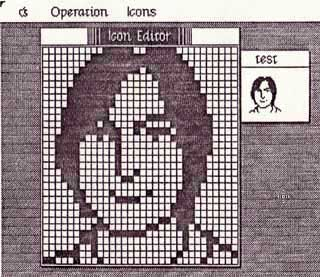
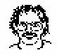

# Steve Icon
* Author: Andy Hertzfeld
* Story Date: February 1983
* Topics: MacPaint, Personality
* Characters: Susan Kare, Steve Jobs, Bill Atkinson, Burrell Smith
* Summary: Having your own icon became a status symbol

 
    
In February 1983, I worked on putting together an icon editor for Susan Kare to use to create icons for the Finder.  Inspired by the "Fat Bits" pixel editing mode that Bill Atkinson had recently added to MacPaint, it had a large window with a 32 by 32 grid, displaying each pixel at eight times its natural size, as well as a small window that showed the icon at its actual size.   Clicking on a pixel would invert it, and subsequent dragging would propagate the change to the dragged over pixels.

Susan started working on icons for the Finder, but she also would draw lots of other images as well, for practice or just for fun, usually reflecting her whimsical sense of humor.  One day, I came over to her cubicle to see what she was working on, and I was surprised to see her laboring over a tiny icon portrait of Steve Jobs.

Icons were only 32 by 32 black or white pixels, 1024 dots in total, and I didn't think it was possible to do a very good portrait in that tiny a space, but somehow Susan had succeeded in crafting an instantly recognizable likeness with a mischevious grin that captured a lot of Steve's personality.  Everyone she showed it to liked it, even Steve himself.

Bill Atkinson was so impressed with the Steve icon that he asked Susan to do one of him, that he could use in the MacPaint about box.  He sat in Susan's cubicle for an hour or so, chatting with her while she crafted his icon. I don't think it turned out quite as good as the Steve icon, but it certainly was an unmistakable likeness, and did become part of MacPaint.

At that point, It became a Mac team status symbol to be iconified by Susan.  As soon as he saw Bill's icon, Burrell Smith started begging Susan for a Burrell icon, even though he had no specific use for it.   He lobbied Susan for a few days, making his standard offer of best friendship (see I'll Be Your Best Friend), before she gave in and had him pose for his icon.  Unfortunately, I can't find a copy of the Burrell icon to display here.

Susan did a few more portraits, for various members of the team who desired to be immortalized in a thousand dots.   She'd usually work on them in the late afternoon, chatting with the subjects as they posed, while other team members listened in.   I got to know a few of my teammates a lot better from these sessions.