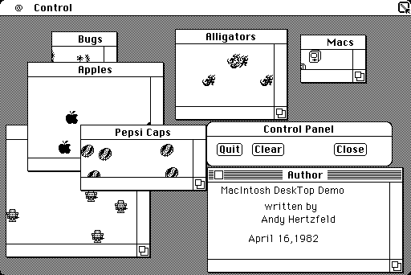

# Bouncing Pepsis
* Author: Andy Hertzfeld
* Story Date: March 1983
* Topics: Software Design, Recruiting, Early Programs
* Characters: Andy Hertzfeld, Steve Jobs, John Sculley, Susan Kare, Bill Atkinson, Mike Murray
* Summary: We cook up a special demo for John Sculley

 
    
The Window manager was the one of the most important parts of the User Interface toolbox, and the ultimate showcase for Quickdraw's "region clipping" technology.  The window manager had to calculate various regions for windows as they were created, moved and resized, and objects drawn inside the windows were automatically clipped as necessary.

The Macintosh window manager was based on the one that Bill Atkinson wrote for Lisa, which was written in Pascal; my job was to rewrite it in 68000 assembly language and adapt it to the Macintosh environment.  The first step was to port Bill's Pascal version.  I wrote a little program to test the port, which I called "Window Manager Demo", that generated some windows and put the window manager through its paces.

A year earlier, I had written a fast "ball bouncing" routine, using custom, 16x16 pixel graphics routines, that could animate hundreds of balls simultaneously, which was a fun way to show off the Mac's raw graphical horsepower.  I decided to animate a few dozen balls in each window in the window manager demo, using Quickdraw, because their continuous movement would eventually cover all the bases inside a window and expose any flaws in the underlying clipping.

After Susan started in January 1983, I asked her to draw some tiny 16 by 16 bitmaps to use in the Window Manager Demo instead of the by now monotonous ball shapes.  Soon, we had a variety of little objects bouncing around in the various windows, like  tiny little Macintoshes, or apples, insects and alligators.  I thought that the Window Manager Demo was finished, but I was wrong.

Steve Jobs came by the software area one evening a couple of months later, excited about someone he had recently met in New York City.  "Hey, I want you to do a demo next week for this guy I met yesterday, John Sculley, he's the president of Pepsi.  He's really smart - you wouldn't believe how smart he is.  If we impress him, we can get Pepsi to buy thousands of Macs.  Maybe even five thousand.  Why don't you try to come up with something special to show him?".

It sounded a little bit fishy to me, since we hardly ever demoed to potential customers at that point.  But I asked Susan to draw some Pepsi imagery, and she came up with tiny little Pepsi caps, as well as Pespi cans, in his honor, so I put them into the Window Manager demo.

The next week, Mike Murray led John Sculley around the engineering area, since Steve was out of town.  He brought him by my cubicle to see the modified Window Manager demo.  I opened the windows one at a time, saving the Pepsi caps and cans for last.  He seemed genuinely excited to see the Pepsi stuff, but oddly cold for most of the demo.  He asked a few questions, but he didn't seem all that interested in the answers.

A few weeks later, we found out the real story - the purpose of John's visit was to interview for CEO of Apple, and he got the job, being convinced by Steve's famous line "Would you rather sell sugar water to kids for the rest of your life, or would you like a chance to change the world?".