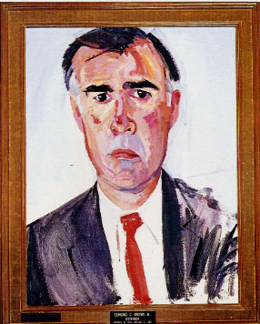

# A Big Scare!
* Author: Dan Cochran
* Story Date: April 1983
* Topics: Celebrities, Lisa
* Characters: Jerry Brown, Dan Cochran, Steve Jobs, John Sculley, Al Mandel
* Summary: A visit to the Lisa offices by former Governor Jerry Brown

 
    
On April 8th of 1983, Steve Jobs came by the Lisa offices on Bandley Drive with the former governor of California, Jerry Brown, in tow. I had just arrived at the office, with a full day of work already scheduled, but had to drop everything when Steve asked me to brief Brown on the Lisa and to give him a tour of the offices.

Al Mandel and I spent an hour or so with Jerry in the Lisa "Sneak Room” (a very well designed multimedia, executive briefing facility), giving him demonstrations and encouraging him to try some stuff himself. As I recall we even took apart a Lisa to show him the hardware architecture. He was trying to feign interest but his mind was off somewhere else (as it often was during his tenure as Governor).

After the show-and-tell I then took Brown on a guided tour through the Lisa facilities and we visited engineering, documentation, marketing, etc. In the past I had taken other famous people on walkthroughs and Apple employees would usually never bat an eye. We were used to this (and after all, WE were celebrities as well). However, the reaction to Jerry Brown was unlike anything I'd ever seen. People were acting almost nervous...concerned. While Jerry was talking to an engineer, someone else took me aside, looked me straight in the eye and pointed at Jerry with a look of anguish on his face. As I had no idea what he was getting at I simply replied nonchalantly, "Yeah...that's Jerry Brown". After 10-15 minutes of this Jerry had completely lost interest. I walked him out of the offices and we bid each other goodbye. But I was still very puzzled by the reaction to him.

As soon as I went back in the Bandley Lobby I discovered the source of the bewilderment. The Apple rumor mill was always incredibly active and that morning (unbeknownst to me because I'd been locked up with the former Governor) the word on Bandley Drive had it that Apple was prepared to announce a new CEO that day. And Jerry's arrival at the Lisa offices nearly triggered one of the biggest Wall Street panics since Black Monday. Some people were convinced that Jerry was to be named the new CEO of Apple!

And, looking back, at that time in Apple's history this scenario was actually very plausible...

As it turns out the Apple rumor mill was correct. Later that day John Sculley was announced as the new CEO of Apple. But that's another story for another time.