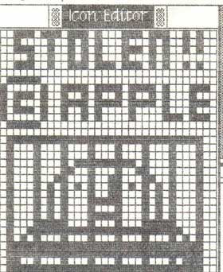

# Stolen From Apple
* Author: Andy Hertzfeld
* Story Date: August 1983
* Topics: Software Design
* Characters: Steve Jobs, Susan Kare, Steve Capps, Andy Hertzfeld, Steve Jasik
* Summary: We put a hidden icon in the ROM

 
    
In 1980, a company called Franklin Computer produced a clone of the Apple II called the Franklin Ace, designed to run the same software.  They copied almost every detail of the Apple II, including all of its ROM based software and all the documentation, and sold it at a lower price than Apple.   We even found a place in the manual where they forgot to change "Apple" to "Ace".   Apple was infuriated, and sued Franklin.  They eventually won, and forced Franklin to withdraw the Ace from the market.

Even though Apple won the case, it was pretty scary for a while, and it wasn't clear until the end that the judge would rule in Apple's favor - Franklin argued that they had a right to copy the Apple II ROMs, since it was just a "functional mechanism" necessary for software compatibility.  We anticipated that someone might try a similar trick with the Macintosh someday.  If they were clever enough (which Franklin wasn't), they could disguise the code (say by systematically permuting some registers) so it wouldn't look that similar at the binary level.  We thought that we better take some precautions.

Steve decided that if a company copied the Mac ROM into their computer, he would like to be able to do a demo during the trial, where he could type a few keystokes into an unmodified infringing machine, and have a large "Stolen From Apple" icon appear on its screen.  The routines and data to accomplish that would have to be incorporated into our ROM in a stealthy fashion, so the cloners wouldn't know how to find or remove it.

It was tricky enough to be a fun project.  Susan designed a nice "Stolen from Apple" icon, featuring prison bars.  Steve Capps had recently come up with a simple scheme for compressing ROM-based icons to save space, so we compressed the icon using his technique, which not only reduced the overhead but also made it much harder to detect the icon.  Finally, we wrote a tiny routine to decompress the icon, scale it up and display it on the screen.  We hid it in the middle of some data tables, so it would be hard to spot when disassembling the ROM.

All you had to do to invoke it is enter the debugger and type a 6 digit hexadecimal address followed by a "G", which meant execute the routine at that address.  We demoed it for Steve and he liked it.  We were kind of hoping someone would copy the ROM just so we could show off our foresight.

As far as I know, no one ever did copy the ROM in a commercial project, so it wasn't really necessary, but it did create some intrigue for a while.  We let it slip that there was a "stolen from Apple" icon hidden in there somewhere, partially to deter people from copying the ROM.  At least one hacker became moderately obsessed with trying to find it.

Steve Jasik was the author of the MacNosy disassembler/debugger, which could be used to create pseudo-source for the ROM.  He found out about the "stolen from Apple" icon pretty early on, and became determined to isolate it.  He lived in Palo Alto, so I would occasionally bump into him, and he would ask me for hints or tell me his latest theory about how it was concealed, which was invariably wrong.

This went on for two or three years, before he finally cracked it: I ran into him and he had it nailed, telling me about the compressed icon and the address of the display routine.  I congratulated him, but was never sure if he figured it out himself or if someone with access to the source code told him.