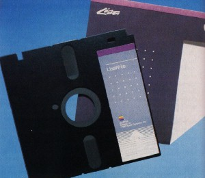

# Quick, Hide In This Closet!
* Author: Andy Hertzfeld
* Story Date: August 1983
* Topics: Hardware Design, Management, Lisa
* Characters: George Crow, Bob Belleville, Larry Kenyon, Steve Jobs, Rod Holt, Rich Williams, Hide Kamoto
* Summary: Steve forbid us to work with Sony

 
    
In 1980, Apple reorganized again, splitting off a new "Disk Division" headed by John Vennard, responsible for developing a hard disk code-named "Pippin" and a next generation floppy disk code-named "Twiggy".  Both were intended to be used first by the Lisa project, and eventually across Apple's entire product line.  At Rod Holt's request, I had written some early diagnostics for Twiggy using an Apple II, but I felt lucky that they asked Rich Williams instead of me to transfer to the disk division as their software guy, since focusing exclusively on disks seemed pretty limiting.

Woz's Apple II floppy disk design was way ahead of the rest of the industry, so Apple felt confident that it could continue to innovate to extend its lead.  Twiggy was a fairly ambitious project, more than quadrupling the capacity of standard floppy disks by doubling the data rate (which required higher density media) and employing other innovative tricks like motor speed control, which slowed down the disk rotation speed on the outer tracks to cram more data on them.  

The Lisa was designed to include two built-in Twiggy drives, so it made sense for the Macintosh to use Twiggy as well.  Twiggy used a Woz-style disk controller, which created a problem for the Lisa designers, since that required exact timing from the microprocessor and therefore couldn't tolerate interrupts, which was perhaps OK for a simple system like the Apple II but was unacceptable for a more sophisticated system like Lisa.  Instead, the Lisa hardware designers (Paul Baker, Bob Paratore and others) solved the problem by including a little Apple II, with its own memory and microprocessor (but clocked twice as fast), inside the Lisa to control the Twiggy drives.

The Lisa also supported an optional, external hard drive through a built-in parallel port.  As the Twiggy designers encountered unexpected difficulties in achieving an acceptable error rate, Lisa came to rely on the hard drive instead.   The Twiggy drive was also slower than expected, because of the high error rate as well as the way the variable motor speed trick increased seek times, since you had to wait for the speed change to stabilize.  Besides, the Lisa operating system designers were used to working on systems that swapped memory from disk, which wasn't really feasible to pull off at floppy disk speeds.  Soon, the hard disk became mandatory, upping the minimum price of a Lisa by more than a thousand dollars.

Lisa was announced to great fanfare in January 1983, but it still wasn't ready to ship.  There were problems in a number of areas, but the biggest one was the low yield of the Twiggy drives, whose high error rate greatly limited production.  Finally, Lisas were shipped to customers in June 1983, even though there continued to be production and reliability problems with the disk drives.

Meanwhile, the Mac team was beginning to panic.  We were using a single Twiggy drive as our floppy disk, and we didn't have a hard disk to fall back on.  It looked like the Twiggy drive was never going to be reliable or cost effective enough for the Macintosh, but we were stuck without an alternative.  If we couldn't find a suitable replacement quickly enough, we'd have to slip the entire project indefinitely.

Fortunately, we were aware of Sony's new 3.5 inch drive that they started to ship in the spring of 1983 through Hewlett-Packard, their development partner.  George Crow, the analog engineer who designed the Mac's analog board, had come from HP prior to working at Apple and was sold on the superiority of the Sony drives.  He procured a drive from his friends at HP and proposed to Bob Belleville that we figure out how to interface it to the Mac as soon as possible, while we negotiate a deal with Sony.

The Sony drive looked really sweet, especially when compared to the Twiggy.  It used the same data rate as Twiggy, but on smaller disks that could fit in a shirt pocket.  Best of all, the media was encased in a hard plastic shell, making it much less fragile and more convenient to handle.

Steve Jobs was finally ready to acknowledge reality and give up on the Twiggy drive.  When he saw the Sony drive he loved it, and immediately wanted to adapt it for the Mac.  But instead of doing the obvious thing and striking a deal with Sony, Steve decided that Apple should take what we learned from Twiggy and engineer our own version of a 3.5" drive, working with our Japanese manufacturing partner Alps Electronics, who manufactured the Apple II floppy drives at a very low cost.

This seemed like suicide to George Crow and Bob Belleville.  The Mac was supposed to ship in less than seven months, and it was preposterous to think that we could get a 3.5" drive into production by then, if we could do it at all, given the disk division's dismal track record.  But Steve was convinced that we should do our own drive, and told Bob to cease all work on the Sony drive.   He instructed Rod Holt, Bob and George to fly to Japan to meet with Alps to initiate a crash project to develop a workable 3.5 inch drive.

Bob and George grudgingly went along with the Alps program, but they were certain that the team would discover that we couldn't pull it off in the alloted time frame.  They hatched an alternative plan to continue to work with Sony surreptitiously, against Steve's wishes.  Larry Kenyon was given a Sony drive to interface to the Mac, but he was told to keep it hidden, especially from Steve.  Bob and George also arranged meetings with Sony, to discuss the customizations that Apple desired and to hammer out the beginnings of a business deal.

This dual strategy entailed frequent meetings with both Alps and Sony, with the added burden of keeping the Sony meetings secret from Steve.  It wasn't that hard to do in Japan, since Steve didn't come along, but it got a little awkward when Sony employees had to visit Cupertino. Sony sent a young engineer named Hide Kamoto to work with Larry Kenyon to spec out the modifications that we required.  He was sitting in Larry's cubicle with George Crow when we suddenly heard Steve Jobs's voice as he unexpectedly strode into the software area.

George knew that Steve would wonder who Kamoto-san was if he saw him.  Thinking quickly, he immediately tapped Kamoto-san on his shoulder, and spoke hurriedly, pointing at the nearby janitorial closet.  "Dozo, quick, hide in this closet. Please! Now!"

Kamoto-san looked confused but he got up from his seat and hurried into the dark janitorial closet.  He had to stay there for five minutes or so until Steve departed and the coast was clear.

George and Larry apologized to Kamoto-san for their unusual request.  "No problem. ", he replied, "But American business practices, they are very strange. Very strange." 

As predicted, a few weeks later the Alps team came back with an eighteen month estimate for getting their drive into production, and we had to abandon the project.  When Bob Belleville revealed that he and George had kept the Sony alternative alive, Steve swallowed his pride and thanked them for disobeying him and doing the right thing.  The Sony drives eventually worked out great, and it's hard to imagine what the Mac would have been like without them today.