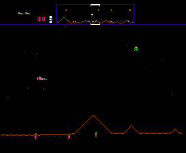
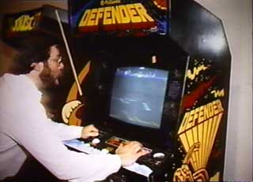

# Make a Mess, Clean it Up!
* Author: Donn Denman
* Story Date: September 1983
* Topics: Personality, Recreation
* Characters: Burrell Smith, Donn Denman, Andy Hertzfeld
* Summary: Burrell had a unique approach to playing Defender

 
    
Working 90 hours a work week requires frequent, and highly effective, work breaks.  In the center of Macintosh work area in Bandley 3 we had a ping pong table, a nice stereo system, and a Defender video game machine.  We found that competitive play gave us a jolt of adrenaline, and a refreshed mind-set when we resumed work.  We also learned a lot about our coworkers and how they excel during competition.  While playing Defender one day I got some great insight into how Burrell accelerates his own learning process.

Andy, Burrell and I had a standing competition playing on the Defender machine.  We'd challenge each other, in two or three player competitions, taking turns at the video game machine, and compare techniques and high scores.  We were roughly equal in skill level, so as we'd take turns at the controls we could watch how the other player was doing, and have a gauge for who was ahead.  This gave us opportunities to refine our skills, learn the other guy's technique, and show off our prowess.

The goal of Defender is to defend your humans from abduction by aliens.  The evil green aliens drop down from the top of the screen and randomly pick up your humans, and try to bring them back up to the top of the screen.  You control a ship and have to shoot the aliens, either before they grab a human, or during their rise up to the top of the screen.  If an alien makes it to the top with a human, they consume him and become a vicious mutant, which attacks very aggressively.  You start the game with ten humans, and if the last one dies, all the aliens become mutants, and they swarm in on your ship from all sides.  

After a while, surviving the first few game levels was pretty easy, unless you had been up all night programming or something.  The Defender machine was probably a pretty good objective measure of current mental capacity.  "Gee, I can't even get through level 2!  I guess it's time to get some sleep."  Better to put in a bad performance on the defender game than mess up the current programming task, or start down the wrong path on some hardware design.

One day Burrell started doing something radical.  Andy came by my cube and said "You've got to come see what Burrell's doing with Defender."  "How can you innovate with a video game?" I wondered.  I'd seen Burrell and Andy innovate on all kinds of things, but I couldn't image how he could somehow step outside the box of a video game - the machine controlled the flow and dictated the goals.  How could you gain some control in that environment?

We started up a new competition, and when Burrell's turn came up, he did something that stunned me.  He immediately shot all his humans!  This was completely against the goal of the game!  He didn't even go after the aliens, and when he shot the last human, they all turned to mutants and attacked him from all sides.  He glanced in my direction with a grin on his face and said "Make a mess, clean it up!" and proceeded to dodge the swarm of angry mutants noisily chasing after him.  "Burrell's not going to win this competition" I said to myself.  "He's not going to last long with a screen full of mutants!"

Often a single mutant is enough to kill you.  They move quicker, and with a different pace and pattern than the other aliens, so the normal evasive techniques don't work very well.   Mutants move so quickly over small distances that they seem to just jump on top of you.  Your ship is faster over the longer term, so you have to outrun them, establishing a gap, and only then do you have enough room to safely turn and fire at them.

When Burrell's next turn came up I was surprised by how long his ship survived.  He'd already developed a technique for dealing with a whole mass of mutants.  He would circle around them again and again, and that would gather them into a densely clumped swarm.  Then, while circling, he'd fire a burst pattern across the whole swarm, not needing to aim at individuals.  He was doing really well, cutting through the swarm like the Grim Reaper's scythe.  Burrell was no longer attacking individual mutants, instead he was treating the whole swarm as one big target.

Burrell may have lost that game and the next few, but it wasn't too long before he was really mastering the machine.  Instead of avoiding the tough situations, he'd immediately create them, and immediately start learning how to handle the worst situation imaginable.  Pretty soon he would routinely handle anything the machine could throw at him.  

I was beginning to see how Burrell could be so successful with everything he does.  Like many high achievers, Burrell likes challenges so much that he actually seeks them out and consciously creates them.  In the long run, this approach makes sense.  He seems to aggressively set up challenging situations throughout his life.  Then, when life throws him a curve ball, he'll swing hard, and knock it out of the park.  

Why intentionally "make a mess?"  So you can get really good at "cleaning up!"