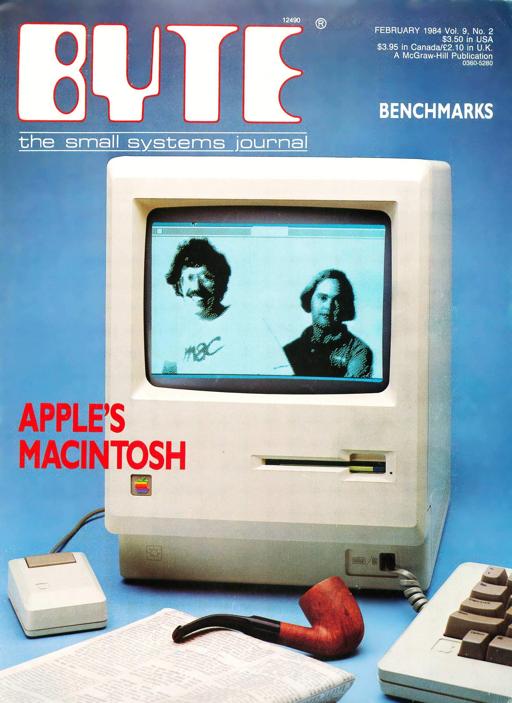

# The Mythical Man Year
* Author: Andy Hertzfeld
* Story Date: October 1983
* Topics: Software Design, Personality, Reality Distortion, QuickDraw
* Characters: Steve Jobs, Bill Atkinson
* Summary: Steve estimates the effort that went into Quickdraw

 
    
One of our first encounters with the press was a group interview with Byte magazine in October 1983. We wanted an article to come out concurrently with the Mac intro the third week of January, and Byte had a three month lead time, so they were the first.

Byte was one of the first PC hobbyist magazines, written for a fairly technical audience of computer enthusiasts.  Five or six of us were being extensively quizzed by two Byte editors, including Steve Jobs.   We were talking about the Mac's graphical user interface software, and how long it took to develop.

Quickdraw, the amazing graphics package written entirely by Bill Atkinson, was at the heart of both Lisa and Macintosh. "How many man-years did it take to write QuickDraw?", the Byte magazine reporter asked Steve.

Steve turned to look at Bill.  "Bill, how long did you spend writing Quickdraw?"
"Well, I worked on it on and off for four years", Bill replied.

Steve paused for a beat and then turned back to the Byte reporter.  "Twenty-four man-years.  We invested twenty-four man-years in QuickDraw."

Obviously, Steve figured that one Atkinson year equaled six man years, which may have been a modest estimate.