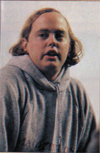
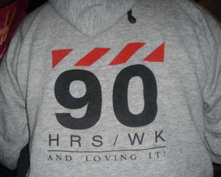

# 90 Hours A Week And Loving It!
* Author: Andy Hertzfeld
* Story Date: October 1983
* Topics: T-Shirts, Personality
* Characters: Burrell Smith, Debi Coleman, Steve Jobs
* Summary: Burrell modifies his sweatshirt

 
    
Most of the Macintosh software team members were between twenty and thirty years old, and with few family obligations to distract us, we were used to working long hours.  We were passionate about the project and willing to more or less subordinate the rest of our lives to it, at least for a while.  As pressure mounted to finish the software in time to meet our January 1984 deadline, we began to work longer and longer hours.  By the fall of 1983, it wasn't unusual to find most of the software team in their cubicles on any given evening, week day or not, still tapping away at their keyboards at 11pm or even later.

The rest of the Macintosh team, which had now swelled to almost a hundred people, nearing the limit that Steve Jobs swore we would never exceed, tended to work more traditional hours, but as our deadline loomed, many of them began to stay late as well to help us test the software during evening testing marathons.  Food was brought in as a majority of the team stayed late to help put the software through its paces, competing to see who could find the most bugs, of which there were still plenty, even as the weeks wore on.

Debi Coleman's finance team decided to commemorate the effort that the entire team was putting forth in the traditional Silicon Valley manner:  they made a T-Shirt.  Actually, to make it a little more special, they chose a high quality, gray hooded sweatshirt.   Steve Jobs had recently bragged to the press that the Macintosh team was working "90 hours a week".   They decided that the tag line for the sweatshirt should be "90 Hours A Week And Loving It", in honor of Steve's exaggerated assertion.

The sweatshirt featured the name Macintosh in red letters, purposefully misspelled as "Mackintosh", as it had been in a recent article, with a black squiggle crossing out the errant 'k'.  The "90 Hours" tag line was emblazoned in black across the back. They were produced in time for the next testing marathon, as a reward for participating. The software team wasn't all that pleased, since we felt that we really were working that hard, but most of the other sweatshirt recipients weren't even coming close.    But it was a pretty nice sweatshirt, so lots of the engineers started wearing them frequently, including Burrell Smith.

When Burrell finally quit Apple in February 1985, he continued to wear the sweatshirt almost every day, but, as soon as he returned home following his resignation, he took some masking tape and made a big 'X' across the leading '9' character, virtually obliterating it from view. He proudly displayed the updated motto, reflecting exactly how he felt.  It now read "0 Hours A Week And Loving It".