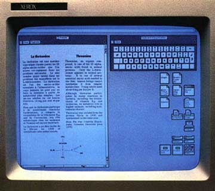

# A Rich Neighbor Named Xerox
* Author: Andy Hertzfeld
* Story Date: November 1983
* Topics: 3rd party developers, Microsoft, Personality
* Characters: Steve Jobs, Neil Konzen, Mike Boich, Bill Gates
* Summary: Steve confronts Bill Gates about copying the Mac

 
    
When Steve Jobs recruited Microsoft to be the first third party applications software developer for the Macintosh, he was already concerned that they might try to copy our ideas into a PC-based user interface.  As a condition of getting an early start at Macintosh development, Steve made Microsoft promise not to ship any software that used a mouse until at least one year after the first shipment of the Macintosh.

Microsoft's main systems programmer assigned to the Mac project was Neil Konzen, a brilliant young Apple II hacker who grew up in their backyard in the suburbs of Seattle.  Neil started working at Microsoft while he was still a high school student, and single-handedly implemented the system software for their hit Z80 card that allowed the Apple II to run CP/M software.    

Neil loved Apple, so it was natural for Microsoft to assign him to their new, top-secret Macintosh project.  He was responsible for integrating Microsoft's byte-code based interpreted environment (which actually was a copy of a system used at Xerox that favored memory efficiency over execution speed, which was appropriate for the Mac's limited memory) with the rapidly evolving Macintosh OS, so he quickly became Microsoft's expert in the technical details of the Mac system.

By the middle of 1983, Microsoft was far enough along to show us working prototypes of their spreadsheet and business graphics programs, Multiplan and Chart (they were also working on a word processor, but they neglected to mention that, since it would compete with MacWrite).  I would usually talk with Neil on the phone a couple of times a week.  He would sometimes request a feature that I would implement for him, or perhaps complain about the way something was done.  But most of the time I would answer his various questions about the intricacies of the still evolving API.

I gradually began to notice that Neil would often ask questions about implementation details that he didn't really need to know about.  In particular, he was really curious about how regions were represented and implemented, and would often detail his theories about them to me, hoping for confirmation.

Aside from intellectual curiosity, there was no reason to care about the system internals unless you were trying to implement your own version of it.  I told Steve that I suspected that Microsoft was going to clone the Mac, but he wasn't that worried because he didn't think they were capable of doing a decent implementation, even with the Mac as an example.

In November 1983, we heard that Microsoft made a surprising announcement at Comdex, the industry's premier trade show, held twice a year in Las Vegas.  Microsoft announced a new, mouse-based system graphical user interface environment called Windows, competing directly with an earlier environment announced by Personal Software called "Vision".   They also announced a mouse-based option for Microsoft Word.  When Steve Jobs found out about Windows, he went ballistic.

"Get Gates down here immediately", he fumed to Mike Boich, Mac's original evangelist who was in charge of our relationships with third party developers.  "He needs to explain this, and it better be good.  I want him in this room by tomorrow afternoon, or else!"

And, to my surprise, I was invited to a meeting in that conference room the next afternoon, where Bill Gates had somehow manifested, alone, surrounded by ten Apple employees.   I think Steve wanted me there because I had evidence of Neil asking about the internals, but that never came up, so I was just a fascinated observer as Steve started yelling at Bill, asking him why he violated their agreement.

"You're ripping us off!", Steve shouted, raising his voice even higher.  "I trusted you, and now you're stealing from us!"

But Bill Gates just stood there coolly, looking Steve directly in the eye, before starting to speak in his squeaky voice.

"Well, Steve, I think there's more than one way of looking at it. I think it's more like we both had this rich neighbor named Xerox and I broke into his house to steal the TV set and found out that you had already stolen it."

Unfortunately,  it turned out that while the agreement that Microsoft signed in 1981 stipulated that they not ship mouse-based software until a year after the Mac introduction, that ended up being defined in the contract as September 1983, since in late 1981 we thought that the Mac would ship in the fall of 1982, and we foolishly didn't let the ship date float in the contract.  So Microsoft was within their rights to announce Windows when they did.  Apple still needed Microsoft's apps for the Macintosh, so Steve really couldn't cut them off.

Microsoft didn't manage to ship a version of Windows until almost two years later, releasing Windows 1.0 in the fall of 1985.  It was pretty crude, just as Steve had predicted, with little of the Mac's thoughtful elegance.  It didn't even have overlapping windows, preferring a simpler technique called "tiling".  When its utter rejection became apparent a few months later, Bill Gates fired the implementation team and started a new version from scratch, led by none other than Neil Konzen.

Neil's version of Windows, released a couple of years later, was good enough that Apple filed a monumental copyright lawsuit against Microsoft in 1988, but they eventually lost on a technicality (the judge ruled that Apple inadvertently gave Microsoft a perpetual license to the Mac user interface in November 1985).