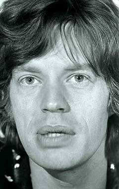
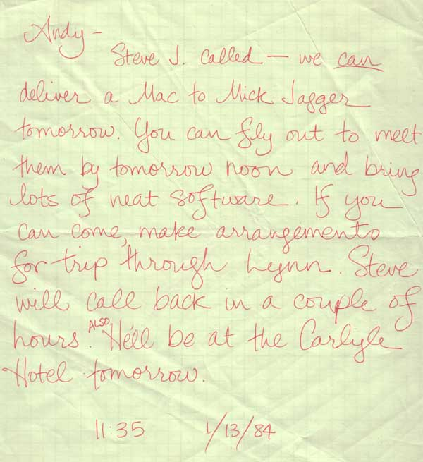

# A Mac For Mick
* Author: Andy Hertzfeld
* Story Date: January 1984
* Topics: Marketing, Celebrities, The Launch
* Characters: Bob Belleville, Steve Jobs, Lynn Takahashi, Patti King, Bill Atkinson, Mike Murray, Andy Hertzfeld
* Summary: We present a Mac to Mick Jagger

 

The last couple of weeks before the Macintosh unveiling on January 24th were extremely hectic.  The software still wasn't finished, and it wasn't clear if there was enough time left to get it into adequate shape.  Meanwhile, the Apple PR machine was revved up to full speed, so there were also plenty of unusual diversions, like being interviewed and photographed for the national press.

The absolute deadline for finishing the software was when the factory opened at 6am Monday morning, on January 16th, eight days before the introduction.  When I came into work on Friday, January 13th, I knew that I would probably stay there all weekend, along with the rest of the team, working as hard as possible to shake out the remaining bugs before Monday.  Steve Jobs, Mike Murray, Bob Belleville and others were in New York city doing a press tour, so I thought we would be relatively free of distractions, and would be able to focus on bug fixing.

I came into work later than usual, around noon, since I had been at Apple until 3am the previous evening, and I wanted to get one decent night's sleep before the final push.  As I went to sit down, I noticed that a handwritten note had been placed on my chair.  It was from our software librarian, Patti King, who had taken a message from Steve Jobs' secretary, Lynn Takahashi.

"Andy -  Steve J. called - we can deliver a Mac to Mick Jagger tomorrow.  You can fly out to meet them by tomorrow noon and bring lots of neat software.  If you can come, make arrangements for the trip through Lynn. Steve will call back in a couple of hours, also, he'll be at the Carlyle Hotel tomorrow."

Wow! A chance to meet Mick Jagger was a once in a lifetime opportunity.  But we still had three more days before the deadline, and I would be absent for at least 30 hours if I tried to go to New York, plus I would be relatively useless when I returned from all the flying.  I called back Lynn to tell her to tell Steve that I couldn't make it.  But I was curious to find out about Mick's reaction.

I found out from Bill Atkinson when he returned from the East Coast on Sunday afternoon, and I got more details from Steve and Mike Murray a bit later.  Steve had apparently gone to a party on Thursday evening, where he was introduced to Andy Warhol.  Andy got really excited about the Macintosh when Steve demoed it to him.  "You must show it to Mick,", he proclaimed, and arranged for Steve and the Apple crew to go to Mick Jagger's townhouse on Saturday afternoon to present him with a Macintosh. 

Steve Jobs, Mike Murray and Bill Atkinson got out of the cab in front of Mick's two-story brownstone townhouse, hauling along a Macintosh in its canvas carrying case.   They knocked on the door at the address they were given, but there was no response for several minutes.  Finally, the door was opened by two huge guys who were obviously bodyguards, who didn't seem all that impressed to be talking to the co-founder of Apple Computer and his entourage.

The Apple folk were led upstairs into an elegantly furnished room to wait for Mick.  Bill set up the Mac and launched MacPaint, and started to fool around with it.  Then, abruptly, Mick Jagger strode into the room, dressed casually in a T-shirt and blue jeans.

Mick was polite, but he didn't seem to have heard of Apple Computer, Steve Jobs or the Macintosh.  Steve tried to strike up a conversation, but he wasn't very successful.  Steve told me that Mick couldn't seem to put together a coherent sentence.  "His speech was slurred and very slow", Steve described it later, "in fact I think he was on drugs.  Either that or he's brain-damaged."   After a few minutes, it was clear that Mick had absolutely no interest whatsoever in Apple or the Macintosh, and an awkward silence ensued.

Fortunately, Mick's twelve year old daughter Jade had followed Mick into the room, and her eyes lit up when she saw MacPaint.  Bill began to teach her how to use it, and pretty soon she was happily mousing away, fascinated by what she could do with MacPaint.  Even though Mick drifted off to another room, the Apple contingent stayed with Jade for another half hour or so, showing off the Macintosh and answering her questions, and ended up leaving the machine with her, since she couldn't seem to part with it.