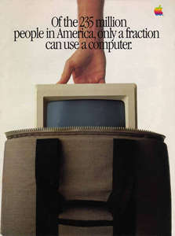

# It Sure Is Great To Get Out Of That Bag!
* Author: Andy Hertzfeld
* Story Date: January 1984
* Topics: Marketing, The Launch, Software Design
* Characters: Steve Jobs, Steve Capps, Bruce Horn, Andy Hertzfeld, Susan Kare, Mike Boich, Mark Barton, Steve Hayden
* Summary: We need a demo for the intro

 

It took a monumental effort, fueled by inordinate amounts of chocolate covered espresso beans (see Real Artists Ship), to finally finish the first release of the Macintosh software in time for the introduction.  We finished with literally no time to spare,  shipping the "golden master" of the "Write/Paint" disk to the factory at 6am on Monday morning January 16th, a week before the introduction.  By that point, most of the software team hadn't slept for days, so we all went home to collapse.

I thought I would need to sleep for at least 24 hours, but I woke up after 6 hours with a desire to go back to Apple to see if the release held up, and to see how everyone else was feeling.  By 5pm, most of the software team had dragged themselves back for the same reason, and we were lounging around in a tired daze, happy that we finally shipped, but still not quite believing it, when Steve Jobs strode into the software area.

"Hey, pick yourselves up off the floor, you're not done yet!"

Uh-oh, I thought, someone must have found a show-stopper in the release and we're going to have to track it down. But that's not what he meant.

"We need a demo for the intro!  The Mac deserves to have a great demo for its first public showing.  I want the Mac to play the theme from "Chariots of Fire" while it's showing a slide show of the apps.  Plus lots of other cool stuff, whatever you can come up with.  And it needs to be done by the weekend, to be ready for the rehearsals."

We moaned and groaned about being tired, but as we talked we realized that it would be fun to cook up something impressive.  We were too tired to think about it right away, but when we came back the next day, a plan started to emerge.

Capps had an idea to use a gigantic font to scroll "Macintosh" across the screen, one letter at a time, to start the demo, so he worked on that, as well as the slideshow.  Bruce Horn wanted to do a starry night with twinkling stars, and a skywriter writing "Macintosh" in cursive across the night sky.  Susan worked on an intro graphic of the Mac sitting in its canvas carrying bag, and well as some of the other graphics for the slideshow part.  I integrated all the pieces and also signed up for the "Chariots of Fire" music part, since no one else wanted to do that.

It's hard to write a music editor/player in two days, but I managed to put something together that could actually play the "Chariots of Fire" theme, but it didn't sound very good, since it used simple sine waves without any envelope shaping.  Steve immediately rejected it as lousy, which it was, and opted for using a CD of the "Chariots of Fire" theme to play in the background instead.

Meanwhile, as we were working on the demo, Mike Boich came by with Mark Barton, a third party developer who we seeded with an early Mac, because he had written an impressive program for the Apple II called S.A.M. (the Software Automatic Mouth).  SAM was a speech generator, which converted text to speech, with a distinctive, winning personality.  I had helped Mark with sound driver issues as he developed it, and now it finally made it to fruition.  SAM sounded even better on the Mac, because we had 8 bits per sample and a higher sampling rate.

When Steve heard SAM talk, he immediately decreed that we had to incorporate SAM in the intro demo.  "I want the Macintosh to be the first computer to introduce itself!", he insisted.  He told Mike Boich to quickly cut a deal with Mark so Apple could bundle the speech generator (rechristened Macintalk) and use it in the intro.

Since my music generator fell through, I got to do the speech part, using Mark Barton's libraries.  I knew that I wasn't clever enough to be the Mac's speechwriter.  I think Susan had the idea of asking Steve Hayden, Chiat-Day's head writer, to do it.  Steve was the guy who conceived the 1984 commercial (see 1984) and was as clever as they come.  He was excited about helping out and got it done overnight.

Once we integrated all the pieces together, the demo didn't come close to be able to run on a standard Macintosh.  Fortunately, we had a prototype of a 512K Mac in the lab, so we decided to cheat a little (there were only two in existence at the time) and use that for the demo, which made things fit.

The demo starts out with Susan's graphic of the Mac hidden in its carrying bag, on a curtained stage, displayed while the program prepared Capp's big letters.  Suddenly, the music swells (from a CD, not generated by the Mac) and Capp's big letters scroll nimbly across the screen, spelling out "Macintosh".  Then we transition to Bruce's skywriter, and then to various screen shots of applications, including third party applications like Microsoft's Multiplan and Chart.  Finally, the music stops, the screen goes blank, and waits for Steve to press the mouse button.  When he does, the Mac starts to speak, in strange but somehow endearing tones:

> Hello, I am Macintosh.  It sure is great to get out of that bag!  Unaccustomed as I am to public speaking, I'd like to share with you a maxim I thought of the first time I met an IBM mainframe: Never trust a computer that you can't lift!Obviously, I can talk, but right now I'd like to sit back and listen.  So it is with considerable pride that I introduce a man who has been like a father to me... Steve Jobs!