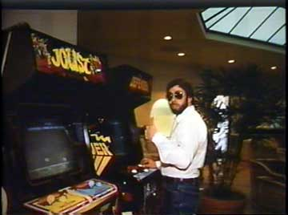

# Spoiled?
* Author: Andy Hertzfeld
* Story Date: April 1984
* Topics: Management, Buildings
* Characters: Bud Tribble, Steve Jobs, Rod Holt, Burrell Smith, Jef Raskin, Randy Wigginton, Hartmut Esslinger
* Summary: The Mac team had a reputation for being spoiled

 
    
The Macintosh team had a reputation for being spoiled, which was certainly true by the middle of 1984, but it wasn't always the case.  Even though Steve Jobs was fond of bragging that the Mac designers were Apple's best engineers, that wasn't necessarily reflected in their compensation.

Two weeks before I transfered to the Mac team after a shake-up in the Apple II group in February 1981 (see Black Wednesday), I received my regular six month review and was slated for a nominal raise in salary, from $22,000/year to $24,000.  I thought that I should still get my raise, even though I had switched groups, so after working on the Mac for a few weeks I approached my new manager Bud Tribble about it.

"Well, that sounds reasonable to me," Bud told me when I explained the situation to him, "but there's a problem.  I'm only getting paid $20,000/year."

I was shocked that Bud was making so little, since the average manager in the Apple II group was making at least twice that much.  I asked Burrell Smith about his compensation, and found out that he was getting paid even less than Bud, since he started at Apple as a lowly service technician (see It's The Moustache That Matters), and had hardly gotten any raises as his responsibility grew.  Less than two months ago, the Mac was an iffy research project under Jef Raskin, and Steve Jobs hadn't adjusted anyone's salary since he took over.

The next day, I talked with Steve and told him about my incipient raise, and asked him why, if the work we were doing was so important,  Burrell and Bud had such low salaries.  Steve was unexpectedly nonchalant, professing that he didn't know what their salaries were, and that he hadn't given anyone raises because no one had asked for one.  He said that we had much more important things to worry about than our salaries, but he had no problem giving all three of us modest raises right away.  But even after the raises came through, the Mac team continued to be relatively underpaid compared to the rest of Apple.

Rod Holt, the designer of the Apple II power supply and the first Macintosh engineering manager, was an extraordinary, opinionated individual who could expound brilliantly on a startling range of topics.  He was the unlikely combination of a committed socialist and a multi-millionaire, by virtue of his being one of Apple's earliest employees.  On one occasion, the Mac team hired an older analog engineer to work on the disk controller, and paid him almost twice what Burrell was making, even though he was only doing a small fraction of the work.  When we complained, Rod invoked his economic theories, how people should be paid according to their needs instead of their talents.  We didn't necessarily buy that, but we really weren't working mainly for the money, and Rod was so charmingly philosophical that we let it slide.

Our offices at Texaco Towers were also kind of quaint by Apple standards.  Most of Apple's offices were outfitted with high tech, partitioned Herman Miller cubicles, but Texaco Towers was more old fashioned, with funky, older desks and second hand furniture.  Steve was generally tight with money, and usually turned down any extravagant requests.  For example, he allowed us to buy an IBM PC to dissect for $2,000 in August 1981 (see Donkey), but nixed our similar request for a $20,000 Xerox Star.

Burrell and I used to walk down to the nearby Texaco station to get  soft drinks from their vending machine most afternoons around 4PM.  One afternoon, in the summer of 1981, Steve brought a visiting dignitary by for a demo while we were out, and, frustrated by our absence, decided to have a refrigerator stocked with soft drinks installed so we wouldn't have to miss work time to get beverages, making free sodas our first unusual perquisite. 

The team's lifestyle began to change as it grew throughout 1982.  In mid-1982, we moved from Texaco Towers to Bandley 4, a more standard Apple building back at the center of the main campus, and the salaries of the early team also rose as we had to pay competitive salaries to newcomers.  Bandley 4 was a typical, ordinary Apple building, but it was only intended to be temporary quarters for the Mac team, until the building across the street, the much larger Bandley 3, could be renovated to accommodate us.

The design for our new quarters in Bandley 3, which we moved into in the summer of 1983, showed the first signs of extravagance.   The software team was ensconced in a large area with glass doors that we dubbed "the fishbowl", since a passerby could observe us without opening the door.  The showpiece of the building was a large atrium in the lobby, with fancy skylights and some interesting furnishings.

To one side of the lobby were two video games, which we had the opportunity to purchase  cheaply  a month or so after moving in;  I paid for Burrell's favorite, Defender (see Make a Mess, Clean it Up!), while Randy Wigginton contributed Joust.   On the other side of the lobby was an expensive stereo system bought by Steve, featuring a compact disc player, which was new technology at the time, and almost 100 CDs, which was just about every one that was released at the time.

Bandley 3 also had a nice little kitchen, near the software area, with a much bigger refrigerator than we had in Texaco Towers.  Steve decided that sodas weren't very healthy, and had the refrigerator stocked with expensive Odwalla fruit juices, delivered fresh every day, as well as an assortment of other beverages.

In the spring of 1984, right about the time that I left Apple, the lobby began to fill up with more interesting artifacts, purchased by Steve Jobs on his various travels.  There was an outrageously expensive Bosendorfer piano that was soon accompanied by a BMW motorcycle, on display as examples of exquisite craftmanship, although it was rumored that Steve purchased them to impress the industrial designer that he was enamored with at the time, Hartmut Esslinger, whose firm, Frog Design, designed the case of the Apple IIc.

That was right around the time that the 100 person Macintosh Division merged with the 250 person Lisa Division, with the Mac people occupying most of the management roles.  The Mac had completed its journey from a funky research project to the center of the company, but I continue to think that it was more fun when we had a lot fewer resources.