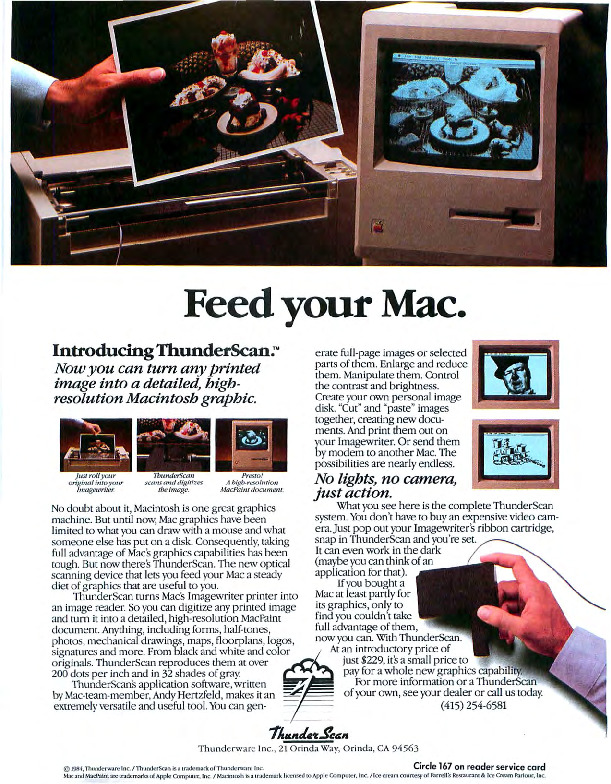
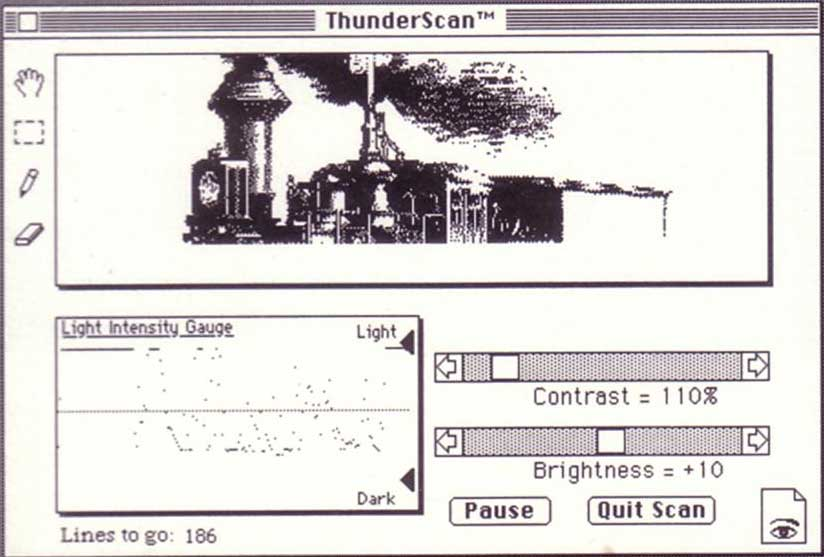

# Thunderscan
* Author: Andy Hertzfeld
* Story Date: June 1984
* Topics: 3rd party developers, Hardware Design, Software Design, Technical
* Characters: Tom Petrie, Victor Bull, Bill Atkinson, Andy Hertzfeld
* Summary: A clever device transforms a printer into a scanner

 
    
The first project that I worked on for Apple after starting in August 1979 was writing low level software for the Silentype printer, a cute, inexpensive thermal printer for the Apple II, that was based on technology licensed from a local company named Trendcom.  In typical Apple fashion, we improved on Trendcom's design by replacing their relatively expensive controller board with a much simpler one that relied on the microprocessor in the Apple II to do most of the dirty work.

The only other engineer working on the project was Victor Bull, who was the hardware designer and also the project leader.  Vic was smart, taciturn and easy to work with, and I learned a lot from him about how thermal printers worked, as well as how things worked at Apple.  We finished the project quickly, and the Silentype shipped in November 1979, less than four months after I began working on it.

In May 1984, during my leave of absence from Apple (see Leave Of Absence), I received a phone call from Victor Bull, who I hadn't heard from in a couple of years.  He had left Apple more than a year ago to work with his friend Tom Petrie at a tiny company based in Orinda named Thunderware, that sold a single product called Thunderclock, an inexpensive calendar/clock card for the Apple II.  Victor said that he thought that I might be interested in writing software for an exciting, clever new product that Thunderware was developing for the Macintosh, which he refused to describe over the phone. He invited me to come visit them to check it out.

In early June, I drove up to Thunderware's office in Orinda, which was about an hour's drive from my house in Palo Alto.  After I arrived at their modest headquarters, Vic introduced me to his partner, Tom Petrie, and I signed a non-disclosure agreement before they ushered me into a back room to see their demo.

The most popular printer for both the Apple II and the Macintosh was the ImageWriter, a $500 dot-matrix printer capable of rendering bitmapped graphics, that was designed and manufactured by Japanese company named C.Itoh Electronics and marketed by Apple.  Virtually every Macintosh owner purchased an ImageWriter, since it was the only printer that was supported by Apple.  Tom's demo consisted of an ImageWriter printer hooked up to an Apple II, that at first glance appeared to be busily printing away.  But when I looked closer, I noticed that instead of blank paper, there was a glossy photograph of a cat threaded through the printer's platen, and the printer's black plastic ribbon cartridge was missing, replaced by a makeshift contraption containing an optical sensing device that trailed an umbilical cord back to the Apple II.

Their potential new product, Thunderscan, was a low cost way to temporarily turn an ImageWriter printer into a high resolution scanner, by replacing the ribbon cartridge with an optical sensor and writing some clever software.  Since the resolution was determined by the precision of the printer's stepper motors, which had to be very accurate in order to print detailed graphics, Thunderscan, priced at under $200, had better resolution than flat bed scanners costing more than ten times as much.  I loved the cleverness of the ingenious concept, and the Woz-like elegance of saving money and adding flexibility by doing everything in software, but there were also a few problems.

The biggest problem was that Thunderscan could only capture one scan line's worth of data on each pass of the print head, which made it nine times slower than regular printing, since the print head could deposit nine dots at a time.  This made for frustratingly slow scanning, often taking over an hour to scan a full page at the highest resolution.  Thunderscan was never going to win any races.

Another apparent problem was the disappointingly low quality of the image being captured and displayed by Tom Petrie's Apple II application. Tom and Vic said their scanner was capable of capturing up to 32 different levels of light intensity, but both the Apple II (in hi-res mode) and the Macintosh only had one bit per pixel to display, so the software had to simulate gray scales using patterns of black and white dots.  It looked like Tom was using a simple threshold algorithm to do the rendering, which threw away most of the gray scale information and made the resulting image look unacceptably blotchy.  It was hard to tell if the quality promised by Tom and Vic was there or not.

Tom and Vic proposed to hire me to write Macintosh software for Thunderscan.  I knew that a low cost scanner would be a great product for the image hungry Macintosh, but only if it had sufficient quality, and I wasn't sure about that. I told them that I'd think it over during the next few days, and, as I did, I became more excited about the potential of Thunderscan for the Macintosh, realizing that the slow speed wouldn't be that much of an impediment if the quality and resolution was good enough.  The low image quality in Tom's prototype was probably caused more by the Apple II software than by anything inherent in the scanner.  The Macintosh was almost ten times faster than the Apple II, so it should be able to sample the incoming data better to obtain more horizontal resolution.  Plus, I knew a much better algorithm for gray scale rendering that would be fun to try out in practice.

My friend and colleague Bill Atkinson was a talented photographer, and one of his hobbies was playing around with digitized pictures, periodically experimenting to find the best algorithms for rendering them.  Bill loved to explain his current work to whoever would listen to him, so I learned a lot about rendering gray scale images over the years simply by being around him.  Bill had progressed over the years from using an "ordered dither" algorithm, where varying threshold values are specified in a sliding matrix, to his current favorite, which was a modified version of what was known as the "Floyd-Steinberg" algorithm, where an error term is maintained and distributed proportionally to neighboring pixels.

I called Thunderware and told them I was interested in working on Macintosh software for Thunderscan, in exchange for a per-unit royalty.   I drove back up to Orinda, where Tom and Vic gave me lots of documentation about the scanner, and the sample code that Tom had written for the Apple II.  For the next couple of months, I drove up to Orinda once a week, usually on Thursday, to meet with Tom and Vic show them my progress, prioritize development issues and discussion various complications as they arose. We would also discuss business terms, but we didn't sign a formal contract until the software was almost finished, when we settled on a royalty of $7.50 per unit.

Tom and Vic had already encountered and surmounted a number of tough problems just to get scanning going at all.  For example, the ImageWriter printer was not really designed to be stepped one scanline at a time, and if you tried that the paper would bunch up against the platen, causing distortion.  Tom and Vic solved the problem by commanding the printer to move three steps up and then two steps back, instead of a single step up, which held the paper snugly against the platen as required.   There were also various techniques for sensing the beginning and end of the scan line, and some timings that were determined by tedious experimentation for how long it took the printer to respond to a command.

It took a week or so to get basic scanning working on the Macintosh, and then a few more days to render the gray scale data with Bill's modified Floyd-Steinberg dithering.  After shaking out a variety of problems, mostly involving synchronization between the printer and the software, I was surprised and impressed by the consistent high quality of the results.  I went through a brief, elated phase of scanning every image in sight that would fit through the printer, just to see how it would turn out.

One important design decision that I made early on was to keep the gray scale data around, to allow more flexible image processing.  Thunderscan documents were five bits per pixel, before the Macintosh generally supported gray scale, and the user could manipulate the contrast and brightness of selected areas of the image, dodging and burning to reveal detail in the captured image.  This also paid off in later versions when we implemented gray scale printing for Postscript printers.

My favorite feature that I came up with for Thunderscan had to do with two dimensional scrolling.  Thunderscan documents could be quite large, so you could only show a portion of them in the image area of the window.  You could scroll the image by dragging with a MacPaint-style "hand" scrolling tool, but you had to drag an awful lot to get to the extremes of a large image.  I decided to add what I called "inertial" scrolling, where you gave the image a push and it kept scrolling at a variable speed in the direction of the push, after the mouse button was released.  I had to add some hysteresis to keep the image from moving accidentally, and make various other tweaks, but soon I had it working and it felt great to be able to zip around  large images by pushing them.

The hardest feature to perfect was bidirectional scanning.  At first, Thunderscan only scanned from left to right, but it wasted time to return the scannner to the left after every scan line.  We could almost double the speed if we scanned in both directions, but it was hard to get the adjacent scan lines that were scanned in opposite directions to line up properly.   Ultimately, we made bidirectional scanning an optional feature, if you wanted to trade a little quality for greater speed.

I finished the software in November 1984, after taking a short break to work on something else (see Switcher).  Thunderscan shipped in December 1984, and did well from the very beginning, with sales gradually rising from around 1,000 units/month to over 7,500 units/month at its peak in 1987.    For a while, it was both the least expensive and highest quality scanning alternative for the Macintosh, although I'm sure it frustrated a lot of users by being too slow.  I did three major revisions of the software over the next few years, improving the scan quality and adding features like gray scale printing and eventually gray scale display for the Macintosh II.

Eventually, the flat bed scanners caught up to Thunderscan, and then surpassed it, in both cost, quality and convenience.   Over its lifetime, Thunderscan sold approximately 100,000 units and improved countless documents by providing users with an inexpensive way to capture high resolution graphics with their Macintoshes.

